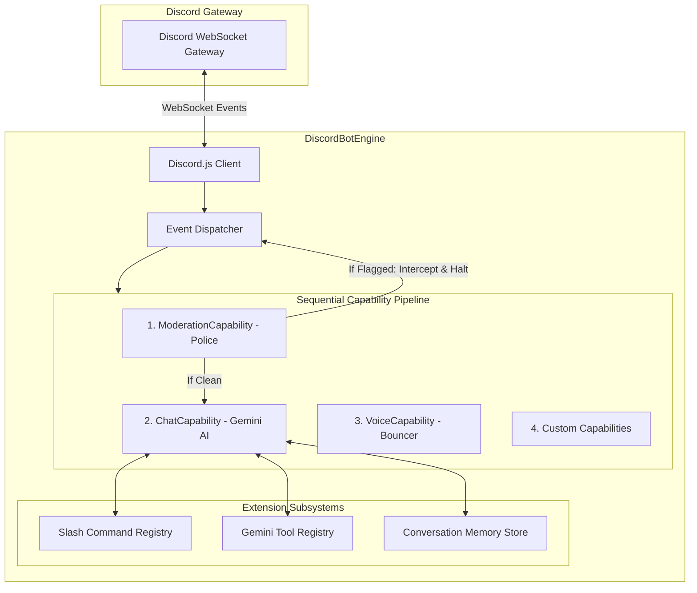

# Design Document: Bot Engine Architecture & Extension Guide

**Author**: Hung Nguyen  
**Status**: Architecture Specification & Developer Guide  
**Target Platform**: `discord-bot` (Node.js 22, TypeScript 5, Discord.js v14, Google GenAI / Vertex AI Gemini, Redux Toolkit, Vitest)  
**Date**: 2026-09-12  

---

## 1. Architectural Overview

The `discord-bot` engine operates as a **single unified Discord client instance (`DiscordBotEngine`)** that maintains a persistent connection to the Discord Gateway, manages multiple server connections (guilds) concurrently, and dispatches incoming events through an extensible **Capability Pipeline**.



---

## 2. Environment Variables & Credentials

All Discord operations (bot client, OAuth2 portal login, slash command deployment) share a **single, unified set of Discord credentials**:

```env
# Discord Application Credentials (Shared by Bot & Portal)
DISCORD_TOKEN=your_discord_bot_token
DISCORD_CLIENT_ID=your_discord_application_client_id
DISCORD_CLIENT_SECRET=your_discord_application_client_secret
DISCORD_REDIRECT_URI=http://localhost:3001/api/v1/auth/discord/callback

# Google GenAI / Gemini
AI_API_KEY=your_google_ai_studio_api_key

# Security & Sessions
BEARER_TOKEN=your_super_secret_bearer_token
SESSION_SECRET=your_session_jwt_secret_key
ADMIN_DISCORD_USER_IDS=123456789,...

# Server & Storage
PORT=3001
NODE_ENV=development
MEMORY_STORE_TYPE=local
```

---

## 3. Capability Pipeline Architecture (`IBotCapability`)

Rather than maintaining separate bot processes or relying on fragile class inheritance mixins, bot features are implemented as **modular capability handlers** conforming to the `IBotCapability` contract.

### 3.1 `IBotCapability` Interface

```typescript
export interface IBotCapability {
  /** Unique capability identifier (e.g. 'moderation', 'chat', 'voice') */
  readonly id: string;
  readonly name: string;

  /**
   * Initializes capability with the active Discord.js client and configuration instance.
   */
  init(client: Client, config: Config): Promise<void> | void;

  /**
   * Handles incoming message events.
   * @param message The Discord message payload.
   * @param guildConfig Per-server configuration for the target guild.
   * @returns `true` if the event was intercepted/handled (halts downstream pipeline propagation), or `false`/`void` to continue.
   */
  handleMessage?(
    message: Message,
    guildConfig?: BotGuildConfig,
  ): Promise<boolean | void>;

  /**
   * Handles Discord slash commands and component interactions.
   */
  handleInteraction?(
    interaction: Interaction,
    guildConfig?: BotGuildConfig,
  ): Promise<void>;

  /**
   * Handles Discord voice state updates (join, leave, mute, deafen).
   */
  handleVoiceStateUpdate?(
    oldState: VoiceState,
    newState: VoiceState,
    guildConfig?: BotGuildConfig,
  ): Promise<void>;

  /**
   * Cleans up timers, event listeners, or cache on shutdown.
   */
  destroy?(): Promise<void> | void;
}
```

### 3.2 Built-in Capabilities

1. **`ModerationCapability` (Police)**:
   - **Priority**: 1 (Runs first in the message pipeline).
   - **Responsibilities**: Censors prohibited wordlists, matches forbidden regex patterns, deletes offending messages, issues user warnings, logs moderation audit trails.
   - **Interception**: If a message violates server policies, it deletes the message, logs the incident, and returns `true`, completely halting further processing so `ChatCapability` never generates AI responses to toxic inputs.

2. **`ChatCapability` (Conversational AI)**:
   - **Priority**: 2.
   - **Responsibilities**: Evaluates channel whitelists (`replyChannelIds`), runs Smart Reply addressee intent classification, manages per-user message debouncing, triggers typing indicators, loads multi-user conversation history from `MemoryService`, invokes Gemini with tool calling, and sends generated replies.

3. **`VoiceCapability` (Bouncergon)**:
   - **Priority**: 3.
   - **Responsibilities**: Monitors voice channel activity, enforces voice matchmaking, creates temporary voice rooms, and manages channel permissions.

---

## 4. How to Extend the Bot: Developer Guide

### 4.1 Adding a New Capability

To create a new capability (e.g., an automated `AnnouncementsCapability` or `PollsCapability`):

#### Step 1: Create the Capability Class
Create a new file under `app/src/capabilities/<capability-name>.ts`:

```typescript
import type { Client, Message, Interaction } from "discord.js";
import type { BotGuildConfig } from "../config/types";
import type { Config } from "../config";
import type { IBotCapability } from "./types";

export class PollsCapability implements IBotCapability {
  readonly id = "polls";
  readonly name = "Interactive Polls";
  private client!: Client;

  async init(client: Client, _config: Config): Promise<void> {
    this.client = client;
    console.info(`[${this.name}] Capability initialized.`);
  }

  async handleMessage(message: Message, guildConfig?: BotGuildConfig): Promise<boolean | void> {
    // Custom message trigger example: "!poll Question | Option 1 | Option 2"
    if (message.content.startsWith("!poll ")) {
      await this.createPoll(message);
      return true; // Halt downstream pipeline
    }
  }

  async handleInteraction(interaction: Interaction, _guildConfig?: BotGuildConfig): Promise<void> {
    if (interaction.isButton() && interaction.customId.startsWith("poll_vote_")) {
      await interaction.reply({ content: "Vote recorded!", ephemeral: true });
    }
  }

  private async createPoll(message: Message): Promise<void> {
    // Poll creation logic...
  }
}
```

#### Step 2: Register in `DiscordBotEngine`
In `app/src/capabilities/bot-engine.ts`, register your capability:

```typescript
export class DiscordBotEngine {
  constructor() {
    this.client = new Client({ /* intents */ });

    // Pipeline registration order:
    this.registerCapability(new ModerationCapability());
    this.registerCapability(new ChatCapability());
    this.registerCapability(new PollsCapability()); // Added
  }
}
```

---

### 4.2 Adding a New Slash Command

Slash commands are auto-discovered from the `app/src/discord/commands/` directory.

#### Step 1: Create Command File
Create a new file under `app/src/discord/commands/<category>/<commandName>.ts` (e.g., `app/src/discord/commands/utilities/summary.ts`):

```typescript
import {
  ChatInputCommandInteraction,
  SlashCommandBuilder,
} from "discord.js";
import type { AppCommand } from "../../types";

export const data = new SlashCommandBuilder()
  .setName("summary")
  .setDescription("Generate an AI summary of recent channel conversation")
  .addIntegerOption((option) =>
    option
      .setName("messages")
      .setDescription("Number of recent messages to summarize (default: 20)")
      .setMinValue(5)
      .setMaxValue(50)
      .setRequired(false),
  );

export const execute = async (
  interaction: ChatInputCommandInteraction,
): Promise<void> => {
  await interaction.deferReply();
  const count = interaction.options.getInteger("messages") || 20;

  // Fetch recent messages and generate summary with GenAI...
  await interaction.editReply({
    content: `Here is the summary of the last ${count} messages...`,
  });
};

const command: AppCommand = { execute };
export default command;
```

#### Step 2: Automatic Discovery & Deployment
- The command is automatically indexed by `parseCommands()` in `app/src/discord/helpers.ts`.
- It is deployed to Discord servers either:
  1. Via the **Web Management Portal**: Click **"Deploy Slash Commands"** in the Server Explorer.
  2. Programmatically via the REST API: `POST /api/v1/guilds/:guildId/deploy-commands`.

---

### 4.3 Adding GenAI Tools (Function Calling)

Tools enable the Gemini model to perform actions in Discord (e.g., fetch server stats, kick users, create channels, search web).

#### Step 1: Define the Tool
In `app/src/tools/` (or a subfolder), implement a `ToolDefinition`:

```typescript
import { Type } from "@google/genai";
import type { ToolDefinition, ToolExecutionContext } from "./types";

export const discordListRolesTool: ToolDefinition = {
  name: "discord_list_roles",
  description: "Lists all roles in the current Discord server with their member counts",
  parameters: {
    type: Type.OBJECT,
    properties: {
      includePermissions: {
        type: Type.BOOLEAN,
        description: "Whether to include permission breakdown for each role",
      },
    },
  },
  execute: async (args: { includePermissions?: boolean }, context: ToolExecutionContext) => {
    const guild = context.guild;
    if (!guild) {
      return { error: "This command can only be executed in a Discord server." };
    }

    const roles = guild.roles.cache.map((role) => ({
      id: role.id,
      name: role.name,
      members: role.members.size,
      color: role.hexColor,
    }));

    return { totalRoles: roles.length, roles };
  },
};
```

#### Step 2: Register in Tool Registry
In `app/src/tools/registry.ts`:

```typescript
export const registerDefaultTools = (): void => {
  const registry = getToolRegistry();
  registry.registerTool(discordListRolesTool);
  // ...other tools
};
```

#### Step 3: Enable Per-Server in Config
Administrators can enable or disable tools per server in the web portal or in `BotGuildConfig.tools`:

```json
{
  "guilds": {
    "123456789012345678": {
      "tools": {
        "googleSearch": true,
        "discord": true
      }
    }
  }
}
```

---

## 5. Verification & Testing Standards

1. **Unit Testing Capabilities**:
   - Each capability must have isolated unit tests under `app/src/capabilities/__tests__/<capability>.test.ts`.
   - Mock Discord `Message` and `Interaction` objects using Vitest without instantiating live Gateway connections.
2. **Pipeline Flow Testing**:
   - Verify that when `ModerationCapability` flags a message, subsequent capabilities in `DiscordBotEngine` are not invoked.
3. **Type Safety & Linting**:
   - Run `pnpm --prefix app typecheck` and `pnpm --prefix app lint` to ensure zero Biome and TypeScript errors.
