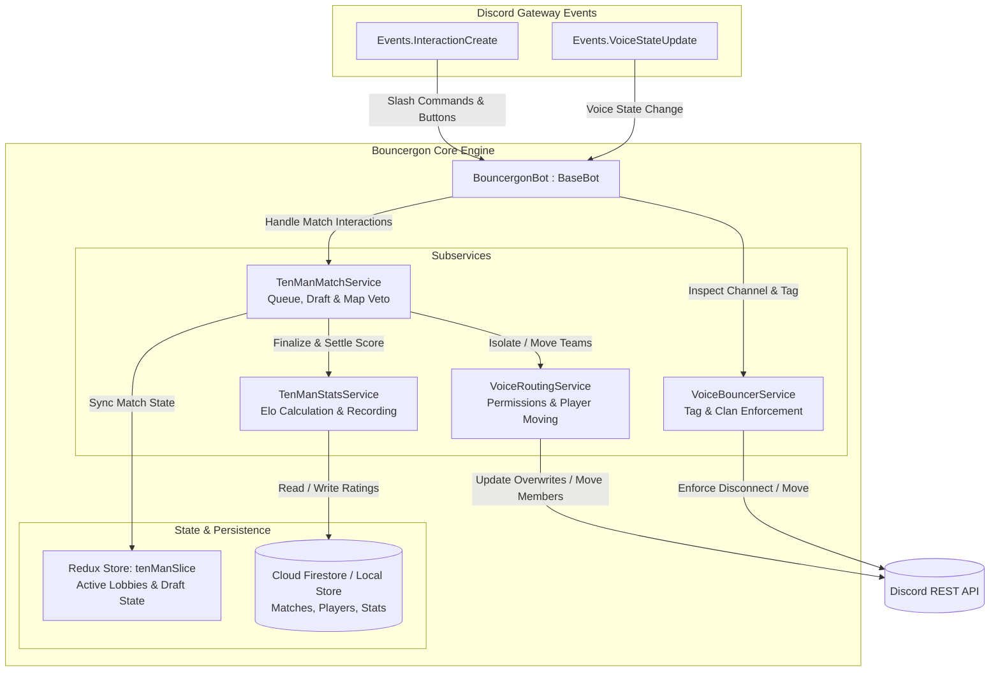
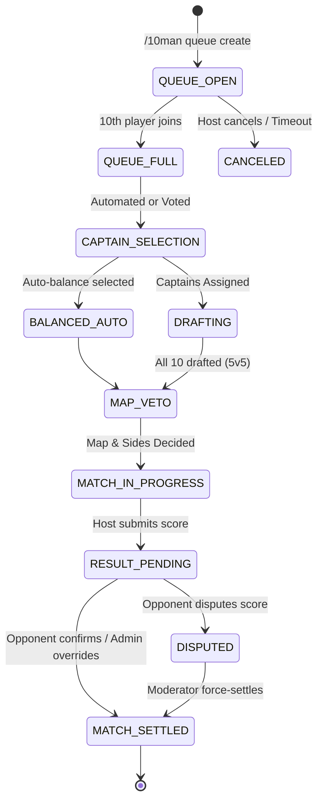

# Design Document: Bouncergon — Voice Channel Bouncer & Valorant 10-Man Matchmaking Platform

**Author**: Hung Nguyen
**Status**: Proposed / Design Specification
**Date**: 2026-09-11

---

## 1. Executive Summary & Problem Statement

### 1.1 Context & Background
Within gaming and esports communities on Discord, managing community voice channel privacy and organizing competitive custom scrims (specifically 5v5 "10-man" matches for titles such as Valorant) is frequently hindered by manual overhead, lack of automated enforcement, and fragmented tooling:
1. **Server Tag / Clan Membership Enforcement**: Guilds often maintain exclusive voice channels reserved for tagged server members (e.g. wearing a clan prefix `[TAG]` in their nickname or server identity). Currently, moderators must manually police and disconnect non-tagged players.
2. **Valorant 10-Man Coordination Friction**: Organizing custom 5v5 matches requires gathering 10 players, picking captains, drafting teams (snake draft or MMR-balanced), picking/banning maps, and coordinating in-game custom lobbies. Doing this manually in text chat is slow, prone to disputes, and unranked.
3. **Voice Isolation During Matches**: Once teams are drafted, players must be manually split into separate Team 1 and Team 2 Voice Channels (VCs). Spectators or unauthorized members can drop into team voice channels mid-round, causing disruptions or ghosting/tactical interference.
4. **Lack of Match Analytics & Rating Tracking**: Casual custom games lack persistence; player match histories, win/loss records, round margins, and competitive MMR/Elo ratings are lost once the lobby closes.

### 1.2 Objectives
**Bouncergon** is a specialized Discord bot subsystem built within the `discord-bot` platform to solve these challenges with full automation:
1. **Automated Voice Bouncer (`VoiceBouncerService`)**:
   - Continuously monitor Discord voice states (`Events.VoiceStateUpdate`).
   - Automatically disconnect or redirect users who join designated tag-only voice channels without matching the configured server tag / clan moniker or server role criteria.
   - Provide non-intrusive ephemeral explanations to bounced users.
2. **Valorant 10-Man Match Organizer (`TenManMatchService`)**:
   - Provide seamless queue management via interactive Discord components (Buttons, Select Menus, Modals).
   - Automated captain selection, draft phase (Snake Draft / MMR Auto-Balancing), and map veto (Pick & Ban) system tailored to the active Valorant competitive map pool.
3. **Dynamic Voice Access Control & Team Routing (`VoiceRoutingService`)**:
   - Automatically restrict Team 1 and Team 2 Voice Channels using Discord Permission Overwrites so only active roster members and authorized casters can connect.
   - Automatically move all 10 players into their designated team VCs upon match start, and pull them back to the General Lobby VC when the match concludes.
   - Eject or auto-mute unauthorized drop-ins instantly.
4. **Competitive MMR/Elo Engine & Persistence (`TenManStatsService`)**:
   - Dual storage architecture (Cloud Firestore in production, Local JSON Store in development) aligned with the platform's `IMemoryStore` paradigm.
   - Multi-player 5v5 Elo rating engine with dynamic K-factors based on win/loss margins and calibration matches.
   - Leaderboards, player profile cards, match history inspection, and mutual captain result confirmation.

---

## 2. High-Level Architecture & System Flow

### 2.1 Component Architecture Diagram



### 2.2 End-to-End Valorant 10-Man Lifecycle

```mermaid
sequenceDiagram
    autonumber
    actor Host as Match Host
    actor Players as 10 Players
    participant Discord as Discord Gateway / UI
    participant TMS as TenManMatchService
    participant VRS as VoiceRoutingService
    participant TSS as TenManStatsService
    participant DB as Firestore / Local Store

    Host->>Discord: /10man queue create
    Discord->>TMS: Initialize Queue Lobby Embed
    TMS->>Discord: Render Queue Embed with [Join] [Leave] [Captains]
    
    Players->>Discord: Click [Join Queue] (x10)
    Discord->>TMS: Queue Filled (10/10 Players)
    TMS->>Discord: Announce Full Lobby & Select Captains (Random / Highest Elo)
    
    rect rgb(30, 45, 65)
        note over TMS,Discord: Phase 1: Team Drafting (Snake Draft)
        TMS->>Discord: Captain 1 selects Player -> Captain 2 selects 2 Players -> etc.
        Discord-->>TMS: Rosters Finalized (Team Alpha vs Team Omega)
    end

    rect rgb(45, 30, 65)
        note over TMS,Discord: Phase 2: Map Veto / Ban Phase
        TMS->>Discord: Interactive Ban Buttons (Ascent, Bind, Haven, Lotus, etc.)
        Discord-->>TMS: Map Decided (e.g., Haven) + Side Selected
    end

    rect rgb(30, 65, 45)
        note over TMS,VRS: Phase 3: Match Active & Voice Isolation
        TMS->>VRS: Lock VCs & Route Teams
        VRS->>Discord: Set PermissionOverwrites (Team Alpha VC & Team Omega VC)
        VRS->>Discord: Move Team Alpha members -> Alpha VC
        VRS->>Discord: Move Team Omega members -> Omega VC
    end

    note over Players: Custom 5v5 Game Played in Valorant Client...

    rect rgb(65, 55, 30)
        note over TMS,TSS: Phase 4: Result Reporting & MMR Settlement
        Host->>Discord: /10man result report (Alpha 13 - 9 Omega)
        TMS->>Discord: Awaiting Confirmation from Opposing Captain
        Discord->>TMS: Captain Omega clicks [Confirm Result]
        TMS->>TSS: Settle Match (Compute 5v5 Elo Deltas)
        TSS->>DB: Save Match Document & Update Player MMR Records
        TMS->>VRS: Release VC Overwrites & Pull Players to Main Lobby
        TMS->>Discord: Post Match Summary & MMR Changes
    end
```



---

## 3. Detailed Component Specifications

### 3.1 Voice Bouncer Service (`VoiceBouncerService`)

#### Purpose
Enforce server identity and tag requirements on designated "Tag-Only" voice channels.

#### Functional Requirements
1. **Channel Matching**: Supports explicit channel IDs (`tagOnlyVoiceChannelIds`) or entire voice channel categories (`tagOnlyCategoryIds`).
2. **Tag Evaluation Rules**:
   - **Prefix/Suffix/Regex Match**: Checks `member.displayName` or `member.user.username` against configured patterns (e.g. `^\[TAG\]`, `TAG\s*\|`, `\bTAG\b`).
   - **Clan Moniker Support**: Detects Discord native Clan Identity / Guild Tags where exposed by Discord.js.
   - **Role Whitelist Exemption**: Bypasses check if the user holds configured exempt roles (e.g., Server Booster, VIP, Moderator).
3. **Enforcement Action**:
   - If non-compliant user joins/moves into target channel:
     - Disconnect user (`member.voice.disconnect("Missing required server tag")`) OR move user to fallback guest channel.
     - Send an ephemeral warning or short-lived text message in the voice channel text chat:
       > ⚠️ **[Bouncergon]** Hey <@userId>, this channel is reserved for members sporting the server tag `[TAG]`. Please update your server nickname or profile to join.
4. **Anti-Spam & Bounce Loop Mitigation**:
   - Memory cache tracking bounce timestamps (`Map<userId, number>`).
   - If a user triggers $>3$ bounces within 30 seconds, suppress duplicate DM/chat notifications to avoid webhook spam.

---

### 3.2 10-Man Match & Queue Orchestrator (`TenManMatchService`)

#### Match State Machine
A 10-man match progresses through strictly defined discrete states:



#### Team Draft Mechanics
1. **Captain Assignment**:
   - **Option A (Rank-based)**: Automatically assign the two players with the highest Elo rating as Captains.
   - **Option B (Random)**: Pick two random players from the pool.
   - **Option C (Host / Custom)**: Host assigns Captain 1 and Captain 2.
2. **Snake Draft Protocol (1-2-2-2-1)**:
   - Coin flip / random choice determines First Pick (Captain 1).
   - Turn 1: Captain 1 picks 1 player (Remaining pool: 7).
   - Turn 2: Captain 2 picks 2 players (Remaining pool: 5).
   - Turn 3: Captain 1 picks 2 players (Remaining pool: 3).
   - Turn 4: Captain 2 picks 2 players (Remaining pool: 1).
   - Turn 5: Captain 1 receives the remaining 1 player.
   - *Result*: Team 1 (5 players) and Team 2 (5 players).

#### Map Veto (Pick & Ban) Protocol
- Active Map Pool (configured in Remote Config, e.g., 7 active Valorant maps: *Ascent, Bind, Haven, Sunset, Lotus, Split, Abyss*).
- Interactive button grid displayed in match thread.
- Step 1: Captain 1 bans 1 map.
- Step 2: Captain 2 bans 1 map.
- Step 3: Captain 1 bans 1 map.
- Step 4: Captain 2 bans 1 map.
- Step 5: Captain 1 bans 1 map.
- Step 6: Captain 2 bans 1 map $\rightarrow$ 1 Map Remaining (Decider Map).
- Step 7: Captain 1 picks starting side (Attack / Defense) on the decider map.

---

### 3.3 Dynamic Voice Isolation & Team Routing (`VoiceRoutingService`)

#### Voice Isolation Protocol
To ensure competitive integrity and prevent cross-team communication or spectator interference:

1. **Channel Provisioning**:
   - **Dedicated Static Channels**: Guild designates `LobbyVC`, `TeamAlphaVC`, and `TeamOmegaVC`.
   - **Dynamic Ephemeral Channels**: Bot dynamically creates temporary `🔊 [10M] Match #X - Team 1` and `🔊 [10M] Match #X - Team 2` inside a configured voice category, destroying them upon match completion.
2. **Permission Overwrites**:
   - On match launch:
     ```typescript
     // Lock Team Alpha VC to Team Alpha roster only
     await teamAlphaVC.permissionOverwrites.set([
       {
         id: guild.roles.everyone.id,
         deny: [PermissionFlagsBits.Connect, PermissionFlagsBits.Speak],
       },
       ...teamAlphaMembers.map((member) => ({
         id: member.id,
         allow: [PermissionFlagsBits.Connect, PermissionFlagsBits.Speak, PermissionFlagsBits.ViewChannel],
       })),
     ]);
     ```
3. **Automated Team Summoning**:
   - Query current voice state for each of the 10 players.
   - If player is currently in any voice channel within the guild, move them via `member.voice.setChannel(targetVCId)`.
   - If player is not connected to voice, tag them in the match thread: *"Please join your team voice channel."*
4. **Intruder Protection Watchdog**:
   - If an unauthorized member joins, `VoiceStateUpdate` event verifies their presence against active match rosters.
   - Unauthorized user is immediately moved back to the Lobby VC or disconnected.
5. **Post-Match Teardown**:
   - Reset permissions on static channels or delete ephemeral channels.
   - Move all connected players back to `LobbyVC` for post-game wrap-up.

---

### 3.4 Elo / MMR Rating & Analytics Engine (`TenManStatsService`)

#### Rating Model: Team-Based 5v5 Elo
Let Team $A$ have players with ratings $R_{A,1}, \dots, R_{A,5}$ and Team $B$ have ratings $R_{B,1}, \dots, R_{B,5}$.

1. **Average Team Rating**:
   $$\bar{R}_A = \frac{1}{5} \sum_{i=1}^5 R_{A,i}, \quad \bar{R}_B = \frac{1}{5} \sum_{j=1}^5 R_{B,j}$$

2. **Expected Outcome ($E_A, E_B$)**:
   $$E_A = \frac{1}{1 + 10^{(\bar{R}_B - \bar{R}_A) / 400}}, \quad E_B = 1 - E_A$$

3. **Margin of Victory Multiplier ($M$)**:
   Let score be $S_{winner} - S_{loser}$ (e.g. 13–4 blowout vs 13–11 overtime).
   $$M = \ln(|S_A - S_B| + 1) \cdot \frac{2.2}{(R_{winner} - R_{loser}) \cdot 0.001 + 2.2}$$

4. **K-Factor Calculation**:
   - Standard baseline $K = 32$.
   - Calibration factor ($K = 64$) for players with $< 5$ total matches played.
   - High-rank stabilization ($K = 16$) for players above $1800$ Elo.

5. **Rating Update ($\Delta R_i$)**:
   For actual match result $W_A \in \{1, 0\}$:
   $$\Delta R_A = K_i \cdot M \cdot (W_A - E_A)$$
   $$\Delta R_B = K_j \cdot M \cdot (W_B - E_B)$$
   - Each player's new rating: $R'_{i} = \max(100, R_i + \Delta R)$.

---

## 4. Data Models & Storage Schema

Following the repository's storage architecture (`IMemoryStore` / Cloud Firestore), all 10-man match records and player profiles are stored in Firestore with JSON fallback.

### 4.1 Firestore Collections & Documents

```
tenManMatches/
  ├── {guildId}_{matchId}
  │     ├── matchId: string
  │     ├── guildId: string
  │     ├── seasonId: string
  │     ├── createdAt: Timestamp
  │     ├── completedAt: Timestamp
  │     ├── status: "completed" | "canceled" | "disputed"
  │     ├── map: string
  │     ├── score: { team1: number, team2: number }
  │     ├── team1: { captainId: string, playerIds: string[], avgElo: number, eloDelta: number }
  │     ├── team2: { captainId: string, playerIds: string[], avgElo: number, eloDelta: number }
  │     ├── hostId: string
  │     └── mvpPlayerId?: string

tenManPlayerStats/
  ├── {guildId}_{userId}
  │     ├── userId: string
  │     ├── guildId: string
  │     ├── displayName: string
  │     ├── currentElo: number (default: 1000)
  │     ├── peakElo: number
  │     ├── matchesPlayed: number
  │     ├── wins: number
  │     ├── losses: number
  │     ├── currentStreak: number
  │     ├── bestStreak: number
  │     ├── mapStats: Record<string, { played: number, won: number }>
  │     ├── recentMatchIds: string[] (last 10 matches)
  │     └── updatedAt: Timestamp

tenManGuildSettings/
  ├── {guildId}
  │     ├── tagPattern: string (e.g., "^\[OMA\]")
  │     ├── tagOnlyVoiceChannelIds: string[]
  │     ├── exemptRoleIds: string[]
  │     ├── lobbyVoiceChannelId: string
  │     ├── team1VoiceChannelId: string
  │     ├── team2VoiceChannelId: string
  │     ├── matchCategoryId?: string
  │     ├── mapPool: string[]
  │     ├── defaultKFactor: number
  │     └── adminRoleIds: string[]
```

---

## 5. Discord Slash Commands & Interaction Design

| Command | Options | Permission | Description |
| :--- | :--- | :--- | :--- |
| `/10man queue create` | `[draft_type]`, `[mode]` | Everyone | Creates a new 10-man lobby queue in the current channel. |
| `/10man queue leave` | - | Everyone | Leaves the active queue. |
| `/10man queue status` | - | Everyone | Displays active queue roster and match status. |
| `/10man cancel` | `[reason]` | Host / Admin | Cancels an active queue or ongoing match. |
| `/10man result report` | `team1_score`, `team2_score`, `[mvp]` | Captain / Host | Submits final score for verification. |
| `/10man result confirm`| `match_id` | Opponent Captain | Confirms match score and triggers Elo calculation. |
| `/10man result dispute`| `match_id`, `reason` | Opponent Captain | Flags score discrepancy for moderator review. |
| `/10man leaderboard` | `[season]`, `[page]` | Everyone | Displays guild Top 10 rankings, Elo, and win rates. |
| `/10man profile` | `[user]` | Everyone | Displays player stats card, rank badge, win rates, and recent form. |
| `/10man config set` | `key`, `value` | Manage Guild / Admin | Configures guild tag rules, VCs, and map pools. |

---

## 6. Remote Config & Configuration Schema Updates

We extend `app/src/config/types.ts` with dedicated configuration blocks:

```typescript
export interface TenManVoiceConfig {
  tagPattern?: string;
  tagOnlyVoiceChannelIds?: string[];
  tagOnlyCategoryIds?: string[];
  exemptRoleIds?: string[];
  lobbyVoiceChannelId?: string;
  team1VoiceChannelId?: string;
  team2VoiceChannelId?: string;
  autoMovePlayers?: boolean;
}

export interface TenManMatchConfig {
  enabled?: boolean;
  mapPool?: string[];
  defaultKFactor?: number;
  calibrationMatchesCount?: number;
  initialElo?: number;
  scoreReportingTimeoutMinutes?: number;
}

export interface BouncergonGuildConfig extends BotGuildConfig {
  voiceBouncer?: TenManVoiceConfig;
  tenMan?: TenManMatchConfig;
}

export interface BotsConfig {
  chatBot: BotConfig;
  policeBot: BotConfig;
  bouncergonBot: BotConfig;
  [botId: string]: BotConfig;
}
```

---

## 7. Verification & Testing Strategy

### 7.1 Automated Unit & Integration Tests
- **Voice Bouncer Tests** (`src/bots/bouncergon/__tests__/bouncer.test.ts`):
  - Verify member with matching `[TAG]` is permitted in tag-only channel.
  - Verify member without tag is disconnected and notification is sent.
  - Verify exempt roles bypass tag enforcement.
- **Draft & Map Veto Tests** (`src/services/tenMan/__tests__/draft.test.ts`):
  - Validate 1-2-2-2-1 snake draft turn sequence and boundary conditions.
  - Verify map ban sequence leaves exactly 1 decider map.
- **Elo Math Engine Tests** (`src/services/tenMan/__tests__/elo.test.ts`):
  - Verify zero-sum rating distribution across both 5-player teams.
  - Verify margin-of-victory multiplier increases Elo delta for blowouts.
  - Verify placement K-factor acceleration for new players.
- **Voice Channel Routing Tests** (`src/services/tenMan/__tests__/voice-routing.test.ts`):
  - Test permission overwrite calculation logic for Team 1 and Team 2 VCs.

### 7.2 End-to-End Simulation
- Simulate complete 10-man flow using synthetic Discord interactions and mock voice states in `tests/e2e/__tests__/ten-man-flow.test.ts`.

---

## 8. Security & Privacy Considerations
1. **Discord Privilege Escalation**:
   - The bot requires `Manage Channels`, `Move Members`, and `Mute Members` Discord permissions.
   - Enforce explicit role verification before executing `/10man cancel` or `/10man config`.
2. **Anti-Griefing & Fake Score Protection**:
   - Matches require two-party confirmation: Captain A reports score, Captain B must click `[Confirm]`.
   - In case of dispute, match moves to `DISPUTED` state and alerts guild admins.
3. **Data Integrity & Concurrency**:
   - Firestore transactions for Elo rating updates to prevent race conditions during simultaneous match completions.
