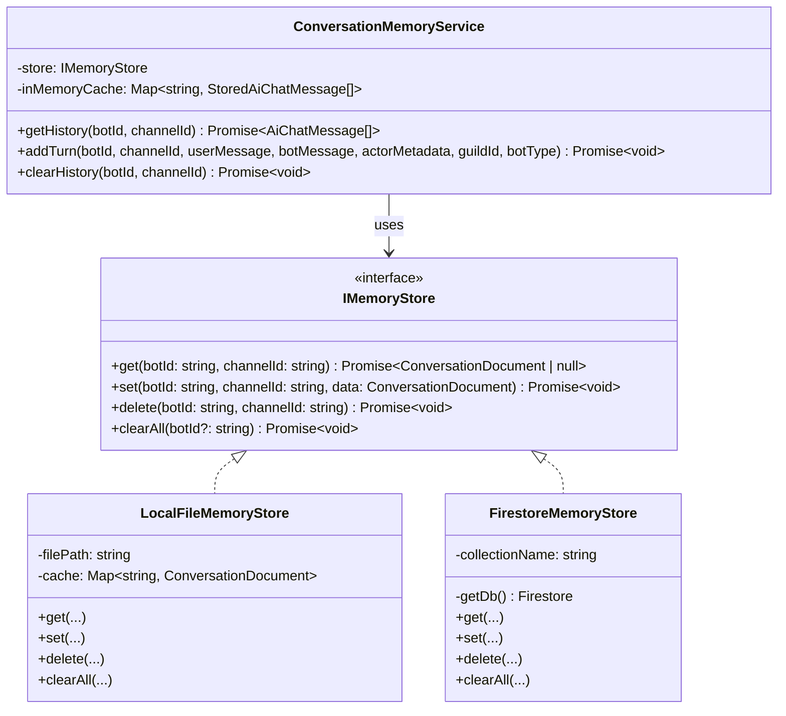
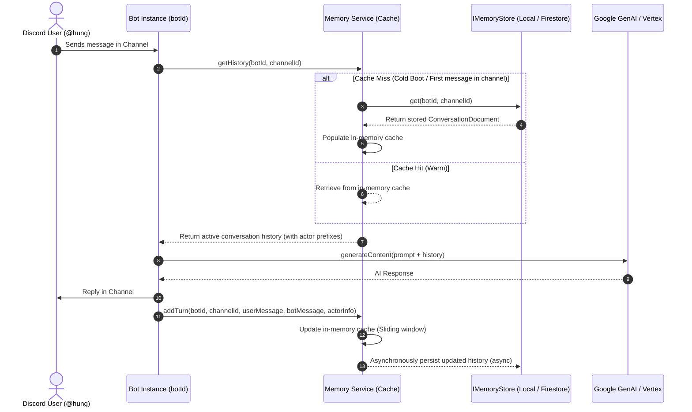

# Design Document: Persistent Conversation Memory (OMA-40)

**Issue**: [OMA-40: Persistent memory](https://linear.app/hungnguyendev/issue/OMA-40/persistent-memory)  
**Author**: Hung Nguyen  
**Status**: Proposed (Updated with Feedback)  
**Date**: 2026-08-26  

---

## 1. Overview & Problem Statement

### 1.1 Current Architecture & Limitations
The Discord bot currently manages conversational context in an in-memory Redux store (`app/src/features/chatbot.ts` and `app/src/store.ts`):
- `messageHistory: Record<string, AiChatMessage[]>` keyed by `channelId`.
- **Ephemeral State**: Whenever the bot process restarts (e.g., container redeployment, server reboot, crash recovery), all active channel conversation histories are wiped back to an empty state.
- **Aggressive & Abrupt Truncation**: When the message history exceeds 40 messages, it is abruptly truncated to the last 14 messages (`slice(-14)`), cutting the conversation context from 20 turns down to 7 turns without warning.
- **Fixed Hardcoded Capacity**: The context window is hardcoded in the reducer without ability to tune via Remote Config for modern large-context LLMs.
- **Lack of Structured Actor Identification**: Messages in memory only store `{ author: "bot" | "user", content: string }`, discarding structured actor metadata (user ID, username, display name) which limits multi-user conversation awareness and attribution in group channels.
- **No Bot Instance Isolation**: Previous models grouped state solely by bot type rather than by specific bot instances (`botId`), risking state collision if multiple bot instances share a channel or run under different bot credentials.

### 1.2 Objectives
1. **Persistence Across Reboots**: Persist conversation history so that context is retained across process restarts and deployments.
2. **Bot Instance Isolation (`botId`)**: Link memory to the specific **bot instance** (using its unique Discord application/user ID `client.user.id` or assigned `botId`) rather than just bot type, allowing multiple distinct bot instances of the same or different bot types to run with independent memory spaces.
3. **Pluggable Storage Abstraction (`IMemoryStore`)**: Support multiple storage backends with a clean abstraction:
   - **Local File Store (`LocalFileMemoryStore`)**: Default for local development (`NODE_ENV=development`), persisting to a local JSON file without requiring Firebase credentials or cloud connectivity.
   - **Cloud Firestore Store (`FirestoreMemoryStore`)**: For production deployments, using Google Cloud Firestore via Firebase Admin SDK.
   - **Configurability**: Configurable via `MEMORY_STORE_TYPE` environment variable (`local` | `firestore`) and Remote Config.
4. **Multi-User Actor Awareness**: Record user identity metadata (`userId`, `username`, `displayName`, `timestamp`) with every user turn to clearly distinguish actors in shared Discord channels.
5. **Increased & Configurable Memory Capacity**: Increase conversation memory capacity to leverage modern Gemini models' large context windows, with dynamic tuning via Firebase Remote Config.
6. **Smooth Sliding Window**: Transition from the abrupt 40-to-14 reduction to a smooth sliding window retention strategy (`slice(-maxHistory)`).
7. **Low Latency & High Resilience**: Ensure sub-millisecond in-memory access during continuous conversations with async background persistence and graceful fallback if storage is temporarily unreachable.

---

## 2. Architecture & Storage Abstraction

### 2.1 Storage Layer Abstraction (`IMemoryStore`)



#### Storage Implementations:
1. **`LocalFileMemoryStore` (Local Development Default)**:
   - Stores conversations in a local JSON file (e.g. `app/.data/conversations.json`).
   - Debounced asynchronous file writes with in-memory caching.
   - Keys documents by `${botId}_${channelId}`.
   - Enables full offline persistence during development and restarts without needing GCP/Firebase permissions.
2. **`FirestoreMemoryStore` (Production Default)**:
   - Persists to Google Cloud Firestore under collection `conversations` with document ID `${botId}_${channelId}`.
   - Leverages the initialized `firebase-admin` SDK credential (`serviceAccountKey`).
3. **Store Selection Strategy**:
   ```typescript
   export function getMemoryStoreType(): "local" | "firestore" {
     if (process.env.MEMORY_STORE_TYPE === "firestore") return "firestore";
     if (process.env.MEMORY_STORE_TYPE === "local") return "local";
     return process.env.NODE_ENV === "production" ? "firestore" : "local";
   }
   ```

---

### 2.2 Cache-Aside / Write-Through Hybrid Flow



---

## 3. Data Model & Multi-User Actor Identification

### 3.1 Bot Instance Partitioning & Actor-Aware Message Schema

**Storage Key / Document ID**: `${botId}_${channelId}` (e.g. `1087094723984572416_123456789012345678`)

```typescript
export interface StoredAiChatMessage {
  author: "bot" | "user";
  content: string; // The message text content
  userId?: string; // Discord User Snowflake ID (e.g. "123456789012345678")
  username?: string; // Discord Username (e.g. "hungnguyen")
  displayName?: string; // Guild Nickname or Display Name (e.g. "Hung")
  timestamp: number; // Unix timestamp in milliseconds
}

export interface ConversationDocument {
  botId: string; // Unique Discord User ID / Instance ID of the bot
  botType?: "chatBot" | "policeBot" | string;
  channelId: string;
  guildId?: string;
  messages: StoredAiChatMessage[];
  updatedAt: number | FirebaseFirestore.FieldValue;
  createdAt?: number | FirebaseFirestore.FieldValue;
}
```

### 3.2 Prompt Context Construction for Multi-Turn Chat
Gemini and Vertex AI multi-turn chat APIs accept messages with roles `"user"` and `"model"`:
- When converting `StoredAiChatMessage[]` into LLM history parts:
  - If `author === "user"`: The content passed to the model includes the speaker's attribution, e.g.:
    ```
    Hung (@hungnguyen): What was the score yesterday?
    ```
  - If `author === "bot"`: Passed directly as the model response.
- **Benefits**:
  1. **Disambiguation**: The model understands when User A asks a question and User B clarifies or follows up.
  2. **Persona & Instance Isolation**: Each bot instance maintains its own dedicated history, and display names/usernames are preserved across reboots.
  3. **Future Extensibility**: Enables per-user context filtering, user statistics, or personalized summaries.

---

## 4. Sliding Window & Configurable Limits

- **Configurable Limits**:
  - `aiMaxConversationHistory` added to `ConfigParameter` and `defaultConfig.json` (Default: `60` messages / 30 turns).
  - Can be adjusted via Firebase Remote Config in production without redeploying.
- **Smooth Sliding Window Pruning**:
  ```typescript
  const maxHistory = config.getConfigValue(ConfigParameter.aiMaxConversationHistory) || 60;
  if (messages.length > maxHistory) {
    const excess = messages.length - maxHistory;
    // Maintain turn alignment by pruning in pairs
    const pruneCount = excess % 2 === 0 ? excess : excess + 1;
    messages = messages.slice(pruneCount);
  }
  ```

---

## 5. Detailed Component Design & Integration

### 5.1 Service Interface (`ConversationMemoryService`)
Located in `app/src/services/memory.ts`:

```typescript
export interface UserActorInfo {
  userId: string;
  username: string;
  displayName: string;
}

export interface IConversationMemoryService {
  getHistory(botId: string, channelId: string): Promise<AiChatMessage[]>;
  
  addTurn(
    botId: string,
    channelId: string,
    userMessage: string,
    botMessage: string,
    actor?: UserActorInfo,
    guildId?: string,
    botType?: string
  ): Promise<void>;

  clearHistory(botId: string, channelId?: string): Promise<void>;
}
```

### 5.2 Bot Integration Points

1. **`app/src/bots/base-bot.ts`**:
   - Helper getter `this.botId` resolving `this.client.user?.id ?? "default-bot"`.
2. **`app/src/bots/chat-bot.ts`**:
   - In `handleMessageTimeout`:
     ```typescript
     const botId = this.client.user?.id || "chatBot";
     const history = await memoryService.getHistory(botId, channel.id);
     const prompt = { text: textWithUsername, files, history };
     ...
     await memoryService.addTurn(
       botId,
       channel.id,
       text,
       content || "?",
       {
         userId: lastMessage.authorId,
         username: lastMessage.authorUsername,
         displayName: lastMessage.authorDisplayName,
       },
       message.guildId ?? undefined,
       "chatBot"
     );
     ```
3. **`app/src/bots/police-bot/index.ts`**:
   - Integrated similarly using `this.client.user?.id || "policeBot"`.
4. **`app/src/discord/commands/checkIn/checkIn.ts`**:
   - Recorded via `memoryService.addTurn(interaction.client.user.id, interaction.channelId, prompt.text, content, { userId: interaction.user.id, username: interaction.user.username, displayName: interaction.user.displayName })`.
5. **`app/src/server/routes/utilityRouter.ts`**:
   - `/clearHistory` accepts `botId` (or channelId) to clear history in the active store (`LocalFileMemoryStore` or `FirestoreMemoryStore`).

---

## 6. Resilience & Error Handling

- **Storage Fault-Tolerance**: If local file I/O or Firestore read/writes fail, the error is logged and the in-memory cache continues serving chat traffic uninterrupted.
- **Graceful Initialization**: Local store automatically creates `.data/` directories if they do not exist; Firestore store lazily accesses `admin.firestore()`.
- **Environment Isolation**: Local development can run completely disconnected from cloud credentials with full persistence.

---

## 7. Verification & Testing Plan

1. **Automated Verification**:
   - `npx tsc --noEmit` to verify type safety across all storage classes, interfaces, and bot handlers.
   - Unit tests for `LocalFileMemoryStore`, `FirestoreMemoryStore`, and `ConversationMemoryService` (sliding window, actor attribution, cache-aside behavior).
2. **Manual Simulation**:
   - **Local Store Test**: Run in dev mode, chat with bot from multiple Discord users, restart bot, verify multi-user context is preserved per `botId` from `.data/conversations.json`.
   - **Firestore Store Test**: Test with `MEMORY_STORE_TYPE=firestore` to verify cloud document creation under `conversations/${botId}_${channelId}`.
   - **Multiple Instance Test**: Verify two bot instances in the same channel maintain distinct memories without collisions.
   - **Clear History Test**: Trigger `/utility/clearHistory` and verify memory reset across cache and persistent files/documents.
