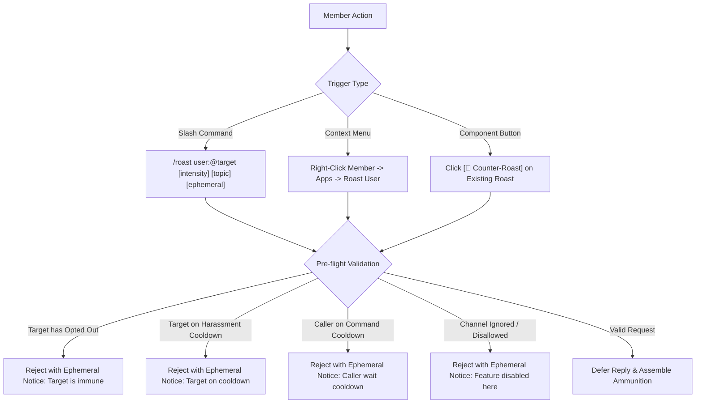
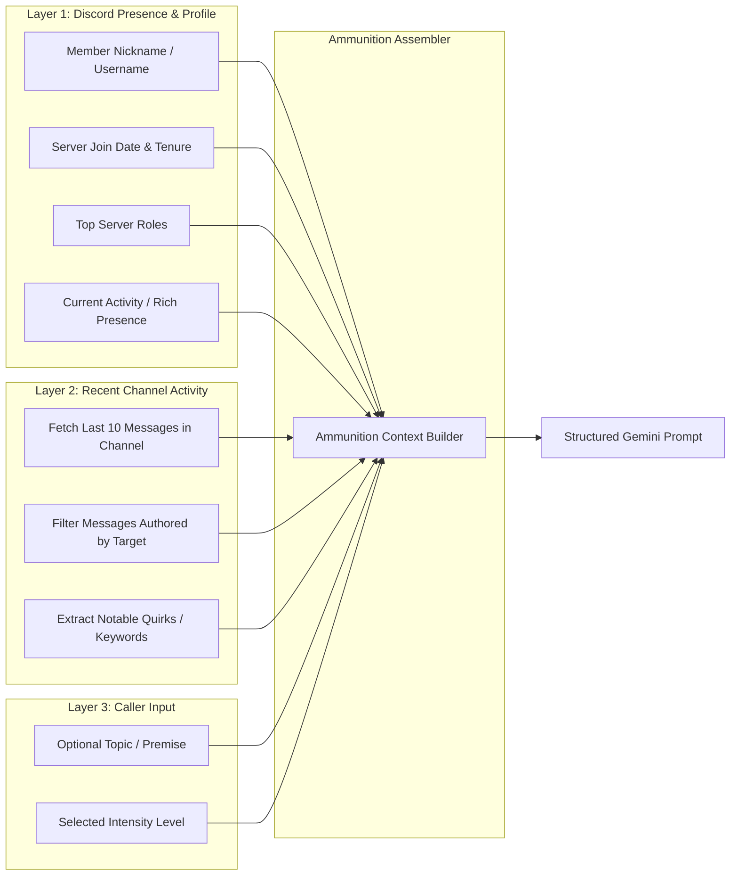
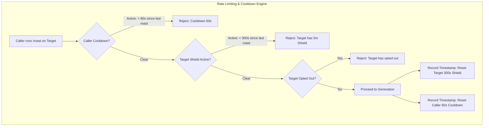
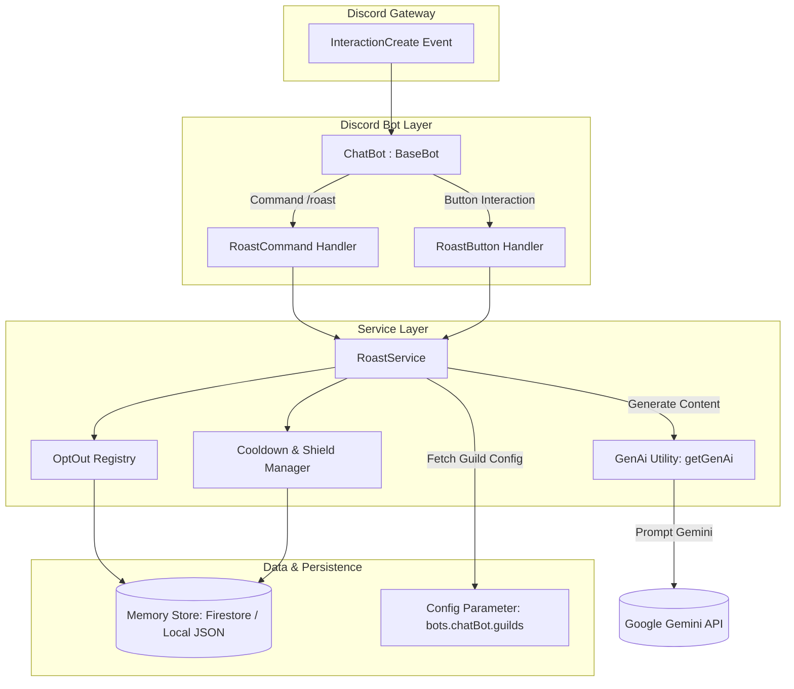
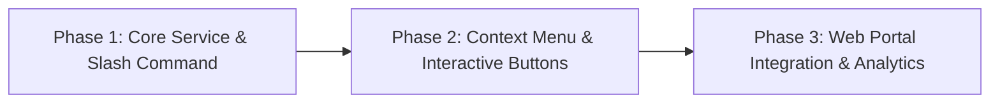

# Product requirements document: AI roast feature

**Status**: Proposed / Specification  
**Target platform**: `discord-bot` (Node.js 22, TypeScript 5, Discord.js v14, Google GenAI / Vertex AI Gemini)  

---

## 1. Executive summary and problem statement

### 1.1 Context and background
Discord gaming communities thrive on banter, friendly rivalries, and inside jokes. In competitive gaming sessions (such as Valorant custom matches or collaborative programming sessions), members frequently tease each other after funny blunders, missed skill shots, or eccentric chat remarks. 

Currently, the `discord-bot` platform supports structured utility commands (such as `/checkin`, `/checkin-report`, and `/ping`) and conversational AI capabilities via `ChatBot`. While `ChatBot` can converse and respond to queries, server members lack a dedicated, community-safe entertainment feature that can playfully roast a specific player on demand.

Manual teasing can unintentionally escalate into toxicity, or become repetitive. A managed AI roast command powered by Google GenAI (Gemini) offers witty, personalized comedic banter grounded in real channel context while enforcing anti-harassment safeguards and user consent.

### 1.2 Objectives and value proposition
The roast feature introduces an interactive, multi-modal comedic system within the `discord-bot` platform:
1. **Personalized contextual humor**: Rather than spitting generic internet insults, the bot analyzes the target's recent chat activity, server roles, join date, and custom status to produce clever, topical comedy.
2. **Three-tier intensity calibration**: Allows users to choose between `Mild` (gentle ribbing), `Medium` (sarcastic comedy club roast), and `Savage` (sharp burns), keeping the experience aligned with the room's mood.
3. **Robust anti-harassment and safety boundaries**: Hard system-level guardrails block hate speech, protected class targeting, real-life trauma, body shaming, and persistent harassment.
4. **Consent and opt-out controls**: Any member can opt out of being targeted (`/roast opt-out`), instantly granting total immunity.
5. **Interactive Discord UX**: Combines a slash command (`/roast`), a right-click context menu (`Apps > Roast User`), and interactive button components (`[🔥 Oof!]`, `[💀 Dead]`, `[🔄 Counter-Roast]`) that encourage collaborative laughs and comedic duels.

### 1.3 Non-goals
- The feature is not a moderation tool and will never issue administrative penalties, mutes, or warnings.
- The feature does not generate unprompted ambient roasts; every roast requires an explicit invocation by a server member.
- The feature will not store or leak private user data, direct messages, or deleted message history.

---

## 2. User personas and key user stories

### 2.1 Personas
- **The Banter Enthusiast (Gamer / Friend)**: Enjoys teasing teammates after a funny gaming misplay and wants the bot to deliver a witty, memorable burn in text chat.
- **The Self-Deprecating Member**: Wants to test the bot's wit by asking the bot to roast themselves after a self-acknowledged mistake.
- **The Privacy-Conscious Member**: Prefers not to be the target of bot-generated humor and wants an effortless, permanent opt-out mechanism.
- **The Community Moderator / Admin**: Wants assurance that bot roasts remain fun and safe, without causing member friction, toxicity, or Discord Terms of Service violations.

### 2.2 User stories
- **US-1: Slash command roast**: As a server member, I want to type `/roast @target` with an optional topic and intensity so that the bot posts a funny roast of my friend in the current channel.
- **US-2: Context menu quick roast**: As a mobile or desktop user, I want to right-click a user's avatar or message and select `Apps > Roast User` so that I can initiate a roast without typing full command parameters.
- **US-3: Counter-roast duel**: As the target of a roast, I want to click a `[🔄 Counter-Roast]` button on the bot's message so that the bot immediately generates a humorous comeback targeting the original instigator.
- **US-4: Self-roast**: As a user, I want to target myself with `/roast @myself` so that the bot roasts me with comedic self-deprecation or mock empathy.
- **US-5: Bot-roast reversal**: As a mischievous user, I want to target the bot with `/roast @Slavegon` so that the bot detects the attempt and immediately roasts me back for trying.
- **US-6: Opt-out protection**: As a user who dislikes teasing, I want to run `/roast opt-out` so that no other member can make the bot target me.

---

## 3. Product specifications and user experience

### 3.1 Interaction triggers



### 3.2 Slash command definition
The command is registered under the `roast` name:

```typescript
export enum CommandRoastOption {
  Target = "target",
  Intensity = "intensity",
  Topic = "topic",
  Ephemeral = "ephemeral",
}

export enum RoastIntensity {
  Mild = "mild",
  Medium = "medium",
  Savage = "savage",
}
```

- **Command**: `/roast`
- **Description**: "Playfully roast a server member with AI-powered comedy."
- **Options**:
  1. `target` (User, required): The server member to roast.
  2. `intensity` (String, optional, choices: `mild`, `medium`, `savage`, default: `medium`): The spiciness level of the roast.
  3. `topic` (String, optional): Specific ammunition or topic (for example, "missed every shot in overtime", "always 20 minutes late to standup", "forgot git commit -m").
  4. `ephemeral` (Boolean, optional, default: `false`): If `true`, the roast is sent only to the caller as an ephemeral message.

### 3.3 Context menu application command
- **Name**: `Roast User`
- **Type**: `ApplicationCommandType.User`
- **Behavior**: Acts as a shortcut to `/roast user:<clicked_user> intensity:medium ephemeral:false`.

### 3.4 Interactive message layout and buttons
Every public roast is posted as a styled Discord message with interactive action components:

```
🔥 **Slavegon's Roast on @target**
"They say patience is a virtue, which explains why @target's code reviews take four business days just to approve a typo fix. If their gaming reflexes were any slower, they'd be playing chess by postal mail."

*(Requested by @caller · Intensity: Savage · Topic: code reviews)*
[🔥 Oof! (12)]  [💀 Dead (8)]  [🔄 Counter-Roast]
```

- **`[🔥 Oof!]` button**: Increments a live reaction counter stored in memory, providing instant feedback without spamming chat reactions.
- **`[💀 Dead]` button**: Increments a secondary live reaction counter.
- **`[🔄 Counter-Roast]` button**:
  - Available only to the **target** of the original roast (or any member if configured for server-wide free-for-all).
  - Clicking this button immediately triggers a reverse roast targeting the original requester (`@caller`) with the same intensity tier.
  - Limits each roast message to a maximum of 2 counter-roast chain links to prevent infinite chat loops.

### 3.5 Opt-out management commands
- `/roast opt-out`: Adds the calling user to the guild's roast opt-out registry. Future roast attempts targeting this user are rejected before calling GenAI.
- `/roast opt-in`: Removes the caller from the opt-out registry, re-enabling playful participation.
- `/roast status`: Ephemerally displays whether the caller is currently opted in or out, and whether their harassment shield is active.

---

## 4. Context gathering and ammunition pipeline

To ensure roasts are creative and genuinely funny rather than canned or generic, the system gathers contextual ammunition across three layers.



### 4.1 Layer 1: Member profile and server identity
The bot extracts non-sensitive profile information from the cached `GuildMember`:
- **Display name and nickname history**: Nickname, global display name, and username.
- **Server tenure**: Duration since joining the guild (for example, "veteran member of 3 years" or "joined yesterday").
- **Prominent roles**: Top 3 non-administrative roles (for example, "Viper Main", "Frontend Dev", "Night Owl").
- **Current activity**: Game or custom status currently displayed in Discord Rich Presence (for example, "Playing Valorant for 6 hours straight").

### 4.2 Layer 2: Recent channel messages
Reusing the message fetching logic in `ChatBot.fetchRecentChannelActivity`, the system retrieves the last 15-20 messages in the active channel and isolates messages authored by the target:
- Samples the target's recent statements (up to 5 recent messages, truncated to 150 characters each).
- Identifies humorous themes such as recurring typos, complaints, excessive emoji usage, or self-reported misplays.
- Strips any user mentions, URLs, or potential credentials before passing to the AI prompt.

### 4.3 Layer 3: Caller topic and premise
If the caller supplied a `topic` argument (for example, "lost 5 ranked games in a row"), this premise is prioritized as the comedic focal point.

---

## 5. AI prompt engineering and intensity calibration

### 5.1 System persona (`Slavegon`)
The system instruction adopts the bot's established persona: a sharp-witted, sarcastic, yet fundamentally good-natured server assistant.

```
You are Slavegon, the witty and sarcastic Discord bot assistant of this server.
Your task is to write a comedy roast targeting a specific server member.

Core Guidelines:
1. Comedic Style: Think roast comedy, stand-up bantering, and clever wordplay. Be punchy, observant, and genuinely funny.
2. Directness: Deliver 1 to 3 punchy sentences (maximum 60 words). Never write long essays or rambling paragraphs.
3. Grounding: Incorporate the provided ammunition (recent messages, activity, roles, or topic) naturally so the roast feels tailored.
4. Output Format: Return only the roast text. Do not add conversational intros (like 'Here is your roast:'), quotes, or apologies.
```

### 5.2 Intensity calibrations

| Tier | Tone and style | Example output |
|---|---|---|
| **Mild** | Gentle ribbing, wholesome teasing, friendly banter. Suitable for any channel. | *"@alex has been in this server for three years and still asks where the voice channel is. We appreciate your consistency, if not your navigation skills."* |
| **Medium** *(Default)* | Classic stand-up roast style, sarcastic, witty burns targeting habits, gameplay, or coding quirks. | *"@chris plays support in games like he works in group projects: technically present, occasionally moving, but leaving everyone else to do the actual heavy lifting."* |
| **Savage** | Sharp, devastating comedy club burns. High bite, maximum comedic effect, while respecting safety guardrails. | *"@sam's commit history looks like a cry for help written by a cat walking across a keyboard. Even the linter gave up and closed the pull request itself."* |

### 5.3 Strictly prohibited safety boundaries
The system prompt contains unconditional negative constraints that align with Google GenAI safety thresholds and Discord Terms of Service:
- **Zero tolerance for hate speech**: Never mention or target race, ethnicity, nationality, religion, gender identity, sexual orientation, disability, or age.
- **No body shaming or physical appearance attacks**: All roasts must focus exclusively on actions, statements, habits, gaming performance, or server banter. Never attack physical looks or real-world health.
- **No doxxing or PII**: Never refer to real-world personal identity, location, offline workplace, or private personal relationships.
- **No encouragement of self-harm or violence**: Prohibit any statement suggesting physical harm, violence, or self-harm.
- **No sexual degradation or vulgar slurs**: Keep language clever rather than crude or sexually explicit.

### 5.4 Edge case handling

#### 5.4.1 Self-roast (`target === caller`)
When a member roasts themselves, the AI receives an adjusted instruction to celebrate their self-awareness with ironic, mock-supportive humor:
- *"We were going to roast you, @caller, but looking at your recent match record, it seems life already beat us to it. Stay strong."*

#### 5.4.2 Bot-roast reversal (`target === bot`)
If a member attempts to roast the bot, the system reverses the target and roasts the caller for trying to challenge software:
- *"Nice try, @caller. You're trying to out-roast an AI with infinite compute while you struggle to remember your own Discord password. Sit down."*

#### 5.4.3 Inactive target with zero chat history
If the target has no recent messages in the channel:
- The bot falls back gracefully to server tenure, roles, username puns, or the caller's explicit topic, without failing or hallucinating fake chat messages.

---

## 6. Safety, privacy, and abuse prevention



### 6.1 Harassment shield cooldown (300 seconds)
To prevent server pile-ons where multiple users spam roasts on the same individual:
- Once a member is roasted, an automated **Harassment Shield** activates for **300 seconds (5 minutes)**.
- Any subsequent roast attempt targeting that same member during this window is rejected with a clear ephemeral message:
  *"@target was recently roasted and is currently shielded (cooldown expires in 3m 42s). Give them a breather!"*

### 6.2 Caller rate limit (60 seconds)
- A caller may only invoke `/roast` once every **60 seconds**, preventing rapid-fire channel spam.

### 6.3 Opt-out registry
- Any member can opt out permanently using `/roast opt-out`.
- The opt-out preference is persisted in the guild's memory store (`IMemoryStore` local JSON or Firestore).
- If an opted-out user is targeted, the command fails immediately before any context gathering or AI token usage:
  *"@target has opted out of roasts. Respect their preference!"*

### 6.4 Guild configuration controls
Guild administrators can configure roast policies via `BotGuildConfig`:
- `enabled` (boolean): Master toggle for the roast feature in the guild.
- `allowedChannelIds` (string array): Limit roasts to designated fun channels (such as `#lounge`, `#bot-spam`).
- `ignoredChannelIds` (string array): Strictly prohibit roasts in serious channels (such as `#announcements`, `#help`).
- `maxIntensity` (`"mild" | "medium" | "savage"`): Allow server admins to cap the maximum allowable intensity tier.

---

## 7. System architecture and technical data contracts

### 7.1 Architecture overview



### 7.2 Configuration schema extensions
In `app/src/config/types.ts`:

```typescript
export interface RoastFeatureConfig {
  enabled?: boolean;
  maxIntensity?: "mild" | "medium" | "savage";
  allowedChannelIds?: string[];
  ignoredChannelIds?: string[];
  targetShieldCooldownSeconds?: number;
  callerCooldownSeconds?: number;
  allowCounterRoast?: boolean;
}

export interface BotGuildConfig {
  // Existing properties...
  roast?: RoastFeatureConfig;
}
```

### 7.3 Data models and interfaces
In `app/src/types.ts` or a dedicated `app/src/services/roast/types.ts`:

```typescript
export interface RoastRequest {
  guildId: string;
  channelId: string;
  caller: {
    id: string;
    username: string;
    displayName: string;
  };
  target: {
    id: string;
    username: string;
    displayName: string;
    nickname?: string | null;
    joinedAt?: Date | null;
    roles: string[];
    activity?: string | null;
  };
  intensity: "mild" | "medium" | "savage";
  topic?: string | null;
  isCounterRoast?: boolean;
}

export interface RoastResult {
  content: string;
  targetId: string;
  callerId: string;
  intensity: string;
  topic?: string | null;
  isCounterRoast: boolean;
}

export interface RoastReactionRecord {
  oofCount: number;
  deadCount: number;
  reactors: Set<string>;
}
```

### 7.4 Service components
1. **`RoastService` (`app/src/services/roast/index.ts`)**:
   - Manages pre-flight checks (channel eligibility, opt-out status, cooldown timers).
   - Coordinates context gathering from Discord member cache and channel message history.
   - Compiles the system instruction and user prompt.
   - Calls `generateChatMessageWithGenAi` and formats the final message with native Discord user mentions.
2. **`RoastCooldownManager` (`app/src/services/roast/cooldown.ts`)**:
   - In-memory sliding window tracking `lastRoastedAtByTarget: Map<string, number>` and `lastInvokedAtByCaller: Map<string, number>`.
3. **`RoastOptOutStore` (`app/src/services/roast/opt-out.ts`)**:
   - Persists opted-out user IDs using the existing `IMemoryStore` abstraction (Local JSON in development, Firestore in production).

---

## 8. Rollout strategy and success metrics

### 8.1 Phased implementation plan



- **Phase 1: Core engine and slash command**:
  - Implement `RoastService`, `RoastCooldownManager`, and opt-out registry.
  - Implement `/roast` slash command and unit tests.
  - Deploy guild commands using `deployCommands.ts`.
- **Phase 2: Context menu and interactive buttons**:
  - Add `Apps > Roast User` user context menu command.
  - Add interactive component buttons (`[🔥 Oof!]`, `[💀 Dead]`, `[🔄 Counter-Roast]`).
  - Wire button interaction handlers in `ChatBot.handleNewInteraction`.
- **Phase 3: Configuration and telemetry**:
  - Expose `roast` guild config parameters in the admin web portal (`web/`).
  - Monitor latency and safety refusal metrics.

### 8.2 Success metrics and key performance indicators
- **Engagement rate**: Number of daily `/roast` invocations per active guild.
- **Duel participation rate**: Percentage of roasts that receive a `[🔄 Counter-Roast]` response (target: > 25%).
- **Community sentiment and safety rate**: Less than 1% opt-out rate across guild members, and zero safety filter violations.
- **Latency performance**: 95th percentile latency from command invocation to final message edit under 3.5 seconds.
