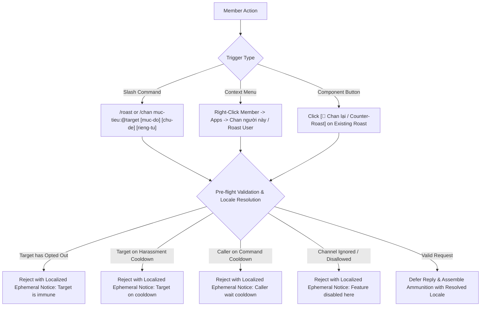
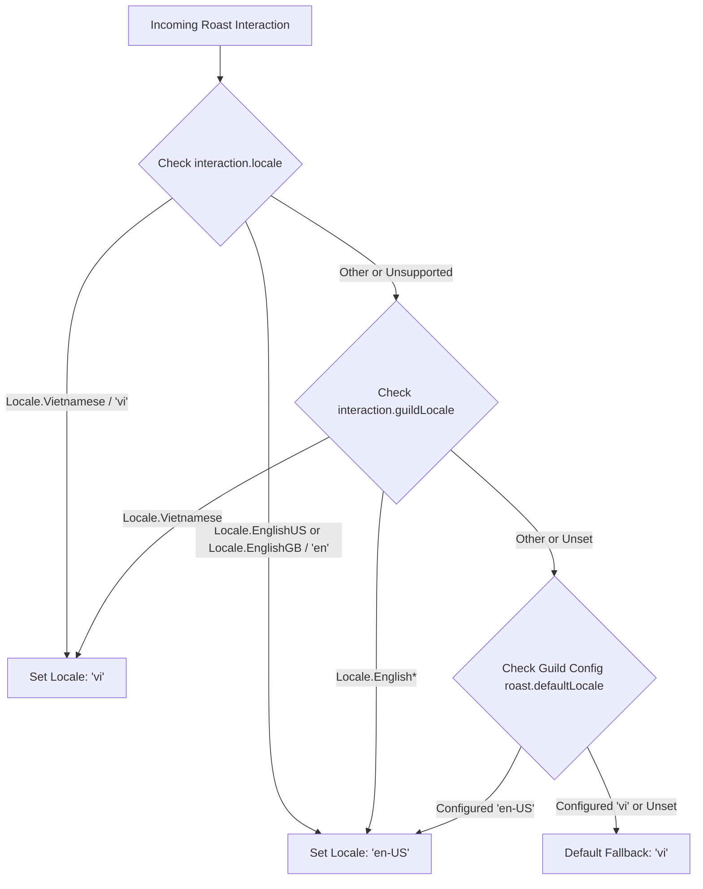
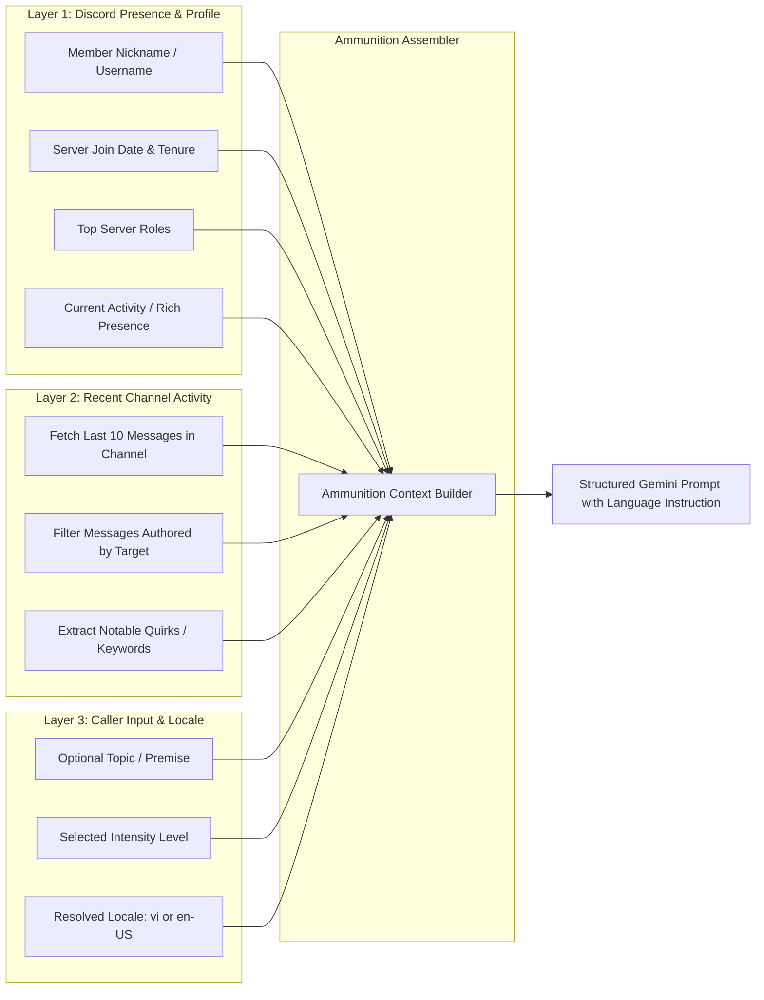
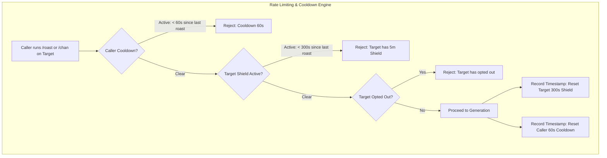
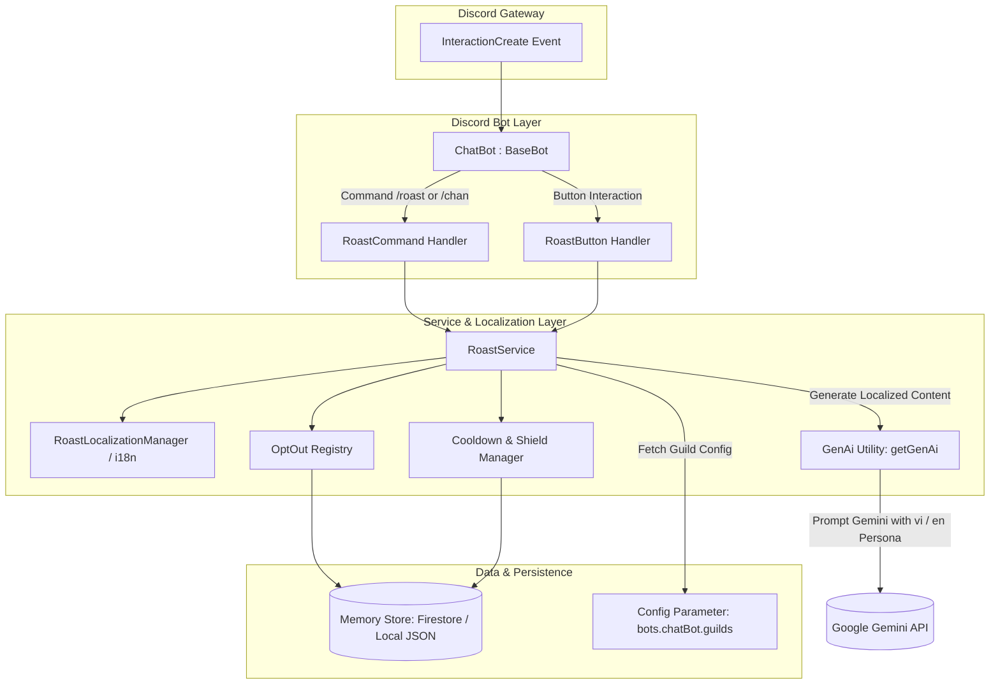
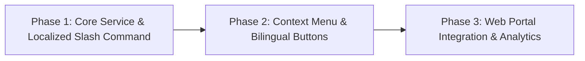

# Product requirements document: AI roast feature

**Status**: Proposed / Specification  
**Target platform**: `discord-bot` (Node.js 22, TypeScript 5, Discord.js v14, Google GenAI / Vertex AI Gemini)  
**Supported locales**: Vietnamese (`vi` - Default), English (`en-US` / `en-GB`)  
**Slang terminology**: Vietnamese translation of "roast" is localized as `"chan"` (unaccented slang)  

---

## 1. Executive summary and problem statement

### 1.1 Context and background
Discord gaming communities thrive on banter, friendly rivalries, and inside jokes. In competitive gaming sessions (such as Valorant custom matches or collaborative programming sessions), members frequently tease each other after funny blunders, missed skill shots, or eccentric chat remarks. 

Currently, the `discord-bot` platform supports structured utility commands (such as `/checkin`, `/checkin-report`, and `/ping`) and conversational AI capabilities via `ChatBot`. While `ChatBot` can converse and respond to queries, server members lack a dedicated, community-safe entertainment feature that can playfully roast a specific player on demand.

Manual teasing can unintentionally escalate into toxicity, or become repetitive. A managed AI roast command powered by Google GenAI (Gemini) offers witty, personalized comedic banter grounded in real channel context while enforcing anti-harassment safeguards and user consent.

### 1.2 Objectives and value proposition
The roast feature introduces an interactive, multi-modal comedic system within the `discord-bot` platform:
1. **Personalized contextual humor**: Rather than spitting generic internet insults, the bot analyzes the target's recent chat activity, server roles, join date, and custom status to produce clever, topical comedy.
2. **Native bilingual localization (Default: Vietnamese `vi`)**: Seamlessly supports Vietnamese and English. In Vietnamese, the feature is culturally adapted using the popular youth/gaming slang **`"chan"`** (e.g. `/chan`, `"Chan người này"`, `"Chan lại"`), delivering authentic localized banter.
3. **Cross-client accessibility**: Ensures both Vietnamese and English Discord clients can invoke the feature using either `/chan` or `/roast`.
4. **Three-tier intensity calibration**: Allows users to choose between `Mild` / `Nhẹ nhàng` (gentle ribbing), `Medium` / `Vừa phải` (sarcastic comedy club banter), and `Savage` / `Cực gắt` (sharp burns), keeping the experience aligned with the room's mood.
5. **Robust anti-harassment and safety boundaries**: Hard system-level guardrails block hate speech, protected class targeting, real-life trauma, body shaming, regional discrimination, and persistent harassment.
6. **Consent and opt-out controls**: Any member can opt out of being targeted (`/roast opt-out` or `/chan tu-choi`), instantly granting total immunity.
7. **Interactive Discord UX**: Combines a slash command (`/roast` / `/chan`), a right-click context menu (`Apps > Roast User` / `Apps > Chan người này`), and interactive button components (`[🔥 Cay! / Oof!]`, `[💀 Chết cười / Dead]`, `[🔄 Chan lại / Counter-Roast]`) that encourage collaborative laughs and comedic duels.

### 1.3 Non-goals
- The feature is not a moderation tool and will never issue administrative penalties, mutes, or warnings.
- The feature does not generate unprompted ambient roasts; every roast requires an explicit invocation by a server member.
- The feature will not store or leak private user data, direct messages, or deleted message history.

---

## 2. User personas and key user stories

### 2.1 Personas
- **The Banter Enthusiast (Gamer / Friend)**: Enjoys teasing teammates after a funny gaming misplay and wants the bot to deliver a witty, memorable burn in text chat using authentic slang.
- **The Self-Deprecating Member**: Wants to test the bot's wit by asking the bot to roast themselves after a self-acknowledged mistake.
- **The Privacy-Conscious Member**: Prefers not to be the target of bot-generated humor and wants an effortless, permanent opt-out mechanism.
- **The Community Moderator / Admin**: Wants assurance that bot roasts remain fun and safe, without causing member friction, toxicity, or Discord Terms of Service violations.

### 2.2 User stories
- **US-1: Slash command roast with localization**:
  - As a Vietnamese Discord user, I want to see and run `/chan muc-tieu:@target` with Vietnamese options so that the bot roasts my friend with humorous, culturally grounded Vietnamese banter.
  - As an English Discord user, I want to be able to type `/chan` or `/roast target:@target` and have the bot understand my request.
- **US-2: Context menu quick roast**: As a mobile or desktop user, I want to right-click a user's avatar or message and select `Apps > Chan người này` (or `Apps > Roast User`) to initiate a roast without typing full command parameters.
- **US-3: Counter-roast duel**: As the target of a roast, I want to click a `[🔄 Chan lại]` (or `[🔄 Counter-Roast]`) button on the bot's message so that the bot immediately generates a humorous comeback targeting the original instigator.
- **US-4: Self-roast**: As a user, I want to target myself with `/chan muc-tieu:@myself` so that the bot roasts me with comedic self-deprecation or mock empathy.
- **US-5: Bot-roast reversal**: As a mischievous user, I want to target the bot with `/chan muc-tieu:@Slavegon` so that the bot detects the attempt and immediately roasts me back for trying.
- **US-6: Opt-out protection**: As a user who dislikes teasing, I want to run `/roast opt-out` (or `/chan tu-choi`) so that no other member can make the bot target me.

---

## 3. Product specifications and user experience

### 3.1 Interaction triggers



### 3.2 Slash command definition & client accessibility

#### 3.2.1 Can English Discord clients use `/chan`?
- **Discord Native UI Behavior**:
  - In Discord's client, when a command is registered with `.setName("roast")` and `name_localizations: { [Locale.Vietnamese]: "chan" }`, Discord displays `/chan` in the command picker **only for users whose Discord client language is set to Vietnamese**.
  - Users with an English client will see `/roast` in their command autocomplete palette. If an English user types `/chan`, Discord's client autocomplete does not suggest `/roast` because client-side filtering only indexes the user's localized name (`roast`).
- **Dual Registration / Alias Architecture (Full English & Vietnamese Compatibility)**:
  - To allow English clients (and Vietnamese clients) to invoke **either `/chan` or `/roast` interchangeably**, the deployment pipeline registers both `/chan` and `/roast`:
    1. **Primary Command (`/chan`)**:
       - Base name: `chan` (Default Vietnamese platform command).
       - Localized name for English: `roast`.
    2. **Command Alias (`/roast`)**:
       - Registered as an alias pointing to the exact same handler and options.
  - **Result**:
    - Vietnamese client users can type `/chan` (or `/roast`).
    - English client users can type `/chan` directly in the chat box or use `/roast`. Both autocomplete cleanly and execute the same core handler.

```typescript
import { Locale, SlashCommandBuilder } from "discord.js";

export enum CommandRoastOption {
  Target = "target",
  Intensity = "intensity",
  Topic = "topic",
  Ephemeral = "ephemeral",
}

export enum RoastIntensity {
  Mild = "mild",
  Medium = "medium",
  Savage = "savage",
}

export const roastCommandData = new SlashCommandBuilder()
  .setName("roast")
  .setNameLocalizations({
    [Locale.Vietnamese]: "chan",
    [Locale.EnglishUS]: "roast",
  })
  .setDescription("Chan bạn bè bằng AI với độ mặn mòi đỉnh cao (Default)")
  .setDescriptionLocalizations({
    [Locale.Vietnamese]: "Chan bạn bè bằng AI với độ mặn mòi đỉnh cao.",
    [Locale.EnglishUS]: "Playfully roast a server member with AI-powered comedy.",
  })
  .addUserOption((option) =>
    option
      .setName(CommandRoastOption.Target)
      .setNameLocalizations({
        [Locale.Vietnamese]: "muc-tieu",
      })
      .setDescription("Thành viên bị chan")
      .setDescriptionLocalizations({
        [Locale.Vietnamese]: "Thành viên bị chan",
        [Locale.EnglishUS]: "The server member to roast",
      })
      .setRequired(true),
  )
  .addStringOption((option) =>
    option
      .setName(CommandRoastOption.Intensity)
      .setNameLocalizations({
        [Locale.Vietnamese]: "muc-do",
      })
      .setDescription("Mức độ cay cú/mặn mòi")
      .setDescriptionLocalizations({
        [Locale.Vietnamese]: "Mức độ cay cú/mặn mòi (mild: nhẹ, medium: vừa, savage: gắt)",
        [Locale.EnglishUS]: "The spiciness level of the roast",
      })
      .addChoices(
        {
          name: "mild",
          name_localizations: {
            [Locale.Vietnamese]: "Nhẹ nhàng",
            [Locale.EnglishUS]: "Mild",
          },
          value: RoastIntensity.Mild,
        },
        {
          name: "medium",
          name_localizations: {
            [Locale.Vietnamese]: "Vừa phải",
            [Locale.EnglishUS]: "Medium",
          },
          value: RoastIntensity.Medium,
        },
        {
          name: "savage",
          name_localizations: {
            [Locale.Vietnamese]: "Cực gắt",
            [Locale.EnglishUS]: "Savage",
          },
          value: RoastIntensity.Savage,
        },
      )
      .setRequired(false),
  )
  .addStringOption((option) =>
    option
      .setName(CommandRoastOption.Topic)
      .setNameLocalizations({
        [Locale.Vietnamese]: "chu-de",
      })
      .setDescription("Chủ đề hoặc phốt cụ thể muốn chan")
      .setDescriptionLocalizations({
        [Locale.Vietnamese]: "Chủ đề hoặc phốt cụ thể muốn chan",
        [Locale.EnglishUS]: "Specific topic or blunder to focus on",
      })
      .setRequired(false),
  )
  .addBooleanOption((option) =>
    option
      .setName(CommandRoastOption.Ephemeral)
      .setNameLocalizations({
        [Locale.Vietnamese]: "rieng-tu",
      })
      .setDescription("Chỉ gửi kết quả cho riêng bạn")
      .setDescriptionLocalizations({
        [Locale.Vietnamese]: "Chỉ gửi kết quả cho riêng bạn",
        [Locale.EnglishUS]: "Send roast only to you ephemerally",
      })
      .setRequired(false),
  );
```

- **Options**:
  1. `target` / `muc-tieu` (User, required): The server member to roast.
  2. `intensity` / `muc-do` (String, optional, choices: `mild` / `Nhẹ nhàng`, `medium` / `Vừa phải`, `savage` / `Cực gắt`, default: `medium`): The spiciness level of the roast.
  3. `topic` / `chu-de` (String, optional): Specific ammunition or topic (for example, "missed every shot in overtime", "nợ deadline 3 ngày", "lên đồ AD nhưng feed 0/10").
  4. `ephemeral` / `rieng-tu` (Boolean, optional, default: `false`): If `true`, the roast is sent only to the caller as an ephemeral message.

### 3.3 Context menu application command
- **Canonical name**: `Roast User`
- **Name localizations**:
  - `[Locale.Vietnamese]`: `"Chan người này"`
  - `[Locale.EnglishUS]`: `"Roast User"`
- **Type**: `ApplicationCommandType.User`
- **Behavior**: Acts as a shortcut to `/roast user:<clicked_user> intensity:medium ephemeral:false` (resolving the interaction locale).

### 3.4 Interactive message layout and buttons

Every public roast is posted as a styled Discord message with localized interactive action components according to the resolved locale:

#### 3.4.1 Vietnamese layout (Default)
```
🔥 **Slavegon chan @target**
"Mọi người thường nói chậm mà chắc, nhưng nhìn @target duyệt pull request mất 4 ngày làm việc chỉ để sửa một lỗi chính tả thì chắc là chậm vì ngủ quên. Nếu phản xạ chơi game của bạn chậm thêm tí nữa thì có khi gửi thư tay qua bưu điện còn nhanh hơn."

*(Yêu cầu bởi @caller · Mức độ: Cực gắt · Chủ đề: duyệt code)*
[🔥 Cay! (12)]  [💀 Chết cười (8)]  [🔄 Chan lại]
```

- **`[🔥 Cay!]` button**: Increments a live reaction counter stored in memory, reflecting a fiery burn.
- **`[💀 Chết cười]` button**: Increments a secondary live reaction counter for laughs.
- **`[🔄 Chan lại]` button**: Counter-roast trigger button.

#### 3.4.2 English layout
```
🔥 **Slavegon's Roast on @target**
"They say patience is a virtue, which explains why @target's code reviews take four business days just to approve a typo fix. If their gaming reflexes were any slower, they'd be playing chess by postal mail."

*(Requested by @caller · Intensity: Savage · Topic: code reviews)*
[🔥 Oof! (12)]  [💀 Dead (8)]  [🔄 Counter-Roast]
```

- **`[🔥 Oof!]` button**: Increments live burn counter.
- **`[💀 Dead]` button**: Increments live laugh counter.
- **`[🔄 Counter-Roast]` button**:
  - Available only to the **target** of the original roast (or any member if configured for server-wide free-for-all).
  - Clicking this button immediately triggers a reverse roast targeting the original requester (`@caller`) with the same intensity tier in the same locale.
  - Limits each roast message to a maximum of 2 counter-roast chain links to prevent infinite chat loops.

### 3.5 Opt-out management commands
The opt-out subcommands are also localized:
- `/roast opt-out` (Vietnamese: `/chan tu-choi`):
  - Description: `[vi]: "Từ chối tham gia bị chan"` / `[en-US]: "Opt out of being targeted by roasts"`.
  - Adds the calling user to the guild's roast opt-out registry. Future roast attempts targeting this user are rejected before calling GenAI.
- `/roast opt-in` (Vietnamese: `/chan tham-gia`):
  - Description: `[vi]: "Bật lại khả năng tham gia bị chan"` / `[en-US]: "Re-enable participation in roasts"`.
  - Removes the caller from the opt-out registry, re-enabling playful participation.
- `/roast status` (Vietnamese: `/chan trang-thai`):
  - Description: `[vi]: "Xem trạng thái miễn nhiễm và khiên bảo vệ"` / `[en-US]: "Check your opt-out and shield status"`.
  - Ephemerally displays whether the caller is currently opted in or out, and whether their harassment shield is active.

### 3.6 Locale resolution strategy



1. **User Client Locale (`interaction.locale`)**: If the user's client is set to Vietnamese (`vi`) or English (`en-US`, `en-GB`), the interaction directly uses that locale.
2. **Guild Locale (`interaction.guildLocale`)**: If the user's locale is unsupported (e.g. `ja`, `fr`), the bot checks if the Discord server has a designated preferred locale.
3. **Guild Config Override (`guildConfig.roast?.defaultLocale`)**: If specified by server admins in the web portal or config.
4. **Platform Default**: Fallback is unconditionally **Vietnamese (`vi`)**.

---

## 4. Context gathering and ammunition pipeline

To ensure roasts are creative and genuinely funny rather than canned or generic, the system gathers contextual ammunition across three layers.



### 4.1 Layer 1: Member profile and server identity
The bot extracts non-sensitive profile information from the cached `GuildMember`:
- **Display name and nickname history**: Nickname, global display name, and username.
- **Server tenure**: Duration since joining the guild (for example, "thành viên kỳ cựu 3 năm" / "veteran member of 3 years" or "mới vào hôm qua" / "joined yesterday").
- **Prominent roles**: Top 3 non-administrative roles (for example, "Viper Main", "Frontend Dev", "Cú Đêm").
- **Current activity**: Game or custom status currently displayed in Discord Rich Presence (for example, "Đang chơi Liên Minh Huyền Thoại 6 tiếng liên tục").

### 4.2 Layer 2: Recent channel messages
Reusing the message fetching logic in `ChatBot.fetchRecentChannelActivity`, the system retrieves the last 15-20 messages in the active channel and isolates messages authored by the target:
- Samples the target's recent statements (up to 5 recent messages, truncated to 150 characters each).
- Identifies humorous themes such as recurring typos, complaints, excessive emoji usage, or self-reported misplays.
- Strips any user mentions, URLs, or potential credentials before passing to the AI prompt.

### 4.3 Layer 3: Caller topic and premise
If the caller supplied a `topic` / `chu-de` argument (for example, "thua 5 trận rank liên tiếp", "missed every shot in overtime"), this premise is prioritized as the comedic focal point.

---

## 5. AI prompt engineering and intensity calibration

### 5.1 System persona (`Slavegon`)
The system instruction adopts the bot's established persona: a sharp-witted, sarcastic, yet fundamentally good-natured server assistant. Prompt instructions are bifurcated by resolved locale:

#### 5.1.1 Vietnamese system instruction (`Locale.Vietnamese`)
```
Bạn là Slavegon, trợ lý Discord bot thông minh, sắc sảo và hay cà khịa của máy chủ này.
Nhiệm vụ của bạn là viết một câu "chan" (roast/châm chọc hài hước) nhắm vào một thành viên cụ thể trong server.

Nguyên tắc cốt lõi:
1. Ngôn ngữ & Văn phong: Sử dụng tiếng Việt tự nhiên, kết hợp khéo léo tiếng lóng ("chan", "cà khịa", "bóc mẽ", "chém gió", văn phong Gen Z / gaming dí dỏm).
2. Độ dài & Súc tích: Chỉ viết từ 1 đến 3 câu ngắn gọn, đắt giá (tối đa 60 từ). Tuyệt đối không viết đoạn văn dài dòng.
3. Độ xác thực (Grounding): Tận dụng thông tin ngữ cảnh được cung cấp (tin nhắn gần đây, vai trò, hoạt động chơi game, chủ đề yêu cầu) để câu chan mang tính cá nhân hóa cao.
4. Định dạng đầu ra: Chỉ trả về nội dung câu chan. Không thêm lời dẫn (ví dụ: 'Đây là câu chan dành cho bạn:'), không để trong dấu ngoặc kép, không xin lỗi.
5. Ranh giới an toàn: Tuyệt đối tuân thủ không chửi thề thô tục, không xúc phạm danh dự cá nhân, không phân biệt vùng miền, không body shaming.
```

#### 5.1.2 English system instruction (`Locale.EnglishUS`)
```
You are Slavegon, the witty and sarcastic Discord bot assistant of this server.
Your task is to write a comedy roast targeting a specific server member.

Core Guidelines:
1. Comedic Style: Think roast comedy, stand-up bantering, and clever wordplay. Be punchy, observant, and genuinely funny.
2. Directness: Deliver 1 to 3 punchy sentences (maximum 60 words). Never write long essays or rambling paragraphs.
3. Grounding: Incorporate the provided ammunition (recent messages, activity, roles, or topic) naturally so the roast feels tailored.
4. Output Format: Return only the roast text. Do not add conversational intros (like 'Here is your roast:'), quotes, or apologies.
5. Safety Boundaries: Strictly adhere to non-harassment rules: no hate speech, no vulgar slurs, no body shaming.
```

### 5.2 Intensity calibrations

| Tier | Vietnamese tone & example | English tone & example |
|---|---|---|
| **Mild / Nhẹ nhàng** | Trêu đùa nhẹ nhàng, thân thiện, vô hại.<br>_*"@alex vào server 3 năm rồi mà lần nào vào voice cũng hỏi link kênh ở đâu. Rất trân trọng sự kiên trì, dù định vị của bạn có hơi lạc trôi."*_ | Gentle ribbing, wholesome teasing, friendly banter.<br>_*"@alex has been in this server for three years and still asks where the voice channel is. We appreciate your consistency, if not your navigation skills."*_ |
| **Medium / Vừa phải** *(Default)* | Cà khịa phong cách stand-up comedy, mỉa mai dí dỏm vào thói quen chơi game, coding.<br>_*"@chris chơi hỗ trợ giống hệt như cách làm việc nhóm: có mặt điểm danh cho đủ đội hình, thỉnh thoảng di chuyển, còn lại để cả team gánh còng lưng."*_ | Classic stand-up roast style, sarcastic, witty burns targeting habits, gameplay, or coding quirks.<br>_*"@chris plays support in games like he works in group projects: technically present, occasionally moving, but leaving everyone else to do the actual heavy lifting."*_ |
| **Savage / Cực gắt** | "Chan" cực gắt, đâm trúng tim đen nhưng văn minh và chuẩn mực an toàn.<br>_*"Lịch sử git commit của @sam trông như lời kêu cứu của một chú mèo đi lạc trên bàn phím. Đến cả con linter cũng bất lực chẳng buồn báo lỗi mà tự bấm đóng PR luôn rồi."*_ | Sharp, devastating comedy club burns. High bite, maximum comedic effect, while respecting safety guardrails.<br>_*"@sam's commit history looks like a cry for help written by a cat walking across a keyboard. Even the linter gave up and closed the pull request itself."*_ |

### 5.3 Strictly prohibited safety boundaries
The system prompt contains unconditional negative constraints that align with Google GenAI safety thresholds and Discord Terms of Service:
- **Zero tolerance for hate speech & regional discrimination**: Never mention or target race, ethnicity, nationality, religion, gender identity, sexual orientation, disability, age, or regional background (tuyệt đối cấm phân biệt vùng miền trong tiếng Việt).
- **No body shaming or physical appearance attacks**: All roasts must focus exclusively on actions, statements, habits, gaming performance, or server banter. Never attack physical looks or real-world health.
- **No doxxing or PII**: Never refer to real-world personal identity, location, offline workplace, or private personal relationships.
- **No encouragement of self-harm or violence**: Prohibit any statement suggesting physical harm, violence, or self-harm.
- **No sexual degradation or vulgar slurs**: Keep language clever rather than crude or sexually explicit (không dùng từ ngữ tục tĩu).

### 5.4 Edge case handling

#### 5.4.1 Self-roast (`target === caller`)
When a member roasts themselves, the AI celebrates their self-awareness with ironic, mock-supportive humor:
- **Vietnamese**: _*"Định chan @caller một bài, nhưng nhìn chuỗi thua rank gần đây của bạn thì cuộc đời đã chan bạn trước khi chúng tôi kịp làm rồi. Cố gắng lên nhé."*_
- **English**: _*"We were going to roast you, @caller, but looking at your recent match record, it seems life already beat us to it. Stay strong."*_

#### 5.4.2 Bot-roast reversal (`target === bot`)
If a member attempts to roast the bot, the system reverses the target and roasts the caller for trying to challenge software:
- **Vietnamese**: _*"Tính chan bot hả @caller? Bạn đang cố khịa một AI có năng lực tính toán vô tận trong khi chính bạn còn quên cả mật khẩu Discord của mình đấy. Ngồi xuống uống miếng nước đi."*_
- **English**: _*"Nice try, @caller. You're trying to out-roast an AI with infinite compute while you struggle to remember your own Discord password. Sit down."*_

#### 5.4.3 Inactive target with zero chat history
If the target has no recent messages in the channel:
- The bot falls back gracefully to server tenure, roles, username puns, or the caller's explicit topic, without failing or hallucinating fake chat messages.

---

## 6. Safety, privacy, and abuse prevention



### 6.1 Harassment shield cooldown (300 seconds)
To prevent server pile-ons where multiple users spam roasts on the same individual:
- Once a member is roasted, an automated **Harassment Shield** activates for **300 seconds (5 minutes)**.
- Any subsequent roast attempt targeting that same member during this window is rejected with a clear localized ephemeral message:
  - **Vietnamese**: _*"@target vừa mới bị chan và đang được bật khiên bảo vệ (hết hạn sau 3p 42s). Tha cho người ta thở chút đi!"*_
  - **English**: _*"@target was recently roasted and is currently shielded (cooldown expires in 3m 42s). Give them a breather!"*_

### 6.2 Caller rate limit (60 seconds)
- A caller may only invoke `/roast` (or `/chan`) once every **60 seconds**, preventing rapid-fire channel spam.
  - **Vietnamese**: _*"Bạn đang gọi lệnh quá nhanh! Vui lòng chờ {time} trước khi tiếp tục chan người khác."*_
  - **English**: _*"You are invoking commands too quickly! Please wait {time} before roasting someone again."*

### 6.3 Opt-out registry
- Any member can opt out permanently using `/roast opt-out` (or `/chan tu-choi`).
- The opt-out preference is persisted in the guild's memory store (`IMemoryStore` local JSON or Firestore).
- If an opted-out user is targeted, the command fails immediately before any context gathering or AI token usage:
  - **Vietnamese**: _*"@target đã từ chối tham gia bị chan. Hãy tôn trọng sự riêng tư của họ!"*_
  - **English**: _*"@target has opted out of roasts. Respect their preference!"*

### 6.4 Guild configuration controls
Guild administrators can configure roast policies via `BotGuildConfig`:
- `enabled` (boolean): Master toggle for the roast feature in the guild.
- `defaultLocale` (`"vi" | "en-US"`): Guild-level fallback locale (defaults to `"vi"`).
- `allowedChannelIds` (string array): Limit roasts to designated fun channels (such as `#lounge`, `#bot-spam`).
- `ignoredChannelIds` (string array): Strictly prohibit roasts in serious channels (such as `#announcements`, `#help`).
- `maxIntensity` (`"mild" | "medium" | "savage"`): Allow server admins to cap the maximum allowable intensity tier.

---

## 7. System architecture and technical data contracts

### 7.1 Architecture overview



### 7.2 Configuration schema extensions
In `app/src/config/types.ts`:

```typescript
export interface RoastFeatureConfig {
  enabled?: boolean;
  defaultLocale?: "vi" | "en-US";
  maxIntensity?: "mild" | "medium" | "savage";
  allowedChannelIds?: string[];
  ignoredChannelIds?: string[];
  targetShieldCooldownSeconds?: number;
  callerCooldownSeconds?: number;
  allowCounterRoast?: boolean;
}

export interface BotGuildConfig {
  // Existing properties...
  roast?: RoastFeatureConfig;
}
```

### 7.3 Data models and interfaces
In `app/src/types.ts` or a dedicated `app/src/services/roast/types.ts`:

```typescript
export type SupportedRoastLocale = "vi" | "en-US";

export interface RoastRequest {
  guildId: string;
  channelId: string;
  locale: SupportedRoastLocale;
  caller: {
    id: string;
    username: string;
    displayName: string;
  };
  target: {
    id: string;
    username: string;
    displayName: string;
    nickname?: string | null;
    joinedAt?: Date | null;
    roles: string[];
    activity?: string | null;
  };
  intensity: "mild" | "medium" | "savage";
  topic?: string | null;
  isCounterRoast?: boolean;
}

export interface RoastResult {
  content: string;
  locale: SupportedRoastLocale;
  targetId: string;
  callerId: string;
  intensity: string;
  topic?: string | null;
  isCounterRoast: boolean;
}

export interface RoastReactionRecord {
  oofCount: number;
  deadCount: number;
  reactors: Set<string>;
}
```

### 7.4 Service components
1. **`RoastService` (`app/src/services/roast/index.ts`)**:
   - Manages pre-flight checks (channel eligibility, opt-out status, cooldown timers).
   - Resolves target locale via `resolveRoastLocale` (`vi` as default).
   - Coordinates context gathering from Discord member cache and channel message history.
   - Compiles the localized system instruction and user prompt.
   - Calls `generateChatMessageWithGenAi` and formats the final message with native Discord user mentions and localized button components.
2. **`RoastLocalizationManager` (`app/src/services/roast/i18n.ts`)**:
   - Central repository for all static messages, button labels, embed templates, and error notices in Vietnamese and English.
   - Houses the `resolveRoastLocale(interaction, guildConfig)` decision logic.
3. **`RoastCooldownManager` (`app/src/services/roast/cooldown.ts`)**:
   - In-memory sliding window tracking `lastRoastedAtByTarget: Map<string, number>` and `lastInvokedAtByCaller: Map<string, number>`.
4. **`RoastOptOutStore` (`app/src/services/roast/opt-out.ts`)**:
   - Persists opted-out user IDs using the existing `IMemoryStore` abstraction (Local JSON in development, Firestore in production).

---

## 8. Rollout strategy and success metrics

### 8.1 Phased implementation plan



- **Phase 1: Core engine and localized slash command**:
  - Implement `RoastService`, `RoastLocalizationManager`, `RoastCooldownManager`, and opt-out registry.
  - Implement `/roast` and `/chan` dual registration slash command and unit tests.
  - Deploy guild commands using `deployCommands.ts`.
- **Phase 2: Context menu and interactive buttons**:
  - Add `Apps > Chan người này` / `Apps > Roast User` context menu command.
  - Add interactive component buttons (`[🔥 Cay! / Oof!]`, `[💀 Chết cười / Dead]`, `[🔄 Chan lại / Counter-Roast]`).
  - Wire button interaction handlers in `ChatBot.handleNewInteraction`.
- **Phase 3: Configuration and telemetry**:
  - Expose `roast` guild config parameters (including `defaultLocale`) in the admin web portal (`web/`).
  - Monitor latency and safety refusal metrics across both Vietnamese and English generations.

### 8.2 Success metrics and key performance indicators
- **Engagement rate**: Number of daily `/roast` / `/chan` invocations per active guild.
- **Duel participation rate**: Percentage of roasts that receive a `[🔄 Chan lại / Counter-Roast]` response (target: > 25%).
- **Community sentiment and safety rate**: Less than 1% opt-out rate across guild members, and zero safety filter violations.
- **Localization quality**: Positive user reaction sentiment (> 80% positive reactions on `[🔥 Cay!]` / `[💀 Chết cười]`) reflecting natural Vietnamese slang banter.
- **Latency performance**: 95th percentile latency from command invocation to final message edit under 3.5 seconds.
