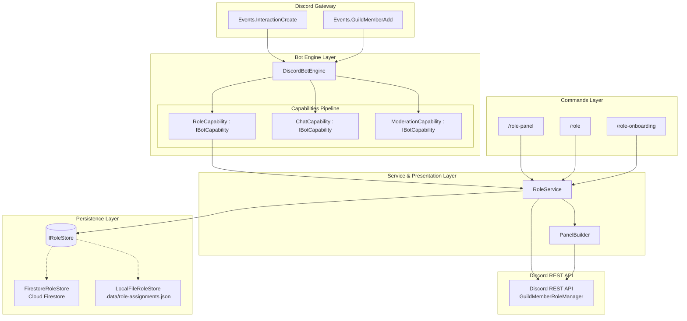
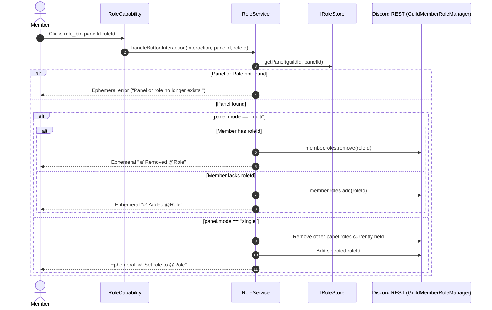
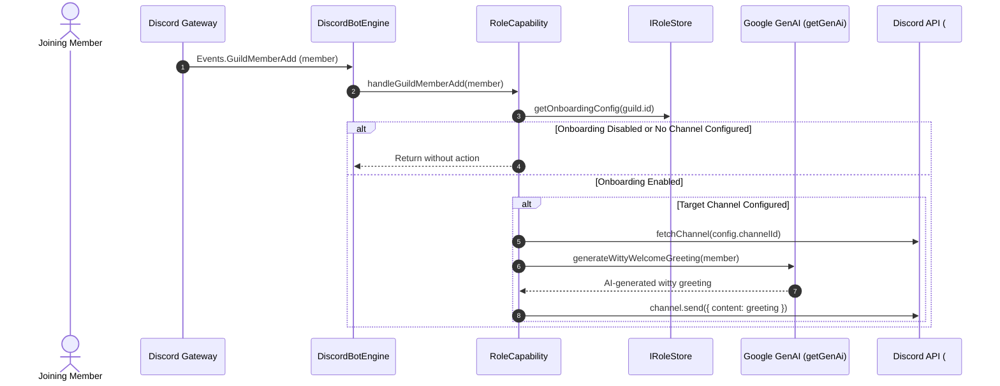

# Technical Design Document: Self-Service Role Assignment & New Member Onboarding

**Author**: Hung Nguyen  
**Status**: Proposed / Design Specification  
**Target Platform**: `discord-bot` (Node.js 22, TypeScript 5, Discord.js v14, Cloud Firestore)  
**Document Stage**: Stage 2 (TDD)  
**PRD Reference**: [`docs/role-assignment-prd.md`](./role-assignment-prd.md)  

---

## 1. Executive Summary & System Overview

### 1.1 Architectural Purpose
This document specifies the technical architecture, component contracts, data schemas, and event routing pipelines for the **Self-Service Role Assignment & New Member Onboarding** platform.

The system is designed as a modular capability (`RoleCapability`) integrated directly into the unified `DiscordBotEngine`. It decouples Discord UI component rendering, role management business logic, and database persistence into clean, testable layers while strictly enforcing Discord API rate limits and role hierarchy security boundaries.

### 1.2 Core Architectural Principles
1. **Pipeline Integration via `IBotCapability`**: Integrates into the bot's capability pipeline alongside `ChatCapability` and `ModerationCapability`.
2. **Dual-Tier Persistence Strategy**: Implements an abstract `IRoleStore` backed by `FirestoreRoleStore` in production and `LocalFileRoleStore` for offline development/testing, matching the platform's storage conventions (`IRoastOptOutStore` / `IBotRegistryStore`).
3. **Pure Component Presentation (`PanelBuilder`)**: Separates Discord message presentation (`EmbedBuilder`, `ActionRowBuilder`) from business logic, ensuring deterministic rendering and isolated unit testing.
4. **Strict Hierarchy & Privilege Guardrails**: Proactively checks role positions in Discord's hierarchy before invoking REST mutations, preventing privilege escalation and catching `DiscordAPIError[50013]` errors before dispatch.
5. **Atomic Role Operations**: Batches role additions and removals to minimize Discord REST round-trips and prevent rate-limiting when toggling multiple roles.

---

## 2. High-Level System Architecture

### 2.1 Architecture Diagram



---

## 3. Data Models & Storage Schema

### 3.1 Domain Interfaces (`app/src/services/roles/types.ts`)

```typescript
export type RoleComponentType = "button" | "dropdown";
export type RoleSelectionMode = "multi" | "single";

export interface RoleOption {
  /** Target Discord role snowflake ID */
  roleId: string;
  /** Display label for button or dropdown item */
  label: string;
  /** Optional Unicode emoji or custom Discord emoji */
  emoji?: string;
  /** Optional secondary description (for select menu options) */
  description?: string;
}

export interface RolePanel {
  /** Unique alphanumeric slug identifier within the guild (e.g. 'notifications') */
  id: string;
  /** Discord Guild snowflake ID */
  guildId: string;
  /** Target Discord channel snowflake ID where the panel was posted */
  channelId?: string;
  /** Target Discord message snowflake ID of the published panel */
  messageId?: string;
  /** Title displayed in the embed */
  title: string;
  /** Explanatory description shown in the embed body */
  description: string;
  /** Component display format */
  type: RoleComponentType;
  /** Selection logic */
  mode: RoleSelectionMode;
  /** List of role options configured for this panel */
  roles: RoleOption[];
  /** Creation timestamp in milliseconds */
  createdAt: number;
  /** Last updated timestamp in milliseconds */
  updatedAt: number;
}

export interface OnboardingConfig {
  /** Discord Guild snowflake ID */
  guildId: string;
  /** Master toggle for onboarding in this server */
  enabled: boolean;
  /** Optional legacy ID of the RolePanel */
  panelId?: string;
  /** Dedicated text channel snowflake ID to post welcome prompts */
  channelId?: string;
  /** Custom welcome greeting template supporting {user}, {server}, and {count} */
  welcomeMessage?: string;
  /** Optional locale override ('vi' | 'en-US') for welcome greetings */
  localeOverride?: string;
  /** Last updated timestamp in milliseconds */
  updatedAt: number;
}
```

### 3.2 Persistence Interface & Factory

```typescript
export interface IRoleStore {
  getPanel(guildId: string, panelId: string): Promise<RolePanel | null>;
  getPanelsByGuild(guildId: string): Promise<RolePanel[]>;
  savePanel(panel: RolePanel): Promise<void>;
  deletePanel(guildId: string, panelId: string): Promise<void>;
  getOnboardingConfig(guildId: string): Promise<OnboardingConfig | null>;
  saveOnboardingConfig(config: OnboardingConfig): Promise<void>;
  clear(guildId?: string): Promise<void>;
}
```

#### Firestore Collection Schema
1. **`role_panels` Collection**:
   * Document ID: `${guildId}_${panelId}`
   * Fields: `id`, `guildId`, `channelId`, `messageId`, `title`, `description`, `type`, `mode`, `roles`, `createdAt`, `updatedAt`.
2. **`role_onboarding` Collection**:
   * Document ID: `${guildId}`
   * Fields: `guildId`, `enabled`, `panelId`, `channelId`, `welcomeMessage`, `updatedAt`.

#### Local File Store Schema
* File path: `.data/role-assignments.json`
* Structure:
  ```json
  {
    "panels": {
      "guildId:panelId": { /* RolePanel */ }
    },
    "onboarding": {
      "guildId": { /* OnboardingConfig */ }
    }
  }
  ```

---

## 4. Component Presentation Layer (`PanelBuilder`)

The presentation layer is responsible for translating domain `RolePanel` models into Discord.js `EmbedBuilder` and `ActionRowBuilder` structures.

### 4.1 Custom ID Namespacing Conventions
All interactive components encode their operational namespace and parameters directly in their `customId`:

| Component | Format | Example |
| :--- | :--- | :--- |
| Role Button | `role_btn:<panelId>:<roleId>` | `role_btn:notifications:123456789012345678` |
| Role Select Menu | `role_select:<panelId>` | `role_select:notifications` |

### 4.2 Button Grid Formulation
* Discord permits a maximum of 5 buttons per `ActionRowBuilder<ButtonBuilder>` and a maximum of 5 action rows per message (25 buttons total).
* `PanelBuilder.buildButtonRows(panel)` iterates over `panel.roles`, chunking them into rows of 5:
  ```typescript
  export function buildButtonRows(panel: RolePanel): ActionRowBuilder<ButtonBuilder>[] {
    const rows: ActionRowBuilder<ButtonBuilder>[] = [];
    const chunkSize = 5;

    for (let i = 0; i < panel.roles.length && i < 25; i += chunkSize) {
      const chunk = panel.roles.slice(i, i + chunkSize);
      const row = new ActionRowBuilder<ButtonBuilder>();
      for (const opt of chunk) {
        const btn = new ButtonBuilder()
          .setCustomId(`role_btn:${panel.id}:${opt.roleId}`)
          .setLabel(opt.label)
          .setStyle(ButtonStyle.Secondary);
        if (opt.emoji) btn.setEmoji(opt.emoji);
        row.addComponents(btn);
      }
      rows.push(row);
    }
    return rows;
  }
  ```

### 4.3 Dropdown Select Menu Formulation
* Uses `StringSelectMenuBuilder` in a single `ActionRowBuilder`.
* If `panel.mode === "multi"`, sets `.setMinValues(0)` and `.setMaxValues(panel.roles.length)`.
* If `panel.mode === "single"`, sets `.setMinValues(1)` and `.setMaxValues(1)`.
* Maps each `RoleOption` to a `StringSelectMenuOptionBuilder`.

---

## 5. Business Logic & Security Validation (`RoleService`)

### 5.1 Role Hierarchy & Manageability Validation

Before attempting to modify member roles or add roles to panels, `RoleService.validateRoleManageable` executes 4 guardrail checks:

```typescript
export interface ValidationResult {
  valid: boolean;
  error?: string;
}

export function validateRoleManageable(
  guild: Guild,
  role: Role,
  callerMember?: GuildMember,
): ValidationResult {
  const botMember = guild.members.me;
  if (!botMember || !botMember.permissions.has(PermissionFlagsBits.ManageRoles)) {
    return {
      valid: false,
      error: "Bot lacks the 'Manage Roles' permission in this server.",
    };
  }

  // 1. Role hierarchy check against bot
  if (role.position >= botMember.roles.highest.position) {
    return {
      valid: false,
      error: `Role '${role.name}' is higher than or equal to the bot's highest role ('${botMember.roles.highest.name}').`,
    };
  }

  // 2. Caller privilege escalation check
  if (callerMember && guild.ownerId !== callerMember.id) {
    if (role.position >= callerMember.roles.highest.position) {
      return {
        valid: false,
        error: `Role '${role.name}' is higher than or equal to your highest role.`,
      };
    }
  }

  // 3. Prohibit dangerous administrative permissions
  const dangerousPermissions = [
    PermissionFlagsBits.Administrator,
    PermissionFlagsBits.ManageGuild,
    PermissionFlagsBits.ManageRoles,
    PermissionFlagsBits.BanMembers,
    PermissionFlagsBits.KickMembers,
  ];
  const hasDangerousPerm = dangerousPermissions.some((perm) =>
    role.permissions.has(perm),
  );
  if (hasDangerousPerm) {
    return {
      valid: false,
      error: `Role '${role.name}' possesses sensitive administrative permissions and cannot be added to self-service panels.`,
    };
  }

  // 4. Managed / Integration roles check
  if (role.managed) {
    return {
      valid: false,
      error: `Role '${role.name}' is managed by an external integration or bot and cannot be assigned.`,
    };
  }

  return { valid: true };
}
```

---

### 5.2 Role Mutation Algorithms

#### A. Button Interaction Toggle


#### B. Dropdown Select Menu Resolution
When an interaction arrives from `role_select:panelId`:
1. Retrieve `panel` from `IRoleStore`.
2. Extract all role IDs configured in the panel: `allPanelRoleIds = panel.roles.map(r => r.roleId)`.
3. Extract roles currently held by the member that belong to this panel: `currentMemberPanelRoleIds = member.roles.cache.filter(r => allPanelRoleIds.includes(r.id)).map(r => r.id)`.
4. Extract selected role IDs from interaction: `selectedRoleIds = interaction.values`.
5. Compute diff:
   * `rolesToAdd = selectedRoleIds.filter(id => !currentMemberPanelRoleIds.includes(id))`
   * `rolesToRemove = currentMemberPanelRoleIds.filter(id => !selectedRoleIds.includes(id))`
6. If `panel.mode === "single"` and multiple options received, reject or apply only the first option.
7. Execute mutations:
   * If `rolesToRemove.length > 0`: `await member.roles.remove(rolesToRemove)`
   * If `rolesToAdd.length > 0`: `await member.roles.add(rolesToAdd)`
8. Respond with formatted ephemeral summary.

---

### 5.3 Onboarding Join Lifecycle (`Events.GuildMemberAdd`)



---

## 6. Bot Capability Pipeline Integration

### 6.1 Enhancing `IBotCapability` (`app/src/capabilities/types.ts`)

Add the optional member join handler:
```typescript
export interface IBotCapability {
  readonly id: string;
  readonly name: string;
  init(client: Client, config: Config): Promise<void> | void;
  handleMessage?(message: Message, guildConfig?: BotGuildConfig): Promise<boolean | undefined>;
  handleInteraction?(interaction: Interaction, guildConfig?: BotGuildConfig): Promise<void>;
  handleVoiceStateUpdate?(oldState: VoiceState, newState: VoiceState, guildConfig?: BotGuildConfig): Promise<void>;
  /** Handles new member joins for onboarding flows */
  handleGuildMemberAdd?(member: GuildMember): Promise<void>;
  destroy?(): Promise<void> | void;
}
```

### 6.2 Binding in `DiscordBotEngine` (`app/src/capabilities/bot-engine.ts`)
1. In `DiscordBotEngine.constructor`:
   ```typescript
   this.registerCapability(new RoleCapability());
   ```
2. In `DiscordBotEngine.bindEvents`:
   ```typescript
   this.client.on(Events.GuildMemberAdd, (member: GuildMember) => {
     this.dispatchGuildMemberAddPipeline(member).catch((error) => {
       console.error("[DiscordBotEngine] Uncaught error in GuildMemberAdd pipeline:", error);
     });
   });
   ```
3. In `DiscordBotEngine.dispatchGuildMemberAddPipeline`:
   ```typescript
   private async dispatchGuildMemberAddPipeline(member: GuildMember): Promise<void> {
     for (const capability of this.capabilities) {
       if (!capability.handleGuildMemberAdd) continue;
       try {
         await capability.handleGuildMemberAdd(member);
       } catch (error) {
         console.error(`[DiscordBotEngine] Error in capability '${capability.name}' handleGuildMemberAdd:`, error);
       }
     }
   }
   ```

---

## 7. Slash Command Architecture

### 7.1 Command Folder Layout
Following repository conventions, command definitions reside under `app/src/discord/commands/roles/`:
* `app/src/discord/commands/roles/panel.ts`: `/role-panel`
* `app/src/discord/commands/roles/role.ts`: `/role`
* `app/src/discord/commands/roles/onboarding.ts`: `/role-onboarding`

### 7.2 In-Place Message Update Flow (`/role-panel update`)
1. Admin runs `/role-panel update <id>`.
2. `RoleService` fetches the stored `RolePanel`.
3. If `!panel.channelId || !panel.messageId`, returns error: *"Panel has not been posted to a channel yet. Use `/role-panel post` first."*
4. Fetches target channel: `const channel = await guild.channels.fetch(panel.channelId)`.
5. Fetches target message: `const message = await channel.messages.fetch(panel.messageId)`.
6. Builds updated embed and component rows via `PanelBuilder`.
7. Calls `await message.edit({ embeds: [embed], components: rows })`.
8. Replies ephemerally: *"✅ Successfully updated role panel message in #channel."*

---

## 8. Error Handling & Edge Cases

| Scenario | Consequence | Mitigation Strategy |
| :--- | :--- | :--- |
| **Role deleted in Discord** | Stored panel references a non-existent role ID. | `PanelBuilder` checks `guild.roles.cache.has(opt.roleId)`. If missing, skips the option and logs a warning rather than failing the message build. |
| **Bot lacks ManageRoles permission** | Discord API returns HTTP 403 / Code 50013. | Checked up front in `validateRoleManageable`. If an unexpected Discord error occurs during execution, catches error and returns a clean ephemeral explanation. |
| **Welcome channel deleted** | Channel ID stored in onboarding config no longer exists. | `handleGuildMemberAdd` verifies channel exists before sending; logs a warning and aborts gracefully without throwing. |
| **Button clicked after bot restart** | Interaction arrives with custom ID. | All panel definitions and roles are retrieved from persistent storage; the handler is completely stateless in memory. |
| **Interaction latency > 3s** | Discord interaction token times out. | All handlers immediately invoke `await interaction.deferReply({ ephemeral: true })` before performing database lookups or role mutations. |

---

## 9. Verification & Testing Strategy

### 9.1 Unit Tests (`pnpm --prefix app test:unit`)
* **`app/src/services/roles/__tests__/store.test.ts`**:
  * Verify `LocalFileRoleStore` and `FirestoreRoleStore` save, retrieve, list, and delete panels and onboarding configurations.
* **`app/src/services/roles/__tests__/panel-builder.test.ts`**:
  * Verify `buildButtonRows` correctly chunks buttons into rows of $\le 5$ and caps at 25.
  * Verify `buildSelectMenuRow` sets `minValues` and `maxValues` according to `mode`.
  * Verify missing guild roles are filtered out safely.
* **`app/src/services/roles/__tests__/role-service.test.ts`**:
  * Test `validateRoleManageable` across role positions (above bot, above caller, equal, below).
  * Test prohibition of `Administrator` and dangerous permissions.
  * Test multi-select toggle (add and remove).
  * Test single-select radio mode (clearing old panel roles).
  * Test onboarding handler formatting and sending to welcome channel.
* **`app/src/discord/commands/roles/__tests__/panel.test.ts`**:
  * Test slash command dispatching, options parsing, and permission requirements.

### 9.2 Linting & Compilation Verification
* **Typecheck**: `pnpm --prefix app typecheck`
* **Format & Lint**: `pnpm --prefix app lint` and `pnpm --prefix app format`
