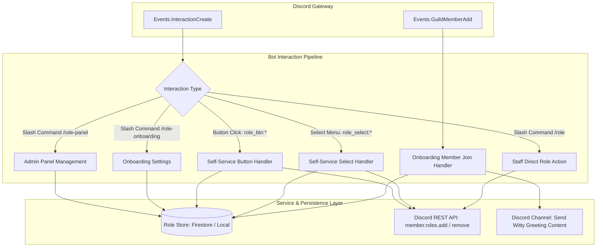
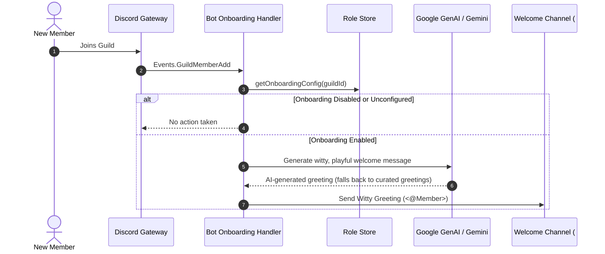

# Product Requirements Document: Self-Service Role Assignment & New Member Onboarding

**Status**: Proposed / Specification  
**Target Platform**: `discord-bot` (Node.js 22, TypeScript 5, Discord.js v14, Cloud Firestore)  
**Document Stage**: Stage 1 (PRD)  

---

## 1. Executive Summary & Problem Statement

### 1.1 Context & Background
Discord servers rely heavily on roles to organize community members, structure notification channels, and grant access to opt-in spaces (such as game-specific channels, topic discussions, or localized chat rooms). However, managing roles in growing communities introduces operational friction:

1. **Moderator Bottlenecks**: Without self-service mechanisms, members must request notification pings or interest tags directly from moderators in public channels, creating administrative overhead and response delays.
2. **Channel Notification Fatigue**: When servers lack granular notification roles (e.g. Announcements, Event Pings, Game Nights), moderators are forced to use `@here` or `@everyone`, annoying members and triggering server mutes.
3. **New Member Drop-off**: When new members join, they are often greeted with empty channels or a wall of static text rules, with no immediate prompt to customize their profile, select their interests, or unlock relevant channels.
4. **Fragility of Legacy Reaction Roles**: Legacy reaction-role bots that listen to emoji reactions on arbitrary messages suffer from API rate limits, lack mutual exclusivity logic (e.g. choosing only one color or team), and provide poor mobile accessibility.

### 1.2 Objectives & Value Proposition
This feature introduces a native, component-driven **Self-Service Role Assignment & Onboarding Platform** within `discord-bot`:

1. **Interactive Self-Service Menus**: Members customize their roles directly through Discord Buttons (`ButtonBuilder`) and Dropdown Select Menus (`StringSelectMenuBuilder`), supporting both independent multi-select and mutually exclusive (single-select/radio) modes.
2. **Dynamic Admin Configuration via Slash Commands**: Server administrators can create, configure, update, and deploy role panels on the fly using `/role-panel` commands without touching configuration files or rebuilding the bot.
3. **Database-Backed Persistence**: Panel schemas and onboarding configurations are persisted to Cloud Firestore (with local file fallback), guaranteeing that buttons and select menus continue working seamlessly across bot restarts and deployments.
4. **Seamless New Member Onboarding**: Upon joining the guild (`Events.GuildMemberAdd`), new members receive a witty welcome greeting in a dedicated channel.
5. **Staff Management Utilities**: Direct administrative slash commands (`/role give` and `/role remove`) allow staff to adjust roles quickly while enforcing strict permission and hierarchy safety.
6. **Zero-Spam Ephemeral Feedback**: All role updates provide instant, private feedback visible only to the interacting member, keeping public channels tidy.

### 1.3 Out of Scope (Non-Goals)
To maintain focus and avoid architectural bloat, the following capabilities are explicitly out of scope for this version:
- ❌ **Temporary / Time-Expiring Roles**: Roles that expire after a duration (e.g. 7-day trials) will not be supported in this phase.
- ❌ **Bulk Role Operations**: Mass assignment commands (e.g. giving a role to all server members) are excluded.
- ❌ **Dedicated Audit Logging Channels**: Dedicated mod-log broadcast channels for role mutations are excluded; actions rely on standard Discord native audit logs.
- ❌ **Automated Gamification Triggers**: Automatic role rewards tied to check-in streaks, message levels, or moderation infractions (PoliceBot quarantine) are excluded.
- ❌ **AI / Natural Language Role Assignment**: Conversational role assignment via Gemini ChatBot tools is excluded.
- ❌ **External REST API Sync**: Webhook or HTTP endpoints to sync roles with external platforms (Patreon, web apps) are excluded.

---

## 2. User Personas & User Stories

### 2.1 Personas
* **The Community Member ("Alex")**: Wants to opt in to gaming pings and announcement alerts easily, change color preferences without bothering moderators, and get instant confirmation.
* **The New Member ("Sam")**: Just joined the server; wants a welcoming experience and an immediate prompt to pick what notifications and community channels they care about.
* **The Server Administrator ("Jordan")**: Server owner or lead moderator who wants to set up clean, attractive role selection panels in `#roles` and configure onboarding without writing code or editing raw JSON.
* **The Community Moderator ("Taylor")**: Server staff member who occasionally needs to assign or revoke roles for users using fast slash commands without navigating Discord's deep desktop menus.

### 2.2 User Stories

#### Self-Service Role Selection
* **US-1: Multi-Select Notification Opt-In**: As a member, I want to click buttons or choose options from a dropdown to select multiple notification roles (e.g. Announcements, Streams, Community Events) so that I only receive pings for topics I care about.
* **US-2: Mutually Exclusive Selection (Radio Mode)**: As a member, I want to select a color role or region from a dropdown, and have the bot automatically remove my previous color or region, so that I never hold conflicting roles.
* **US-3: Ephemeral Confirmation**: As a member, I want to receive an immediate, private confirmation message when I toggle a role so that I know the change succeeded without notifying the entire channel.

#### New Member Onboarding
* **US-4: Witty Welcome Greeting**: As a newly joined member, I want to see a fun, witty welcome message in the `#welcome` channel so that I feel immediately welcomed into the community.

#### Admin Panel Configuration
* **US-6: Create & Deploy Role Panels**: As an admin, I want to run `/role-panel create` and `/role-panel post` to generate an interactive panel in `#roles` containing custom titles, descriptions, and buttons or dropdowns.
* **US-7: Add and Remove Roles with Metadata**: As an admin, I want to run `/role-panel add-role` with custom labels, emojis, and descriptions, and `/role-panel remove-role` to modify options dynamically.
* **US-8: In-Place Panel Updates**: As an admin, when I add or edit a role on an existing panel, I want to run `/role-panel update` so that the existing message in `#roles` updates in-place without deleting and reposting it.
* **US-9: Configure Onboarding Flow**: As an admin, I want to run `/role-onboarding set` to configure the welcome channel, toggle onboarding status, and customize the witty greeting template (supporting `{user}`, `{server}`, and `{count}`).

#### Direct Staff Utilities
* **US-10: Quick Staff Role Assignment**: As a moderator, I want to run `/role give @user @role` or `/role remove @user @role` to grant or revoke roles quickly with proper permission and hierarchy checks.

---

## 3. Product Specifications & Interaction Workflows

### 3.1 Interaction Architecture Overview

---

### 3.2 Self-Service Role Panels (Member Experience)

#### Component Types & Modes
The bot supports two distinct UI component styles:
1. **Dropdown Select Menus (`type: "dropdown"`)**: Uses `StringSelectMenuBuilder`. Best suited for categorized choices (1 to 25 roles per menu).
2. **Buttons (`type: "button"`)**: Uses `ButtonBuilder`. Best suited for prominent single toggles or small sets (up to 25 buttons arranged in 5 action rows).

Panels support two selection modes:
* **Multi-Select Mode (`mode: "multi"`)**:
  * For buttons: Clicking a button checks if the member has the role. If yes, revokes it; if no, grants it.
  * For dropdowns: The user selects 1 or more options. The bot compares the selection against the member's current roles from this panel: missing selected roles are added; unselected panel roles currently held by the member are removed.
* **Single-Select Mode (`mode: "single"` / Radio Mode)**:
  * For buttons and dropdowns: Selecting an option adds the chosen role and automatically revokes all other roles configured in this panel that the member currently holds.

#### Ephemeral Feedback Rules
All self-service interactions defer with an ephemeral reply within 3 seconds, followed by a formatted result:
* **Added role**: `✅ Added the **@RoleName** role.`
* **Removed role**: `🗑️ Removed the **@RoleName** role.`
* **Multiple updates (dropdown)**: `✅ Updated roles:\n+ Added **@RoleA**\n- Removed **@RoleB**`
* **Hierarchy or Permission Error**: `⚠️ Unable to update roles: The bot lacks permission to manage this role because it is positioned higher than the bot's highest role.`

---

### 3.3 New Member Onboarding Flow

#### Onboarding Configuration Attributes
* **`enabled` (boolean)**: Master toggle for onboarding in the guild.
* **`channelId` (string)**: Dedicated text channel where the AI-generated welcome message is posted.
* **Greeting Generation**: Dynamically generated via Google GenAI (`getGenAi()`), celebrating the new member's arrival with playful comedic flair and tagging `<@Member>`. If GenAI is temporarily unavailable, gracefully falls back to curated witty greetings.

---

### 3.4 Slash Command Specifications

#### 3.4.1 Panel Management: `/role-panel`
* **Permission Requirement**: `ManageRoles` (`PermissionFlagsBits.ManageRoles`).

| Subcommand | Parameter | Type | Required | Description |
| :--- | :--- | :--- | :--- | :--- |
| `create` | `id` | String | Yes | Unique panel slug (alphanumeric, e.g. `notifications`, `colors`). |
| | `title` | String | Yes | Embed title displayed on the panel. |
| | `type` | String (Choice) | Yes | Display component style: `dropdown` or `button`. |
| | `mode` | String (Choice) | No | Selection mode: `multi` (default) or `single` (radio mode). |
| | `description` | String | No | Explanatory description shown in the embed body. |
| `add-role` | `id` | String | Yes | Target panel ID. |
| | `role` | Role | Yes | Discord role to add to the panel. |
| | `label` | String | No | Custom display label (defaults to role name). |
| | `emoji` | String | No | Unicode or custom Discord emoji for button/option. |
| | `description` | String | No | Description string (for dropdown options only). |
| `remove-role`| `id` | String | Yes | Target panel ID. |
| | `role` | Role | Yes | Discord role to remove from the panel. |
| `post` | `id` | String | Yes | Target panel ID to publish. |
| | `channel` | Channel | No | Target channel to post in (defaults to current channel). |
| `update` | `id` | String | Yes | Target panel ID to refresh in-place on its posted message. |
| `list` | *(none)* | *(none)* | No | Lists all configured panels for the server with role counts. |
| `delete` | `id` | String | Yes | Deletes the panel configuration from the database. |

#### 3.4.2 Staff Direct Management: `/role`
* **Permission Requirement**: `ManageRoles` (`PermissionFlagsBits.ManageRoles`).

| Subcommand | Parameter | Type | Required | Description |
| :--- | :--- | :--- | :--- | :--- |
| `give` | `user` | User | Yes | Target member to grant the role to. |
| | `role` | Role | Yes | Role to assign. |
| `remove` | `user` | User | Yes | Target member to revoke the role from. |
| | `role` | Role | Yes | Role to revoke. |

#### 3.4.3 Onboarding Configuration: `/role-onboarding`
* **Permission Requirement**: `ManageGuild` (`PermissionFlagsBits.ManageGuild`).

| Subcommand | Parameter | Type | Required | Description |
| :--- | :--- | :--- | :--- | :--- |
| `set` | `channel` | Channel | No | Channel to post welcome messages in (defaults to current). |
| | `enabled` | Boolean | No | Enable or disable AI witty welcome onboarding (defaults to `true`). |
| | `locale` | String | No | Locale override for greetings (`vi` for Tiếng Việt or `en-US` for English). |
| `status` | *(none)* | *(none)* | No | Displays current onboarding setup, target channel, active locale, and AI greeting status. |
| `disable` | *(none)* | *(none)* | No | Disables the onboarding greeting flow. |

---

## 4. Security, Permissions & Discord Guardrails

> [!IMPORTANT]
> **Discord Role Hierarchy & Privilege Escalation Rules**
> 1. **Bot Position Rule**: The Discord bot cannot add, remove, or modify any role that is equal to or higher than the bot's own highest role in Discord's role hierarchy.
> 2. **Caller Position Rule**: An executing moderator cannot assign, remove, or configure roles in a panel that are equal to or higher than the moderator's own highest role.
> 3. **Bot Permission Rule**: The bot must possess the `ManageRoles` guild permission (`PermissionsBitField.Flags.ManageRoles`).
> 4. **Protected Sensitive Permissions**: Roles possessing dangerous administrative permissions (`Administrator`, `ManageGuild`, `ManageRoles`, `BanMembers`, `KickMembers`) cannot be added to self-service panels. If an admin attempts to add such a role, the command will be rejected with an explanatory error.

---

## 5. Non-Functional Requirements & Capacity Limits

### 5.1 Discord API Limits & Component Specifications
* **Buttons per Message**: Maximum of 25 buttons (5 action rows of 5 buttons each). Adding a 26th button to a button panel is rejected with a validation error.
* **Dropdown Select Menu**: Maximum of 25 options per `StringSelectMenuBuilder`. Adding a 26th role to a dropdown panel is rejected.
* **Interaction Timeout**: Discord interactions expire after 3,000ms. All component and slash command handlers must call `interaction.deferReply({ ephemeral: true })` immediately if processing exceeds 500ms.
* **Rate Limits**: Sequential role changes on a single member must be batched or executed atomically via `member.roles.add` / `member.roles.remove` with array arguments to prevent hitting Discord's route rate limit (`/guilds/{guild.id}/members/{member.id}/roles`).

### 5.2 Persistence & Reliability
* **Persistence Guarantee**: Panel and onboarding configurations must be committed to storage before confirming success to the admin.
* **Graceful Degradation**:
  * If a role configured on a panel was deleted in Discord by a server admin, the bot gracefully omits that role option during component rendering and logs a warning.
  * If the welcome channel configured for onboarding was deleted, the bot logs an error and skips posting without crashing the gateway connection.

---

## 6. Acceptance Criteria

| ID | Category | Criterion |
| :--- | :--- | :--- |
| **AC-1** | Admin Config | Running `/role-panel create` creates a valid panel record in the database. |
| **AC-2** | Admin Config | Running `/role-panel add-role` successfully adds a manageable role to the panel and updates the database. |
| **AC-3** | Hierarchy Safety | Attempting to add a role higher than the bot or caller's highest role is blocked with a clear warning. |
| **AC-4** | Sensitive Perms | Attempting to add an `Administrator` role to a self-service panel is blocked. |
| **AC-5** | Publishing | Running `/role-panel post` renders the embed and components in the target channel and records `messageId` and `channelId`. |
| **AC-6** | In-Place Update | Running `/role-panel update` updates the existing Discord message with the latest options. |
| **AC-7** | Multi-Select | Clicking a button or selecting options in multi-select mode correctly adds/removes roles independently and confirms ephemerally. |
| **AC-8** | Single-Select | In single-select mode, selecting an option assigns the new role and revokes any previously assigned roles from that panel. |
| **AC-9** | Staff Commands | `/role give` and `/role remove` update target member roles and enforce hierarchy. |
| **AC-10**| Onboarding Flow | When a member joins a guild with onboarding enabled, the bot posts a witty welcome greeting in the configured channel. |
| **AC-11**| Bot Restart | Restarting the bot leaves existing posted buttons and select menus fully functional. |
