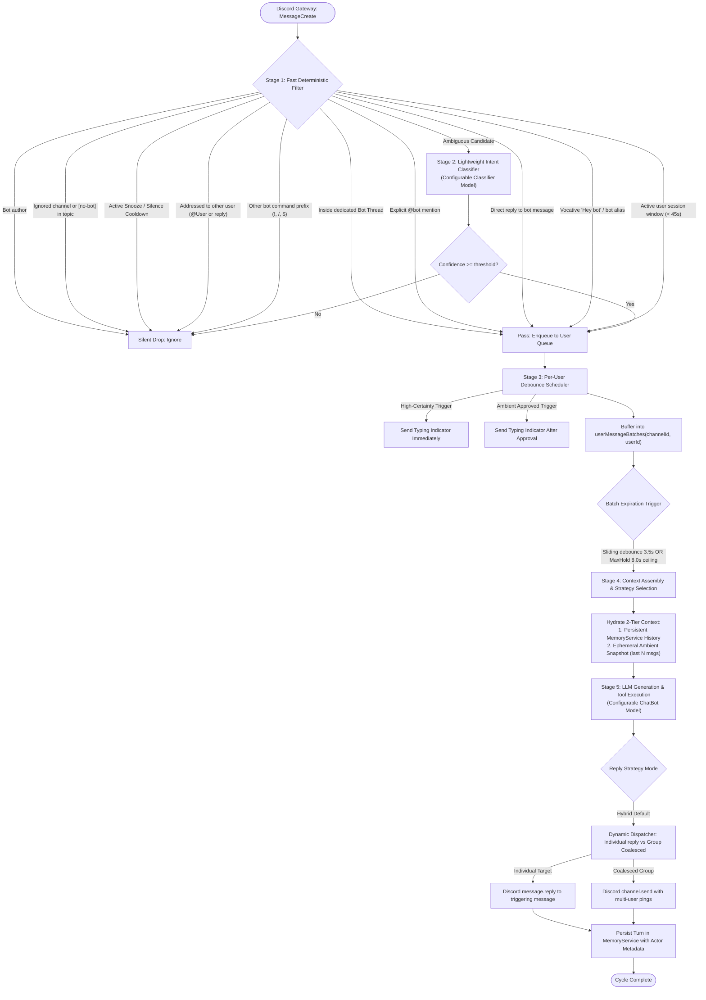

# Design Document: Smart Reply & Multi-User Conversational Intent (OMA-69)

**Issue**: [OMA-69: Smart reply](https://linear.app/hungnguyendev/issue/OMA-69/smart-reply)  
**Author**: Hung Nguyen  
**Status**: Proposed / Design Specification (Updated with Hybrid Default & Clean References)  
**Target Platform**: `discord-bot` (Node.js 22, TypeScript 5, Discord.js v14, Redux Toolkit, Google GenAI / Gemini)  
**Date**: 2026-09-11  

---

## 1. Executive Summary & Problem Statement

### 1.1 Current Architecture & Limitations
The current chatbot implementation (`app/src/bots/chat-bot.ts`) relies on rigid message targeting and a naive channel-level message debounce queue:

1. **Mandatory Explicit Mentions or Dedicated Channels**:
   * The bot only responds if explicitly `@mentioned` or if the message arrives in a statically configured `replyChannelIds` list (`BaseBot.shouldReplyToMessage`).
   * It cannot detect when a message is naturally directed at the bot in general conversation (e.g. conversational follow-ups, assistant inquiries, or vocative addressing like *"Hey bot, what's the weather?"*).
2. **Channel-Level Queue Collision & Race Conditions**:
   * `messageTimeout` in `chat-bot.ts` is keyed strictly by `channelId` (`Record<string, NodeJS.Timeout>`).
   * When user A posts a message, a 5-second timeout starts. If user B posts a message in the same channel 3 seconds later, `clearMessageTimeout(channelId)` cancels user A's pending response and restarts the timer for user B.
   * In `handleMessageTimeout`, the bot filters messages with `.filter((m) => m.authorId === lastMessage.authorId)` and calls `clearMessageBuffer(channel.id)`. As a result, user A's message is permanently dropped and discarded without any reply.
3. **Lack of Multi-User Awareness & Room Context in Shared Channels**:
   * Discord channels are dynamic, multi-user environments. Currently, the prompt assumes a single linear dialogue rather than a multi-party conversational room.
   * If User B asks *"What does that error mean?"* following a code snippet posted by User A, the bot's direct history with User B has zero context about User A's snippet, resulting in degraded or confused replies.
   * If multiple users communicate with the bot concurrently, the bot cannot distinguish whether to reply to each user separately, coalesce their requests, or maintain individual conversational contexts.

### 1.2 Objectives
1. **Intelligent Addressee & Intent Resolution (Smart Reply)**:
   * Accurately determine whether an incoming message is intended for the bot without requiring repetitive `@bot` mentions.
   * Avoid false positives (bot interjecting uninvited into human-to-human dialogues).
   * Utilize a tiered architecture (zero-cost deterministic heuristics followed by lightweight LLM classification) to keep latency and token costs minimal.
2. **Robust Multi-Message Batching & Isolated Debouncing**:
   * Allow users to send multi-part messages in rapid succession (e.g. 2–3 brief messages) without triggering fragmented, intermediate bot responses.
   * Provide per-user debounce isolation so user B typing does not cancel or delay user A's pending response.
   * Enforce a maximum hold ceiling (`maxDebounceDelay`) to prevent indefinite postponement from continuous typing.
3. **Context Assembly with Ambient Channel Snapshots**:
   * Ground the bot with recent channel context (last 3–5 ambient messages) alongside persistent conversation memory, allowing it to understand references to messages sent by other users.
4. **Interruption Mitigation & Annoyance Controls**:
   * Implement immediate "Quiet / Snooze" cooldowns via natural keywords (e.g. *"not you bot"*, *"shh"*) or reaction emojis (🤫 / 🛑).
   * Enforce ambient rate capping to prevent runaway bot chatter in active channels.
5. **Standardized Model Configuration & Selectable Classifier**:
   * Standardize Model Configuration (`ModelConfig`) across global, ChatBot generation, and Tier 2 Classification models.
   * Support selectable classification models (`classifierModel`) so administrators can pick between ultra-fast models (`gemini-3.5-flash-lite`) and high-capacity models.
   * Universal configurability with production-hardened recommended defaults (`replyStrategy: "hybrid"`).

---

## 2. Architecture & System Flow

### Option A: Interactive Rendered Mermaid Flowchart



---

### Option B: Plain Text ASCII Architecture Diagram

```
+---------------------------------------------------------------------------------------+
|                                    DISCORD GATEWAY                                    |
|                             (Events.MessageCreate)                                    |
+-------------------------------------------+-------------------------------------------+
                                            |
                                            v
+---------------------------------------------------------------------------------------+
|                          STAGE 1: FAST DETERMINISTIC FILTER                           |
|  - Is message from a bot? -> Ignore                                                   |
|  - Channel opt-out / [no-bot] in topic / Ignored channel? -> Ignore                   |
|  - Channel in active Snooze/Quiet cooldown? -> Only allow explicit @mentions           |
|  - Inside a dedicated Bot Thread (thread.ownerId === bot.id)? -> PASS (Direct)        |
|  - Explicit @bot mention? -> PASS (Direct trigger)                                    |
|  - Reply to bot's message? -> PASS (Thread continuation)                              |
|  - Directed at another user (@User, reply to User)? -> REJECT                         |
|  - Starts with command prefix (!, /, $) or other bot call? -> REJECT                  |
|  - Active conversation window for this user (last 45s)? -> PASS                       |
+-------------------------------------------+-------------------------------------------+
                     |                                              |
     (Passed Deterministically)                         (Ambiguous Candidate)
                     |                                              |
                     v                                              v
+------------------------------------+      +-------------------------------------------+
|                                    |      |       STAGE 2: LIGHTWEIGHT CLASSIFIER     |
|                                    |      |       (Configurable Classifier Model)     |
|                                    |      |  Evaluate message + last 3 channel turns  |
|                                    |      |  Output: { isAddressedToBot, confidence } |
|                                    |      +---------------------+---------------------+
|                                    |                            |
|                                    |              +-------------+-------------+
|                                    |              |                           |
|                                    |     (Confidence >= 0.75)         (Confidence < 0.75)
|                                    |              |                           |
|                                    |              v                           v
|                                    |      +---------------+           +---------------+
|                                    +----->|  ENQUEUE TO   |           |    IGNORE     |
|                                           | USER BUFFER   |           |  (Silent Noop)|
|                                           +-------+-------+           +---------------+
+---------------------------------------------------|-----------------------------------+
                                                    v
+---------------------------------------------------------------------------------------+
|                       STAGE 3: PER-USER DEBOUNCE & BATCH SCHEDULER                    |
|  - Buffer message into `userBuffer[channelId][userId]`                                |
|  - If High-Certainty Trigger -> Trigger `sendTyping()` immediately                   |
|  - If Ambient Candidate -> Defer `sendTyping()` until after classifier approves       |
|  - Reset per-user sliding debounce timer (3.5s); enforce maxHold ceiling (8.0s)       |
+---------------------------------------------------+-----------------------------------+
                                                    |
                                             (Timer Expires)
                                                    |
                                                    v
+---------------------------------------------------------------------------------------+
|                     STAGE 4: MULTI-USER DISPATCH & CONTEXT ASSEMBLY                   |
|  - Check for concurrent user queue expirations (Strategy: HYBRID Default)             |
|  - Hydrate 2-Tier Context:                                                            |
|    1. Persistent dialogue memory (`MemoryService.getHistory`)                         |
|    2. Ambient channel snapshot (ephemeral last N messages from the room)              |
|  - Format prompt with structured multi-speaker attribution                            |
+---------------------------------------------------+-----------------------------------+
                                                    |
                                                    v
+---------------------------------------------------------------------------------------+
|                         STAGE 5: LLM GENERATION & EXECUTION                           |
|  - GenAI model invocation (`generateChatMessageWithGenAi`) with tools & grounding     |
|  - Execute any relevant function calls (Discord API, Valorant, Search)                |
+---------------------------------------------------+-----------------------------------+
                                                    |
                                                    v
+---------------------------------------------------------------------------------------+
|                           STAGE 6: DISCORD MESSAGE DELIVERY                           |
|  - INDIVIDUAL: `triggerMessage.reply(response)` to maintain Discord context threads   |
|  - COALESCED: `channel.send(response)` with structured mentions (@Alice, @Bob)        |
|  - Append conversation turn to `MemoryService.addTurn` with actor metadata            |
+---------------------------------------------------------------------------------------+
```

---

## 3. Addressee & Intent Detection Engine

In busy channels, running a generative LLM call on every message would lead to prohibitive API costs, latency, and unwanted chatter. The intent engine uses a **two-tier resolution funnel**:

### 3.1 Tier 1: Zero-Cost Deterministic Filter
Executed synchronously inside `handleNewMessage` in $< 1\text{ms}$:

| Check | Criteria | Decision |
| :--- | :--- | :--- |
| **Bot Author** | `message.author.bot === true` | `DROP` (Prevent bot-to-bot loops) |
| **System / Ignored Channel** | `guildConfig.ignoredChannelIds.includes(channel.id)` | `DROP` |
| **Channel Topic Opt-Out** | Channel topic contains `[no-bot]` | `DROP` |
| **Active Snooze / Cooldown** | Channel in active silence cooldown | `DROP` (Unless explicit `@bot` mention) |
| **Dedicated Bot Thread** | `message.channel.isThread()` and thread owner or member is the bot | `TRIGGER (High Priority - Bypass Tier 2)` |
| **Explicit Bot Mention** | `message.mentions.has(botUserId)` | `TRIGGER (High Priority)` |
| **Direct Bot Reply** | `message.reference` points to a message by `botUserId` | `TRIGGER (High Priority)` |
| **Negative Targeting Filter** | `message.mentions.users.some(u => u.id !== botUserId)` or replied to another user | `DROP` |
| **Bot Name / Alias Vocative** | Regex match on `botName` / aliases at start or end of text (e.g. `^(hey\s+)?(${botName}|bot|assistant)[,:]?\s+.*`) | `TRIGGER` |
| **Active Session Window** | User had a direct bot interaction in this channel within `activeSessionTtl` (default: 45s) and message contains no other user mention | `TRIGGER` |
| **Dedicated Bot Channel** | Channel ID in `guildConfig.replyChannelIds` | `TRIGGER` |

### 3.2 Dedicated Discord Thread Handling (`ThreadChannel`)
When users open a Discord Thread from a bot message or create a thread dedicated to the bot:
* The bot checks `message.channel.isThread()`.
* If the bot created the thread, was invited to the thread, or the thread title references the bot, **every message sent inside that thread is treated as directed at the bot**.
* **Impact**: Completely bypasses Tier 2 ambient classification inside threads, eliminating false negative drops and saving classification tokens.

### 3.3 Tier 2: Contextual Ambient Classifier
When a message passes Tier 1 without an explicit trigger (e.g. ambient inquiries in channels where `smartReply.mode = "ambient_intent"`), it is evaluated by a fast classification prompt using the configured `classifierModel` (default: `gemini-3.5-flash-lite`) with structured schema output:

```ts
interface IntentClassificationResult {
  isAddressedToBot: boolean;
  targetAudience: "bot" | "user" | "everyone" | "unknown";
  confidence: number; // 0.0 - 1.0
  reasoning: string;
}
```

* **System Instruction**: Detailed in Section 8.1.
* **Decision Boundary**:
  * If `isAddressedToBot === true` and `confidence >= ambientConfidenceThreshold` (default: 0.75): Trigger response queue.
  * Otherwise: Remain silent (`SILENT_DROP`).

---

## 4. Multi-Message Batching & Per-User Debounce Scheduler

### 4.1 The Concurrency & Debounce Flaw in Current Code
In current code:
```ts
// Existing bug in chat-bot.ts:
const messageTimeout: Record<string, NodeJS.Timeout> = {};
// Single timeout per channel!
clearMessageTimeout(message.channelId);
setMessageTimeout({
  channelId: message.channelId,
  timeout: setTimeout(...),
});
```
If user A sends a message and 2 seconds later user B sends a message:
1. User A's timer is destroyed.
2. The buffer now contains `[msgA, msgB]`.
3. When user B's timer fires, `messages.filter((m) => m.authorId === lastMessage.authorId)` only keeps `msgB`.
4. `clearMessageBuffer(channelId)` wipes `msgA` forever.

### 4.2 New Per-User Channel Queue Architecture
We decouple message queues by `(channelId, userId)`:

```ts
interface UserMessageBatch {
  channelId: string;
  userId: string;
  messages: DiscordMessage[];
  firstReceivedAt: number;
  lastReceivedAt: number;
  timeoutId: NodeJS.Timeout | null;
  maxHoldTimeoutId: NodeJS.Timeout | null;
}
```

### 4.3 Debounce Timing & Typing Indicator Management
* **`debounceDelay`** (Default: `3500ms`): Time to wait for subsequent messages from the same user.
* **`maxDebounceDelay`** (Default: `8000ms`): Hard upper ceiling to guarantee response dispatch even if a user continues typing.
* **Typing Indicator Timing**:
  * **High-Certainty Triggers** (Explicit mention, reply to bot, thread message): Send Discord `sendTyping()` immediately upon message arrival to give instant visual feedback.
  * **Ambient Candidates**: Do **NOT** send `sendTyping()` until Tier 2 classification passes. This prevents the awkward UX of the bot typing for 3 seconds and disappearing when an ambient message was not meant for it.

---

## 5. Multi-User Channel Interaction & Reply Strategy

The ticket explicitly raises the core architectural question:
> *"If there are multiple people messaging the bot at the same time, it should reply to each of them, or send single message that reply both of them?"*

### 5.1 Trade-off Analysis of Reply Modes

| Dimension | Mode A: Independent Targeted Replies | Mode B: Coalesced Multi-User Reply | Mode C: Dynamic Hybrid (Recommended Default) |
| :--- | :--- | :--- | :--- |
| **Discord UX & Clarity** | **Superior**: Direct inline reply (`message.reply()`) to the user's specific message. Clear notification bell and thread reference. | **Mixed**: Single message mentioning `@UserA` and `@UserB`. Can be confusing if topics were unrelated. | **Best**: Context-aware selection. |
| **Tool Execution** | **Clean**: Tool contexts (`ToolExecutionContext.author`) are cleanly mapped to the specific user requesting the action. | **Complex**: Hard to isolate execution context if User A asks for Valorant stats and User B asks to search Google. | **Adaptive**: Separate when distinct tools/intents are detected; coalesced for conversational group chat. |
| **Token Cost & Rate Limits** | Higher if multiple users chat simultaneously (multiple LLM calls). | Lower (one LLM generation for both users). | Balanced. |
| **Handling Unrelated Topics** | Excellent: Handles Alice's math question and Bob's gaming question without cross-talk. | Poor: LLM tries to awkwardly combine two completely unrelated thoughts into one paragraph. | Excellent: Segregates unrelated topics automatically. |

### 5.2 Strategy Specification: Mode C (Dynamic Hybrid - Default)

1. **Hybrid Execution Flow (Default)**:
   * When user batches expire, the dispatcher inspects all expired user queues in the channel within a micro-window ($\Delta t \le coalesceWindowMs$, default: 1500ms).
   * **If single user batch**: Dispatches an independent targeted response using Discord inline reply (`message.reply()`).
   * **If multiple user batches with distinct intents / tool calls**: Dispatches separate targeted responses for each user.
   * **If multiple user batches with shared conversational context**: Synthesizes a unified response tagging both participants (`"@Alice @Bob ..."`).

---

## 6. Context Assembly & Ambient Channel Snapshot

### 6.1 The "Context Gap" in Multi-User Channels
In a group channel, user queries often reference statements, links, or code snippets posted by other members moments prior:
> **User A:** *`<posts error log: ECONNREFUSED 127.0.0.1:5432>`*  
> **User B:** *`@bot why is that failing?`*

If the bot only loads its private historical turns with User B from `MemoryService`, it has no knowledge of User A's error log.

### 6.2 Two-Tier Context Assembly
When building `AiPrompt`, the bot hydrates two distinct context tiers:

```ts
export interface ChannelContextSnapshot {
  recentChannelMessages: {
    authorId: string;
    authorUsername: string;
    authorDisplayName: string;
    content: string;
    timestamp: number;
  }[];
}
```

1. **Tier 1: Dialogue Memory (`MemoryService.getHistory`)**:
   * Contains structured previous conversation turns between the bot and the channel's users.
2. **Tier 2: Ambient Channel Snapshot (Ephemeral Scratchpad)**:
   * Fetches the last $N$ messages (`ambientSnapshotLimit`, default: 5) from the channel buffer immediately preceding the triggering message.
   * Injected into the prompt as ambient context:
     ```
     --- Recent Channel Activity (for context reference only) ---
     [10:14:02] @Alice (AliceDev): "Here is the stack trace: ConnectionRefused on port 5432"
     [10:14:15] @Bob (BobTester): "Can you help fix that?"
     --- End Recent Channel Activity ---
     ```
   * Enables the bot to answer contextually without permanently storing or polluting persistent memory with User A's ambient chatter.

---

## 7. Interruption Control & Annoyance Mitigation

### 7.1 "Snooze / Quiet" Negative Feedback Loop
If the bot interjects inappropriately, users can silence ambient listening instantly:
1. **Natural Keyword Detection**:
   * If a message in the channel matches quiet phrases (e.g. `"not you bot"`, `"shh"`, `"shut up bot"`, `"quiet bot"`), the bot:
     * Dispatches an acknowledgment reaction (e.g., 🤫).
     * Enters an active **Silence Window** for that channel (`silenceDurationMinutes`, default: 10 minutes).
2. **Reaction-Based Dismissal**:
   * If a user reacts to the bot's unprompted response with 🤫 or 🛑, the bot immediately triggers the silence cooldown for that channel.
3. **Behavior During Silence Window**:
   * Ambient detection is completely disabled.
   * The bot **strictly requires explicit `@mentions`** to reply.

### 7.2 Ambient Rate Throttling
* To prevent runaway conversational loops, ambient smart replies enforce a channel cooldown:
  * Maximum **1 unprompted ambient reply every `ambientRateLimitSeconds`** (default: 120s) per channel.
  * Direct `@mentions` bypass this throttle entirely.

---

## 8. System Instruction Architecture & Personalization Engine

System instructions are divided into two clear responsibilities: **Intent Classification** (Tier 2 gatekeeper) and **Conversational Generation** (ChatBot).

### 8.1 Tier 2 Intent Classification System Instruction
This prompt governs the binary classification gatekeeper model (configurable via `classifierModel`) and is fixed across all guilds:

```text
You are an intent classification engine for an AI Discord bot named "{botName}".
Your task is to analyze the recent channel messages and determine if the LATEST message is intended for the bot, or if it is part of a conversation between human members.

Evaluation Rules:
1. Target Audience:
   - "bot": The message is directly asking a question, making a request, or conversing with {botName} (even without an explicit ping).
   - "user": The message is responding to or addressing another human member in the channel.
   - "everyone": The message is a general rhetorical remark, broadcast, or casual banter not directed at an assistant.
2. Positive Indicators for "bot":
   - Answering a question previously asked by {botName}.
   - Inquiries requesting assistant action, calculations, definitions, translations, or technical assistance.
   - Using {botName}'s name or alias without a ping.
3. Negative Indicators (return false):
   - Conversational gossip, humor, or greetings clearly directed between humans.
   - Discussion about other topics where members are conversing back and forth.
   - When in doubt, err on the side of caution: return isAddressedToBot = false.

Output format (strictly JSON):
{
  "isAddressedToBot": boolean,
  "targetAudience": "bot" | "user" | "everyone" | "unknown",
  "confidence": number, // 0.0 to 1.0
  "reasoning": string // max 10 words
}
```

### 8.2 Conversational ChatBot System Instruction & Dynamic Personalization

#### Core Architecture
The ChatBot system instruction consists of:
1. **Line 1 (Identity & Persona)**: Defines who the bot is. By default:
   `"You are {botName}, an intelligent Discord assistant in this server."`
   * **Required Configuration**: `botName` is a **mandatory** configuration property in `BotGuildConfig`.
   * **Personalization Replacement**: If `personalization` is defined in `BotGuildConfig`, it **replaces** Line 1 entirely.
2. **Lines 2+ (Standardized Multi-User Guidelines)**: Fixed, hardcoded rules ensuring robust Discord group behavior, attribution, brevity, and formatting.

#### Standardized Multi-User Guidelines (Hardcoded Base)
```text
Guidelines for Group Channels:
1. Multi-Party Awareness: You are speaking in a shared Discord channel with multiple people. Always observe who is speaking in [Timestamp] @Username (DisplayName): ....
2. Direct Addressing: Address the person who asked you directly using their username or nickname. If multiple people asked related questions, address both (e.g., "@Alice @Bob ...").
3. Tone & Format: Be concise, direct, and conversational. Avoid repetitive pleasantries or corporate filler. Use Discord markdown formatting (**bold**, code blocks) and emojis naturally.
4. Ambient Context: Use the 'Recent Channel Activity' snapshot only to understand context and references (like errors, images, or previous links). Do not respond to ambient chatter unless directly referenced by the user.
5. Deference: If told to be quiet or not needed, acknowledge briefly ("Understood, staying quiet! 🤐") and disengage.
```

#### Assembly Logic Implementation
```ts
/**
 * Assembles the final ChatBot system instruction with optional personalization.
 * If personalization is provided, it replaces the default identity opening line.
 */
export const buildChatBotSystemInstruction = ({
  botName,
  personalization,
}: {
  botName: string;
  personalization?: string;
}): string => {
  const intro = personalization?.trim()
    ? personalization.trim()
    : `You are ${botName}, an intelligent Discord assistant in this server.`;

  return `${intro}

Guidelines for Group Channels:
1. Multi-Party Awareness: You are speaking in a shared Discord channel with multiple people. Always observe who is speaking in [Timestamp] @Username (DisplayName): ....
2. Direct Addressing: Address the person who asked you directly using their username or nickname. If multiple people asked related questions, address both (e.g., "@Alice @Bob ...").
3. Tone & Format: Be concise, direct, and conversational. Avoid repetitive pleasantries or corporate filler. Use Discord markdown formatting (**bold**, code blocks) and emojis naturally.
4. Ambient Context: Use the 'Recent Channel Activity' snapshot only to understand context and references (like errors, images, or previous links). Do not respond to ambient chatter unless directly referenced by the user.
5. Deference: If told to be quiet or not needed, acknowledge briefly ("Understood, staying quiet! 🤐") and disengage.`;
};
```

---

## 9. Privacy, Data Retention & Channel Policies

### 9.1 Zero Persistent Storage for Ambient Chatter
* Unaddressed ambient messages inspected by Tier 1 or Tier 2 are **processed strictly in volatile memory and immediately discarded**.
* Only confirmed bot-user conversational turns are persisted to Firestore/memory storage (`MemoryService.addTurn`).

### 9.2 Granular Opt-Out Controls
* **Guild Configuration**: `smartReply.enabled` and channel blacklists in `ignoredChannelIds`.
* **Channel Topic Tag**: Channel administrators can include `[no-bot]` anywhere in the channel topic/description to permanently disable ambient listening in that channel.

---

## 10. Redux State & Store Refactoring

In `app/src/features/chatbot.ts`, refactor `messageBuffer` from a single channel array to a structured per-channel, per-user bucket store:

```ts
export interface UserPendingBatch {
  userId: string;
  authorUsername: string;
  authorDisplayName: string;
  messages: DiscordMessage[];
  firstMessageTimestamp: number;
  lastMessageTimestamp: number;
  isProcessing: boolean;
}

export interface ChatbotState {
  /** key is channel id */
  messageHistory: Record<string, AiChatMessage[]>;
  /** Keyed by channelId -> userId -> UserPendingBatch */
  userMessageBatches: Record<string, Record<string, UserPendingBatch>>;
  /** Active conversational session timestamps: channelId -> userId -> lastInteractionTimestamp */
  activeUserSessions: Record<string, Record<string, number>>;
  /** Channel silence cooldown expiry: channelId -> timestamp */
  channelSilenceCooldowns: Record<string, number>;
  lastMemberFetch?: number;
}
```

---

## 11. Model Registry & Standardized Model Configuration

To standardize model selection across ChatBot generation and Tier 2 Classification, model options are formally typed and unified under a reusable `ModelConfig` schema.

### 11.1 Supported Model Registry

```ts
export type SupportedGenAiModel =
  | "gemini-3.5-flash-lite"
  | "gemini-3-flash-preview"
  | "gemini-3.5-flash"
  | "gemini-3.6-flash"
  | (string & {});
```

| Model ID | Provider Support | Avg. Latency | Cost Tier | Recommended Use Case |
| :--- | :--- | :--- | :--- | :--- |
| **`gemini-3.5-flash-lite`** | `google-genai`, `vertex` | ~150–250ms | Very Low | **Recommended Default for Tier 2 Classifier**. Ultra-fast, minimal overhead. |
| **`gemini-3.5-flash`** | `google-genai`, `vertex` | ~300–500ms | Low | **Recommended Default for ChatBot Generation**. Great tool support and speed. |
| **`gemini-3-flash-preview`** | `google-genai`, `vertex` | ~250–450ms | Low | Preview generation model for next-gen reasoning & conversational speed. |
| **`gemini-3.6-flash`** | `google-genai`, `vertex` | ~300–500ms | Low | High-capacity flash variant for fast conversational generation. |

### 11.2 Standardized `ModelConfig` Schema

```ts
export interface ModelConfig {
  /** AI Provider backend ('google-genai' | 'vertex') */
  provider?: "google-genai" | "vertex";
  /** Model identifier from the SupportedGenAiModel registry */
  modelId: SupportedGenAiModel;
  /** Sampling temperature (0.0 for deterministic classification, 0.7 for creative chat) */
  temperature?: number;
  /** Maximum output tokens limit */
  maxOutputTokens?: number;
  /** Nucleus sampling topP parameter */
  topP?: number;
}
```

#### Pre-configured Defaults

```ts
/** Default configuration for Tier 2 Classification */
export const DEFAULT_CLASSIFIER_MODEL_CONFIG: ModelConfig = {
  provider: "google-genai",
  modelId: "gemini-3.5-flash-lite",
  temperature: 0.1,
  maxOutputTokens: 50,
};

/** Default configuration for ChatBot Generation */
export const DEFAULT_CHATBOT_MODEL_CONFIG: ModelConfig = {
  provider: "google-genai",
  modelId: "gemini-3.5-flash",
  temperature: 0.7,
  maxOutputTokens: 2048,
};
```

---

## 12. Configuration Schema & Recommended Defaults

Every option is fully configurable in `BotGuildConfig`, with sensible, production-hardened defaults set as the recommended baseline:

```ts
export interface SmartReplyConfig {
  /** Enable smart addressee and intent detection without explicit mentions */
  enabled?: boolean;
  /** Ambient channel listening mode */
  mode?: "disabled" | "mentions_and_vocative" | "ambient_intent";
  /** Selectable Tier 2 intent classification model configuration */
  classifierModel?: ModelConfig;
  /** Confidence threshold for ambient classifier */
  ambientConfidenceThreshold?: number;
  /** Milliseconds to debounce multiple messages from the same user */
  debounceMs?: number;
  /** Hard ceiling to trigger generation regardless of continuing messages */
  maxDebounceMs?: number;
  /** Seconds that a user remains in an active conversational session */
  sessionTtlSeconds?: number;
  /** Reply strategy when multiple users message simultaneously */
  replyStrategy?: "independent" | "coalesced" | "hybrid";
  /** Micro-window to coalesce concurrent user queries in hybrid mode */
  coalesceWindowMs?: number;
  /** Minutes to silence ambient listening after negative user feedback */
  silenceDurationMinutes?: number;
  /** Minimum seconds between ambient unprompted replies in the same channel */
  ambientRateLimitSeconds?: number;
  /** Number of recent ambient channel messages to include in context snapshot */
  ambientSnapshotLimit?: number;
  /** Enable natural language keyword dismissal ('not you bot', 'shh') */
  enableKeywordDismissal?: boolean;
  /** Enable emoji reaction dismissal ('🤫', '🛑') */
  enableReactionDismissal?: boolean;
  /** Typing indicator dispatch behavior */
  sendTypingBehavior?: "immediate_for_all" | "deferred_for_ambient" | "disabled";
  /** Automatically treat all messages in bot-owned threads as directed to bot */
  threadAutoListen?: boolean;
  /** Topic tag string that disables ambient bot listening for that channel */
  optOutTopicTag?: string;
}

export interface BotGuildConfig {
  /** REQUIRED: The bot's name used for system prompts and vocative resolution */
  botName: string;
  /** Optional custom persona that replaces the first line of the system instruction */
  personalization?: string;
  /** Selectable ChatBot conversational generation model configuration */
  chatBotModel?: ModelConfig;
  replyChannelIds: string[];
  ignoredChannelIds: string[];
  respondToMentions: boolean;
  replyDelay?: number;
  tools?: BotGuildToolsConfig;
  /** Smart reply and multi-user intent configuration */
  smartReply?: SmartReplyConfig;
}
```

### Full Configuration Reference & Defaults Table

| Option Name | Type | Recommended Default | Valid Range / Options | Description |
| :--- | :--- | :--- | :--- | :--- |
| **`botName`** | `string` | *(Required)* | Non-empty string | **Mandatory** bot identity name (e.g. `"ChatBot"`, `"Jarvis"`). |
| `personalization` | `string` | `undefined` | Any sentence | Custom persona string replacing Line 1 of the system instruction. |
| `chatBotModel` | `ModelConfig` | `{ modelId: "gemini-3.5-flash" }` | `ModelConfig` | Selectable LLM configuration for ChatBot response generation. |
| `smartReply.classifierModel` | `ModelConfig` | `{ modelId: "gemini-3.5-flash-lite" }` | `ModelConfig` | **Selectable LLM configuration for Tier 2 ambient classification**. |
| `enabled` | `boolean` | **`true`** | `true`, `false` | Master toggle for smart reply features. |
| `mode` | `string` | **`"ambient_intent"`** | `"disabled"`, `"mentions_and_vocative"`, `"ambient_intent"` | Mode of unprompted listening. `"ambient_intent"` enables Tier 2 LLM classifier. |
| `ambientConfidenceThreshold`| `number` | **`0.75`** | `0.0 - 1.0` | Minimum classifier confidence score required to trigger an ambient reply. |
| `debounceMs` | `number` | **`3500`** | `1000 - 10000` (ms) | Sliding window to wait for consecutive messages from the same user. |
| `maxDebounceMs` | `number` | **`8000`** | `3000 - 20000` (ms) | Maximum elapsed time before forcing batch execution regardless of typing. |
| `sessionTtlSeconds` | `number` | **`45`** | `10 - 300` (s) | Duration after an interaction where follow-ups are implicitly addressed to bot. |
| `replyStrategy` | `string` | **`"hybrid"`** | `"independent"`, `"coalesced"`, `"hybrid"` | **Default: `"hybrid"`**. Dynamic selection between direct inline replies and group coalescing. |
| `coalesceWindowMs` | `number` | **`1500`** | `500 - 5000` (ms) | Time delta between separate user batch completions to trigger group coalescing. |
| `silenceDurationMinutes` | `number` | **`10`** | `1 - 60` (min) | Duration to mute ambient listening after receiving negative feedback. |
| `ambientRateLimitSeconds` | `number` | **`120`** | `10 - 600` (s) | Cooldown between unprompted ambient responses in the same channel. |
| `ambientSnapshotLimit` | `number` | **`5`** | `0 - 15` (msgs) | Number of recent channel messages to pass as grounding context. |
| `enableKeywordDismissal` | `boolean` | **`true`** | `true`, `false` | Enables silencing via phrases like *"not you bot"* or *"shh"*. |
| `enableReactionDismissal` | `boolean` | **`true`** | `true`, `false` | Enables silencing via reactions (🤫 / 🛑). |
| `sendTypingBehavior` | `string` | **`"deferred_for_ambient"`**| `"immediate_for_all"`, `"deferred_for_ambient"`, `"disabled"` | Typing timing to prevent phantom typing on ambient false positives. |
| `threadAutoListen` | `boolean` | **`true`** | `true`, `false` | Treat all messages in bot-owned threads as addressed to the bot. |
| `optOutTopicTag` | `string` | **`"[no-bot]"`** | any string | Channel topic tag that opts a channel out of ambient listening. |

---

## 13. Edge Cases & Safeguards

| Scenario | Risk | Mitigation |
| :--- | :--- | :--- |
| **Bot Loops** | Two bots trigger each other in a continuous cycle. | Strict `message.author.bot` drop at the very beginning of the pipeline. Never respond to bots under any circumstance. |
| **Rapid Fire Typing** | User sends 15 short messages in 5 seconds. | Per-user debounce resets sliding timer; `maxDebounceMs` (8s) guarantees an upper bound so the bot always responds. Buffer capped at 10 messages per batch. |
| **Channel Cross-Talk** | User A asks bot something; User B chats with User C in the same channel. | Strict negative addressee filters: User B mentioning User C or replying to User C is immediately ignored. User A's batch continues cleanly. |
| **Ambiguous Addressee** | User says *"Can someone help me?"* in a busy room. | Tier 2 classifier identifies `targetAudience: "everyone"`. If confidence is below threshold, bot stays silent. Conservative default avoids annoying users. |
| **Unwanted Interruption** | Bot chimes in awkwardly. | User says *"not you bot"* or reacts with 🤫 / 🛑; bot activates 10-minute silence cooldown on that channel. |
| **Discord Rate Limits** | Multiple users triggering bot at the same second. | Bot uses independent per-user message queues; Discord client rate limit queue manages outbound replies smoothly. |

---

## 14. Implementation Plan & Work Breakdown

Upon approval of this design doc, ticket **OMA-69** will be tracked and delivered in the following progressive phases:

### Phase 1: Core Redux Batching & Per-User Scheduler
* Refactor `app/src/features/chatbot.ts` to implement `userMessageBatches`, `activeUserSessions`, and `channelSilenceCooldowns`.
* Update `chat-bot.ts` timer management to replace single-channel `messageTimeout` with isolated `(channelId, userId)` debouncing.
* Implement `debounceMs` sliding timer and `maxDebounceMs` ceiling timer.
* Add typing indicator separation (immediate for high certainty, deferred for ambient).
* Add unit tests in `chatbot.test.ts`.

### Phase 2: Addressee Resolution & Deterministic Filters (Tier 1)
* Implement `AddresseeService` with Tier 1 deterministic heuristics:
  * Explicit mentions & replies to bot.
  * Dedicated thread handling (`thread.ownerId === bot.id`).
  * Bot name/alias vocatives (`/^(hey\s+)?(${botName}|bot)/i` based on configured `botName`).
  * Active session context tracker (`sessionTtlSeconds`).
  * Channel topic opt-out (`[no-bot]`) and silence cooldown checks.
  * Negative targeting filter (replies to other users, mentions of other users).
* Update `BaseBot.shouldReplyToMessage` and `ChatBot.handleNewMessage`.

### Phase 3: Selectable Ambient Intent Classifier (Tier 2) & Annoyance Controls
* Implement `ModelConfig` registry in `app/src/genAi/types.ts`.
* Implement classification module using the configured `smartReply.classifierModel` (defaulting to `gemini-3.5-flash-lite`).
* Integrate into `AddresseeService` for channels with `smartReply.mode: "ambient_intent"`.
* Implement the "Quiet / Snooze" negative feedback listener (keywords + 🤫/🛑 reactions).
* Add ambient rate limit throttling (`ambientRateLimitSeconds`).

### Phase 4: Multi-User Context Assembly & Reply Dispatcher
* Implement `buildChatBotSystemInstruction({ botName, personalization })` in `app/src/genAi/helpers.ts`.
* Enhance prompt builder with two-tier context assembly:
  1. Persistent dialogue history from `MemoryService`.
  2. Ambient channel snapshot (ephemeral last `ambientSnapshotLimit` channel messages).
* Implement `ReplyDispatcher` using `chatBotModel` (defaulting to `gemini-3.5-flash`) with **hybrid reply strategy as default**:
  * Default `message.reply()` targeted responses for individual user turns.
  * Group coalescing logic for concurrent collaborative turns ($\Delta t \le coalesceWindowMs$).
* Ensure `ToolExecutionContext` maps cleanly to the correct triggering user.

### Phase 5: Verification & Integration Testing
* Add unit tests for `AddresseeService` covering all heuristic rules, cooldowns, and edge cases.
* Add unit test for `buildChatBotSystemInstruction` verifying default and personalized outputs.
* Add unit tests for `ModelConfig` resolution and fallback handling.
* Add integration tests simulating multi-user interleaving and silence trigger in the same channel.
* Update documentation and sample configurations.
