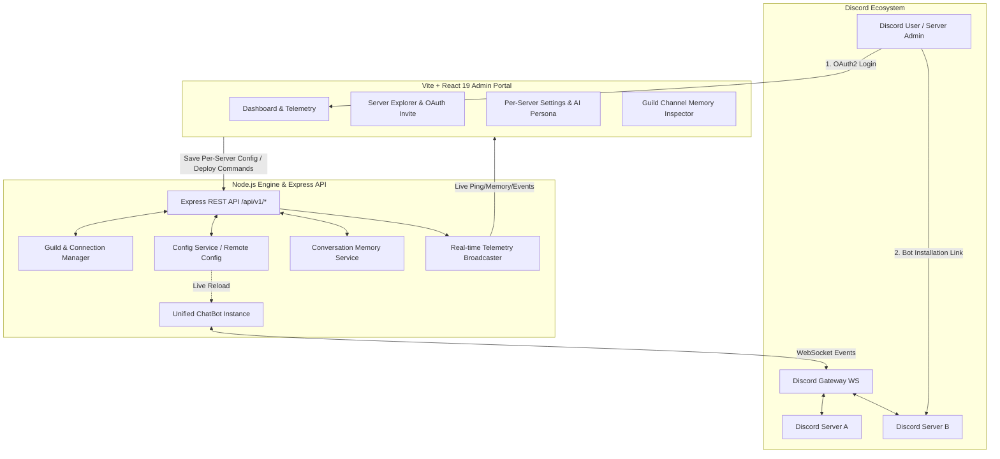

# Design Document: System Management Web Application & Server Connection Manager

**Author**: Hung Nguyen  
**Status**: Revised Design & Implementation  
**Target Platform**: `discord-bot` (Node.js 22, TypeScript 5, Discord.js v14, Google GenAI / Gemini, Express 4, React 19, Tailwind CSS, Biome, Vitest)  
**Date**: 2026-09-12  

---

## 1. Executive Summary & Revised System Architecture

### 1.1 Core Architecture: Single Unified Bot Instance, Multi-Server Management
The `discord-bot` platform is refactored from a multi-bot dynamic container model into a **single unified Bot Engine (`ChatBot`)** that connects to Discord Gateway and manages its presence across multiple Discord servers (guilds):

1. **Single Bot Instance Lifecycle**:
   - The bot runs as a single, primary Discord client instance initialized with `CHAT_BOT_TOKEN`, `CHAT_BOT_CLIENT_ID`, and `AI_API_KEY`.
   - Simplifies deployment, Gateway WebSocket management, and eliminates token encryption/decryption key failures.

2. **OAuth2 Bot Installation & Server Discovery**:
   - The bot is invited to Discord servers via its standard Discord OAuth2 URL (`https://discord.com/oauth2/authorize?client_id=${CHAT_BOT_CLIENT_ID}&permissions=8&scope=bot%20applications.commands`).
   - The bot client naturally tracks and receives events for all joined guilds via `client.guilds.cache`.
   - The web management portal discovers both **installed servers** (where the bot is currently present) and **manageable servers** (where the logged-in administrator has `Manage Server` / `Administrator` rights but the bot is not yet installed).

3. **Per-Server (Per-Guild) Configuration Management**:
   - Administrators can manage the bot's behavior independently on each connected Discord server:
     - **Channel Whitelists & Blacklists**: `replyChannelIds`, `ignoredChannelIds`.
     - **AI Persona & Custom Prompts**: Per-server `systemInstruction` overriding or extending global prompts.
     - **Smart Reply & Ambient Intent**: Server-specific ambient detection threshold, reply strategies, and dismissal triggers.
     - **Tool Capabilities**: Per-server toggles for Google Search, Discord moderation tools, and voice/bouncer features.
     - **Slash Command Deployment**: Direct 1-click deployment and refresh of application commands to individual servers.
     - **Conversation Memory Partitioning**: Inspecting and clearing stored conversational turns isolated by channel/guild.

4. **Discord OAuth2 Operator Single Sign-On (SSO)**:
   - Operators log in via the dedicated Management Portal OAuth2 credentials (`MANAGEMENT_PORTAL_CLIENT_ID` + `MANAGEMENT_PORTAL_CLIENT_SECRET`).
   - Access control is role-aware:
     - **Super Admin** (`ADMIN_DISCORD_USER_IDS` / Bearer token): Full global access across all connected servers and core settings.
     - **Server Admin** (`canManage: true` via Discord guild permissions): Delegated access to configure the bot only on servers they manage.

---

## 2. Server Topology & Data Flow

---

## 3. Detailed REST API Specification (`/api/v1/*`)

### 3.1 Bot Telemetry & Status (`/api/v1/bot`)
- `GET /api/v1/bot`: Returns the bot instance runtime metrics (status `ONLINE`/`STOPPED`, Gateway ping ms, uptime, joined guilds count, user avatar, username).
- `POST /api/v1/bot/restart`: Restarts the Discord Gateway connection without restarting the HTTP server.
- `GET /api/v1/bot/invite-url`: Returns the OAuth2 installation/invite URL with configured permissions and scopes.

### 3.2 Guild & Server Management (`/api/v1/guilds`)
- `GET /api/v1/guilds`: Returns a unified list of guilds:
  - Installed guilds with channel topology, member count, and bot permissions.
  - Uninstalled guilds that the logged-in user manages (with direct invite link).
- `GET /api/v1/guilds/:guildId`: Returns detailed information for a specific server (text channels, voice channels, roles).
- `GET /api/v1/guilds/:guildId/config`: Returns the current server-specific `BotGuildConfig`.
- `PUT /api/v1/guilds/:guildId/config`: Updates server-specific settings and synchronizes with `Config` service / Remote Config with instant reload.
- `POST /api/v1/guilds/:guildId/deploy-commands`: Deploys Discord slash commands to the target guild.
- `POST /api/v1/guilds/deploy-commands-all`: Deploys slash commands to all joined guilds (Super Admin only).

### 3.3 Memory Inspector (`/api/v1/memory`)
- `GET /api/v1/memory/guilds/:guildId/channels/:channelId`: Retrieves stored conversation turns for a specific channel.
- `DELETE /api/v1/memory/guilds/:guildId/channels/:channelId`: Purges conversational memory for a specific channel.
- `DELETE /api/v1/memory/all`: Purges all conversation memory partitions (Super Admin only).

### 3.4 Configuration & Remote Config (`/api/v1/config`)
- `GET /api/v1/config`: Returns active global configuration (AI models, safety parameters, emoji mappings).
- `POST /api/v1/config/reload`: Triggers immediate re-synchronization from Remote Config or local fallback.

### 3.5 Real-Time Telemetry & Activity Feed (`/api/v1/dashboard/events`)
- Server-Sent Events (SSE) broadcasting:
  - `initial_state`: Initial telemetry metrics and bot status.
  - `telemetry_tick`: 3-second heartbeat with live Gateway ping, heap memory, and guild count.
  - `activity_log`: Live stream of bot interactions, slash command invocations, smart replies, and moderation events.

---

## 4. Frontend Design & User Experience (`web/`)

### 4.1 Navigation & Screen Organization
1. **Dashboard & Telemetry**:
   - Bot Status Card (Live Online/Offline indicator, Gateway Ping, Uptime, Connected Servers, Memory usage).
   - Bot OAuth2 Invite Banner (one-click copy or open invite URL).
   - Live Gateway Activity Feed (real-time SSE stream).
2. **Server Explorer & Settings Manager** (Primary View):
   - **Server Grid / Sidebar**: Displays all joined servers and manageable servers.
   - **Server Detail Panel**:
     - *Overview*: Member count, channel count, server icon, bot join date.
     - *AI Persona & Prompts*: Custom system prompt for this server, response behavior, reply delay.
     - *Channel Routing*: Whitelist reply channels (`replyChannelIds`), blacklist channels (`ignoredChannelIds`).
     - *Smart Reply*: Toggle ambient intent classification, confidence threshold slider, coalescing window.
     - *Tools & Moderation*: Google search tool flag, discord moderation tools.
     - *Commands & Deployment*: 1-click slash command deploy button with status feedback.
3. **Memory Inspector**:
   - Channel selector for active guild, message turn dialogue inspector with user/bot attribution, and clear cache action.
4. **Global System Config**:
   - Visual view and raw JSON editor for global AI parameters (default model, max output tokens, safety thresholds).

---

## 5. Security & Access Control

1. **OAuth2 Portal Authentication**:
   - `MANAGEMENT_PORTAL_CLIENT_ID` and `MANAGEMENT_PORTAL_CLIENT_SECRET` handle SSO authentication.
   - Session tokens are signed via JWT and stored in HTTP-only, secure cookies.
2. **Capability Guards**:
   - `requireCapability("guild:read")`, `requireCapability("guild:manage_channels")`, `requireCapability("guild:deploy_commands")`.
   - `requireGuildPermission("guildId")`: Ensures server admins can only view/modify servers where they possess administrative rights.
3. **Fail-Fast Environment Validation**:
   - Essential variables (`CHAT_BOT_TOKEN`, `CHAT_BOT_CLIENT_ID`, `AI_API_KEY`, `BEARER_TOKEN`) fail fast on server boot.
   - Clear warnings when `MANAGEMENT_PORTAL_*` secrets are missing.
