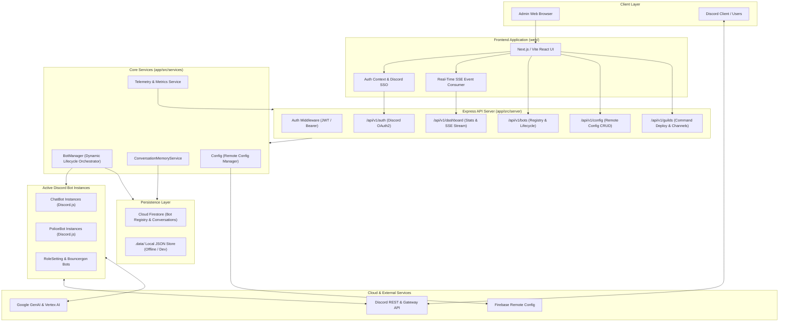
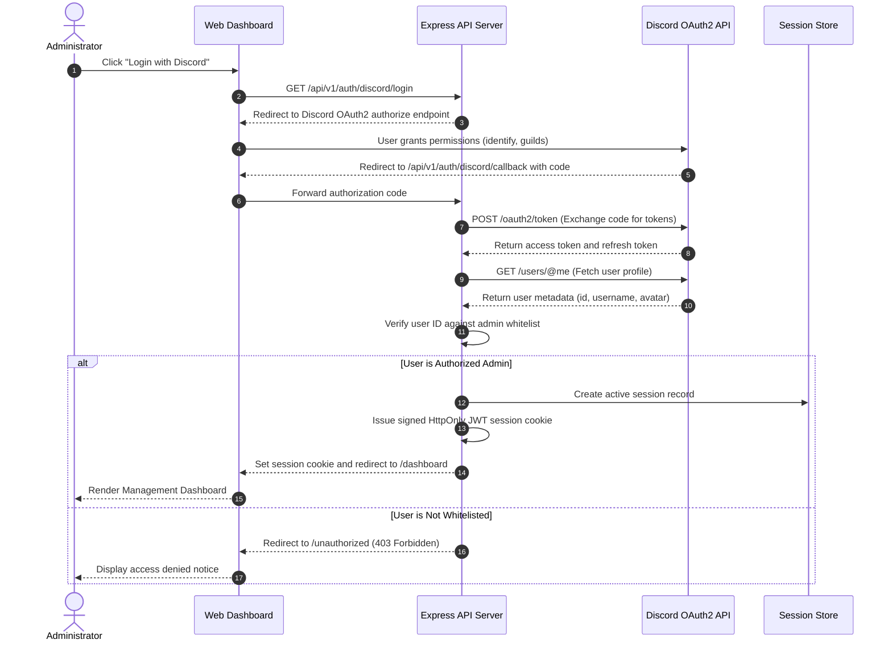
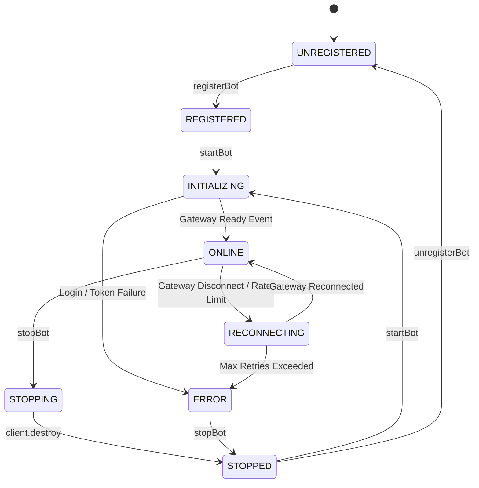
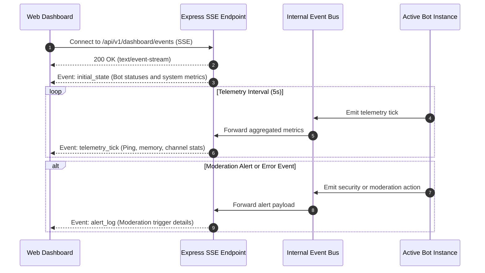
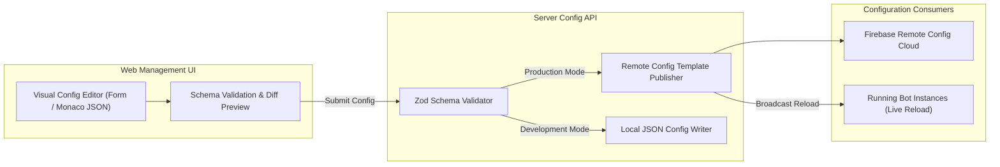

# Design Document: System Management Web Application

**Author**: Hung Nguyen  
**Status**: Proposed  
**Date**: 2026-08-27  

---

## 1. Overview & System Goals

### 1.1 Current Architecture & Limitations
The `discord-bot` platform currently operates as a standalone headless Node.js service running in Docker or local Node environments:
- **Static Bot Initialization**: Bots (`ChatBot`, `PoliceBot`) are hardcoded and statically initialized at boot time in [main.ts](file:///Users/hung/Dev/discord-bot/app/src/main.ts) based on fixed environment variables (`CHATBOT_TOKEN`, `POLICE_BOT_TOKEN`). Adding, registering, or restarting an individual bot instance requires modifying source code or restarting the entire process.
- **Manual Configuration Management**: System configurations (e.g. `guildEmojis`, `guildMembers`, `bots` policies, AI model selection, safety parameters) must be manually edited directly in the Firebase Remote Config console or modified in [defaultConfig.json](file:///Users/hung/Dev/discord-bot/app/src/config/defaultConfig.json). There is no schema validation, rollback history, or visual editing interface.
- **Opaque Observability & Monitoring**: Bot health, Discord Gateway WebSocket ping, runtime memory consumption, conversation turn volume, AI generation latency, and moderation events are only observable via container logs or debugging outputs.
- **Manual Slash Command Deployment**: Refreshing and deploying Discord application slash commands to guilds requires manual HTTP calls via cURL or Postman to `/utility/deploy-command` with a static bearer token.
- **Lack of Role-Based Authentication**: The Express server relies on a single static `BEARER_TOKEN` header without support for operator logins, Discord Single Sign-On (SSO), or fine-grained administrative permissions.

### 1.2 Design Objectives
1. **Discord OAuth2 Single Sign-On (SSO)**: Allow operators to log in securely using their Discord accounts, authenticating identity and verifying administrative privileges via configurable admin user IDs and server permissions.
2. **Centralized Monitoring Dashboard**: Provide real-time operational visibility into bot instances (status, Gateway latency, uptime, memory usage, joined guilds, message activity, error logs, and AI inference latency).
3. **Dynamic Bot Registry & Lifecycle Orchestrator (`BotManager`)**: Enable registering new bot instances at runtime (ChatBot, PoliceBot, RoleSettingBot, BouncergonBot), managing bot tokens securely, and dynamically starting, stopping, or restarting individual bots without process restarts.
4. **Interactive Guild Assignment & Slash Command Deployment**: Allow operators to inspect guilds where bots reside, manage per-guild channel configurations, and trigger 1-click slash command deployments directly from the UI.
5. **Visual Configuration Management**: Deliver a rich configuration editor for Firebase Remote Config / local fallback with schema validation, draft diffing, and live-reload triggering.
6. **Conversation & Memory Inspector**: Allow operators to browse active conversation sessions, inspect multi-user context turns, and clear memory cache per channel or bot instance.

---

## 2. System Architecture

### 2.1 Monorepo & Component Structure

```
discord-bot/
├── app/                           # Core Bot Engine & Express API Server
│   ├── src/
│   │   ├── main.ts                # Application bootstrapper
│   │   ├── bots/                  # Bot implementations (BaseBot, ChatBot, PoliceBot)
│   │   ├── config/                # Remote Config & Local configuration schema
│   │   ├── server/                # Express API & SSE endpoints
│   │   │   ├── middlewares/       # Auth (Discord OAuth JWT + Bearer token), CORS, Error handling
│   │   │   └── routes/            # REST API (auth, dashboard, bots, config, memory, guilds)
│   │   ├── services/
│   │   │   ├── bot-manager/       # Dynamic Bot Orchestrator & Registry
│   │   │   ├── memory/            # Persistent conversation memory (IMemoryStore)
│   │   │   └── metrics/           # Real-time telemetry, latency & event logging
│   │   └── utils/
│   └── package.json
├── web/                           # Next.js / Vite React Admin Web Application
│   ├── src/
│   │   ├── app/                   # App Router / Pages (Dashboard, Bots, Config, Memory, Settings)
│   │   ├── components/            # UI components (BotCard, MetricsChart, ConfigEditor, GuildPicker)
│   │   ├── hooks/                 # Real-time SSE hooks, SWR / React Query data fetchers
│   │   └── lib/                   # API client, Discord OAuth helpers, auth context
│   └── package.json
├── docs/                          # Architectural documentation & design docs
└── pnpm-workspace.yaml            # Monorepo workspace configuration
```

### 2.2 High-Level Architecture Diagram



---

## 3. Core Subsystems Design

### 3.1 Authentication & Authorization Subsystem (Discord OAuth2 SSO)

#### 3.1.1 OAuth2 Flow & Session Architecture
The web application utilizes Discord OAuth2 for Single Sign-On. 



#### 3.1.2 Role-Based Access Control (RBAC)
- **Roles**:
  - `SUPER_ADMIN`: Configured via `ADMIN_DISCORD_USER_IDS` environment variable. Has full permissions (manage bots, view/edit configs, deploy commands, view/delete conversation memories, register new bots).
  - `GUILD_ADMIN`: Users who possess `ADMINISTRATOR` or `MANAGE_GUILD` permissions in specific guilds. Can manage bot settings and slash command deployment for their owned guilds.
  - `VIEWER`: Read-only access to monitoring dashboards and telemetry without permission to edit configs or control bot lifecycles.
- **Session Security**:
  - Signed JWT stored in an `HttpOnly`, `Secure`, `SameSite=Lax` cookie.
  - CSRF protection via OAuth2 `state` validation using cryptographic random nonces stored in short-lived cookies.
  - Bearer token header (`Authorization: Bearer <TOKEN>`) remains fully supported for programmatic CI/CD pipelines and external automation.

---

### 3.2 Dynamic Bot Registry & Orchestration (`BotManager`)

#### 3.2.1 Dynamic Bot Lifecycle Management
Bot lifecycle management is abstracted into a singleton `BotManager` service, replacing static startup routines with dynamic registration, initialization, and lifecycle control.

#### 3.2.2 `BotManager` Lifecycle State Machine



#### 3.2.3 Dynamic Bot Registry Schema & Storage
Bot credentials and metadata are stored in a pluggable `IBotRegistryStore` (Local JSON in dev, Cloud Firestore in prod):

```typescript
export type BotType = "chatBot" | "policeBot" | "roleSettingBot" | "bouncergonBot" | "custom";

export type BotLifecycleStatus = "STOPPED" | "INITIALIZING" | "ONLINE" | "RECONNECTING" | "ERROR";

export interface RegisteredBotRecord {
  id: string;                      // Unique Bot Instance Identifier (e.g., "chat-bot-main")
  name: string;                    // Human-readable display name (e.g., "Main Chat AI")
  botType: BotType;                // Handler type
  clientId: string;                // Discord Application Client ID
  encryptedToken: string;          // AES-256-GCM encrypted Discord bot token
  autoStart: boolean;              // Auto-start when server boots
  assignedGuildIds: string[];      // Whitelisted guild IDs
  customConfigOverrides?: Record<string, unknown>; // Specific bot policy overrides
  createdAt: number;
  updatedAt: number;
}

export interface BotRuntimeMetrics {
  id: string;
  status: BotLifecycleStatus;
  userTag?: string;                // e.g. "ChatBot#1234"
  avatarUrl?: string;
  gatewayPingMs: number;
  uptimeSeconds: number;
  joinedGuildsCount: number;
  totalChannelsCount: number;
  messageCount24h: number;
  errorCount24h: number;
  lastError?: string;
  lastStartedAt?: number;
}
```

#### 3.2.4 Bot Token Encryption Vault
To guarantee that bot tokens are never stored in plaintext in databases or exposed in API responses:
- Tokens are encrypted using **AES-256-GCM** with an application master key (`BOT_VAULT_ENCRYPTION_KEY`).
- API endpoints return masked tokens (e.g., `MTEx...********`).
- Decryption occurs only in memory when `BotManager.startBot(id)` instantiates the `Discord.js` client.

---

### 3.3 Real-Time Dashboard & Telemetry Engine

#### 3.3.1 Metrics Aggregation
The backend collects and maintains operational metrics:
- **System Resource Metrics**: Node.js process RSS/Heap memory, Event Loop Lag, CPU usage percentage.
- **Discord Gateway Telemetry**: WebSocket ping latency per bot instance, reconnect count, gateway heartbeat status.
- **AI Inference Telemetry**: Gemini / Vertex AI request rate, token consumption (prompt tokens, completion tokens), average response time, error rate.
- **Activity & Moderation Counters**: Hourly/daily message traffic, police bot moderation interventions, slash command invocations.

#### 3.3.2 Real-Time Event Streaming (Server-Sent Events)
Rather than aggressive frontend polling, the dashboard connects to an SSE endpoint (`GET /api/v1/dashboard/events`):



---

### 3.4 Configuration Management & Remote Config Sync

#### 3.4.1 Config Architecture & Synchronization
The application manages configuration through Firebase Remote Config (with local JSON fallback):



#### 3.4.2 Visual Config Schema & Validation
The web interface provides specialized UI controls for each config parameter:
- **`guildEmojis`**: Visual mapping editor with emoji picker and server emoji name tagger.
- **`guildMembers`**: Guild roster manager (username, real name, pronouns/gender).
- **`bots`**: Per-bot policy switches (`respondToMentions`, `replyChannelIds`, `ignoredChannelIds`).
- **AI Settings**: Dropdowns for `aiProvider` (`google-genai` | `vertex`), `aiModelId` (`gemini-2.0-flash`, `gemini-1.5-pro`), sliders for `aiMaxOutputTokens` (100 - 8192) and `aiMaxConversationHistory` (10 - 200), and safety category thresholds.
- **Validation**: Strict validation with [Zod](https://zod.dev) before any configuration change is saved or published to prevent bot runtime crashes.

---

### 3.5 Guild Management & Slash Command Deployment

#### 3.5.1 Guild Explorer
- Fetches all guilds currently joined by the selected bot instance via `client.guilds.cache`.
- Lists channels (text, voice, forum), guild roles, member counts, and bot permissions.
- Allows one-click channel policy assignment (adding/removing a channel from `replyChannelIds` or `ignoredChannelIds`).

#### 3.5.2 Automated Slash Command Deployment
- Dispatches commands directly via Discord REST API using [deployGuildCommands](file:///Users/hung/Dev/discord-bot/app/src/discord/deployCommands.ts).
- Web UI provides:
  - **Single Guild Deployment**: Deploy commands to a selected guild immediately.
  - **Bulk / Global Deployment**: Deploy commands to all assigned guilds with progress indicators.
  - **Invite Link Generator**: Generates OAuth2 bot invite URLs with required bot scopes (`bot`, `applications.commands`) and permissions (`SendMessages`, `ReadMessageHistory`, `EmbedLinks`, `AttachFiles`, `ManageMessages`).

---

## 4. API Specifications

All endpoints are hosted under `/api/v1` and secured by the `auth` middleware (supporting Discord OAuth2 session cookie and `Authorization: Bearer <TOKEN>` header).

### 4.1 Authentication Endpoints

| Method | Endpoint | Description | Auth Required |
|---|---|---|---|
| `GET` | `/api/v1/auth/discord/login` | Initiates Discord OAuth2 login redirect | No |
| `GET` | `/api/v1/auth/discord/callback` | Handles OAuth2 callback, sets session cookie | No |
| `GET` | `/api/v1/auth/me` | Returns current authenticated user and role | Yes |
| `POST` | `/api/v1/auth/logout` | Clears session cookie and invalidates session | Yes |

### 4.2 Dashboard & Telemetry Endpoints

| Method | Endpoint | Description | Auth Required |
|---|---|---|---|
| `GET` | `/api/v1/dashboard/stats` | High-level system stats (active bots, memory, message counts) | Yes |
| `GET` | `/api/v1/dashboard/events` | Server-Sent Events (SSE) stream for live telemetry & alerts | Yes |

### 4.3 Bot Management & Lifecycle Endpoints

| Method | Endpoint | Description | Auth Required |
|---|---|---|---|
| `GET` | `/api/v1/bots` | List all registered bots with runtime metrics & status | Yes |
| `POST` | `/api/v1/bots` | Register a new bot instance | Yes (Admin) |
| `GET` | `/api/v1/bots/:id` | Get detailed bot metadata, guild list, and metrics | Yes |
| `PATCH` | `/api/v1/bots/:id` | Update bot metadata, assigned guilds, or overrides | Yes (Admin) |
| `DELETE` | `/api/v1/bots/:id` | Unregister and stop a bot instance | Yes (Admin) |
| `POST` | `/api/v1/bots/:id/start` | Start / log in a registered bot instance | Yes (Admin) |
| `POST` | `/api/v1/bots/:id/stop` | Stop / disconnect a running bot instance | Yes (Admin) |
| `POST` | `/api/v1/bots/:id/restart` | Restart an active bot instance | Yes (Admin) |

### 4.4 Guild & Command Deployment Endpoints

| Method | Endpoint | Description | Auth Required |
|---|---|---|---|
| `GET` | `/api/v1/bots/:id/guilds` | List all Discord guilds joined by this bot | Yes |
| `GET` | `/api/v1/bots/:id/guilds/:guildId/channels` | List channels for a specific guild | Yes |
| `POST` | `/api/v1/bots/:id/guilds/:guildId/deploy-commands` | Deploy application slash commands to guild | Yes (Admin) |
| `POST` | `/api/v1/bots/:id/deploy-commands-all` | Deploy application slash commands to all guilds | Yes (Admin) |

### 4.5 Configuration Management Endpoints

| Method | Endpoint | Description | Auth Required |
|---|---|---|---|
| `GET` | `/api/v1/config` | Retrieve current active system configuration | Yes |
| `PUT` | `/api/v1/config` | Validate and update configuration (publish to Remote Config) | Yes (Admin) |
| `POST` | `/api/v1/config/reload` | Force all running bots to reload latest config from template | Yes (Admin) |
| `GET` | `/api/v1/config/schema` | Retrieve JSON schema definitions for config validation | Yes |

### 4.6 Conversation Memory Endpoints

| Method | Endpoint | Description | Auth Required |
|---|---|---|---|
| `GET` | `/api/v1/memory/conversations` | List conversation channels with message count & last activity | Yes |
| `GET` | `/api/v1/memory/conversations/:botId/:channelId` | Retrieve full stored turn history for channel | Yes |
| `DELETE` | `/api/v1/memory/conversations/:botId/:channelId` | Clear stored and in-memory history for channel | Yes (Admin) |

---

## 5. Web Frontend UI / UX Architecture

### 5.1 Technology Stack
- **Framework**: [Next.js](https://nextjs.org/) (App Router, React 19) or Vite SPA (React 19 + TypeScript).
- **Styling**: Vanilla CSS / Tailwind CSS with modern dark mode aesthetic, glassmorphic cards, and responsive layout.
- **Icons & Visuals**: Lucide Icons, Discord brand iconography, and dynamic status badges.
- **State & Data Fetching**: SWR / TanStack Query for optimistic UI updates, auto-revalidation, and SSE integration.
- **Editor**: Monaco Editor / JSON Tree view for raw config fallback with live JSON schema validation.

### 5.2 Page Hierarchy & Views

```
Web Management Portal
├── /login                         # Discord OAuth2 login screen
├── /dashboard                     # System overview, bot status cards, activity charts
├── /bots                          # Bot registry list & registration modal
│   └── /bots/[id]                 # Bot details, joined guilds, channel rules, live logs
├── /config                        # Remote Config visual editor, diff viewer, publish bar
├── /memory                        # Conversation memory explorer & cache management
├── /audit-logs                    # Audit trail of administrative actions & bot events
└── /settings                      # General app settings, admin whitelist, token vault status
```

### 5.3 UI Wireframes & Key Interfaces

#### 5.3.1 Dashboard View
```
+---------------------------------------------------------------------------------------------------+
|  [Logo] Discord Bot Management Portal                 Logged in as: Hung#0001 (Admin) [Logout]    |
+---------------------------------------------------------------------------------------------------+
|  [Dashboard]  [Bots]  [Config Editor]  [Memory Inspector]  [Guilds]  [Audit Logs]                 |
+---------------------------------------------------------------------------------------------------+
|  SYSTEM OVERVIEW                                                                                   |
|  +-------------------+  +-------------------+  +-------------------+  +-------------------+        |
|  | ACTIVE BOTS: 2/2  |  | TOTAL GUILDS: 8   |  | MSGS TODAY: 1,420 |  | AVG LATENCY: 24ms |        |
|  +-------------------+  +-------------------+  +-------------------+  +-------------------+        |
|                                                                                                   |
|  REGISTERED BOT INSTANCES                                                  [+ Register New Bot]   |
|  +---------------------------------------------------------------------------------------------+  |
|  | ChatBot (ID: chat-bot-main)     | Status: [ONLINE]  | Ping: 22ms | Guilds: 5  | [Stop] [Restart]|  |
|  | PoliceBot (ID: police-bot-main) | Status: [ONLINE]  | Ping: 26ms | Guilds: 4  | [Stop] [Restart]|  |
|  +---------------------------------------------------------------------------------------------+  |
|                                                                                                   |
|  REAL-TIME ACTIVITY FEED (SSE)                                                                    |
|  [14:32:01] ChatBot replied in #general (Guild: DevServer) [Turn #24] [284ms]                     |
|  [14:30:15] PoliceBot monitored #photos (No violation detected)                                  |
|  [14:28:44] Slash command /checkin executed by @user in #daily                                    |
+---------------------------------------------------------------------------------------------------+
```

#### 5.3.2 Bot Registration & Configuration Modal
```
+---------------------------------------------------------------------------+
| Register New Bot Instance                                             [X] |
+---------------------------------------------------------------------------+
| Bot Display Name:   [ Bouncergon Moderation Bot                         ] |
| Instance ID:        [ bouncergon-bot-prod                               ] |
| Bot Type:           [ BouncergonBot (Voice Channel & Matchmaking)   |v]   |
| Discord Client ID:  [ 1087094723984572416                               ] |
| Bot Token:          [ ************************************************* ] |
| Auto-Start:         [X] Yes, launch on boot                               |
| Assigned Guilds:    [X] DevServer (123...)  [X] GamingHub (456...)        |
|                                                                           |
| [ Test Token Connection ]                                                 |
|                                                    [ Cancel ]  [ Register ]|
+---------------------------------------------------------------------------+
```

---

## 6. Security, Data Privacy & Reliability

### 6.1 Authentication & Secrets Protection
- **Token Masking & Encryption**: Bot tokens are encrypted at rest using AES-256-GCM and never returned to the frontend.
- **Discord OAuth2 State Verification**: Protects against CSRF via high-entropy cryptographic state parameters validated upon callback.
- **Session Expiration**: JWT sessions expire after 7 days; renewal requires active Discord authorization.
- **Rate Limiting**: Express API routes are protected by IP and user rate limiters (`express-rate-limit`) to prevent abuse.

### 6.2 Fault Tolerance & Process Isolation
- **Non-Fatal Bot Crashes**: If an individual bot encounters an unhandled Discord API or Gateway error, `BotManager` catches the exception, updates the bot's status to `ERROR` or `RECONNECTING`, and logs the trace without terminating the main Express server or other running bots.
- **Graceful Shutdown**: On `SIGTERM` or `SIGINT`, `BotManager` gracefully calls `client.destroy()` on all active bot instances, flushes in-memory metrics and pending conversation turns, and closes server connections cleanly.

---

## 7. Implementation Roadmap & Phasing

### Phase 1: API Foundation & `BotManager` Orchestrator (Backend)
- Implement `BotManager` and `IBotRegistryStore` (`LocalFileBotRegistryStore` and `FirestoreBotRegistryStore`).
- Refactor `main.ts` to initialize bots dynamically through `BotManager`.
- Implement bot lifecycle endpoints (`/api/v1/bots`, `/start`, `/stop`, `/restart`).
- Implement metrics aggregation service and SSE telemetry stream (`/api/v1/dashboard/events`).

### Phase 2: Discord OAuth2 Authentication & Security Layer
- Implement Discord OAuth2 routes (`/api/v1/auth/discord/login`, `/callback`, `/me`, `/logout`).
- Build JWT session issuance and cookie handling.
- Implement RBAC middleware verifying Discord admin IDs and guild permissions.

### Phase 3: Configuration & Guild Deployment Engine
- Build `/api/v1/config` CRUD endpoints with Zod schema validation and Remote Config publishing.
- Build `/api/v1/bots/:id/guilds` and guild slash command deployment triggers.
- Build `/api/v1/memory` conversation inspection and cache-clearing endpoints.

### Phase 4: Web Application Frontend (`web/`)
- Initialize web project workspace with Next.js / Vite React and TypeScript.
- Build Dashboard overview (stats cards, bot grid, SSE live activity stream).
- Build Bot Registry view (registration modal, lifecycle toggles, guild assignments).
- Build Visual Remote Config Editor (form views, JSON mode, diff preview, publish workflow).
- Build Conversation Memory Inspector and Guild Command Deployment view.

### Phase 5: Verification, Testing & CI Integration
- Unit tests (`vitest`) for `BotManager`, OAuth2 handlers, and config validators.
- Integration tests (`supertest`) for all `/api/v1/*` endpoints.
- End-to-end verification of OAuth2 login, bot lifecycle control, and command deployment.

---

## 8. Verification & Testing Strategy

### 8.1 Automated Testing
1. **Unit Tests (`pnpm test:unit`)**:
   - `BotManager`: Verify registering, starting, stopping, restarting bots, and handling disconnected clients.
   - Token Vault: Verify AES-256-GCM encryption and decryption round-trip.
   - Config Validator: Test Zod validation rules with valid and invalid config schemas.
   - Auth Middleware: Test Discord OAuth JWT verification and bearer token fallback.
2. **Integration Tests (`pnpm test:integration`)**:
   - Test all `/api/v1/auth/*`, `/api/v1/bots/*`, `/api/v1/config/*`, and `/api/v1/guilds/*` routes using `supertest`.
   - Test SSE connection establishment and event push at `/api/v1/dashboard/events`.
3. **Type Checking & Linting**:
   - `pnpm build` (TypeScript compiler validation).
   - `pnpm lint` (ESLint 9 checks across entire codebase).

### 8.2 Manual Verification Checklist
1. **Discord Login Test**: Initiate login flow, authorize with Discord account, verify admin whitelist check and session cookie.
2. **Dynamic Bot Lifecycle Test**: Register a new test bot token from the UI, click "Start", verify bot logs into Discord Gateway, click "Stop", verify clean disconnection.
3. **Remote Config Test**: Modify `aiMaxConversationHistory` and `aiModelId` in the web editor, click "Publish", verify Remote Config template updates and running bots reload config.
4. **Slash Command Deployment Test**: Select a guild from the UI, click "Deploy Commands", verify application commands register in the Discord guild.
5. **Memory Inspection Test**: Chat with bot in a channel, open Memory Inspector in Web App, verify turns render with user attribution, click "Clear History", verify memory resets.
